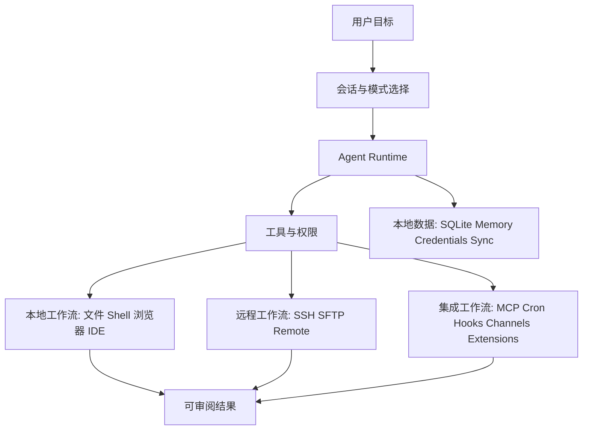

# Ola 功能规划与问题审查报告

> 审查日期：2026-08-17
>
> 范围：功能规划、产品闭环、交付链路、质量与文档一致性；未修改业务代码。
>
> 结论：Ola 的底层能力已经很完整，但目前更像一个同时承载 AI IDE、桌面 Agent、远程运维、自动化平台、消息机器人和创作工具的“能力集合”。下一阶段的首要问题不是继续扩功能，而是收敛主用户、主工作流和可验证交付。

## 1. 项目摘要

Ola 是一个 local-first 的 Electron 桌面 Agent 平台，采用 React Renderer、Preload 安全桥、Electron Main 和 .NET Native Worker 四层架构。[source:README.md] [source:CLAUDE.md] [source:sidecars/Ola.Native.Worker/]

当前产品覆盖聊天 Agent、代码协作、计划与多 Agent 团队、文件与 Shell、浏览器、SSH、MCP、定时任务、8 类消息渠道、同步、凭据托管登录、CodeGraph、画布/媒体、桌宠和自定义 Extensions。能力本身不缺，问题集中在功能组合、用户路径和发布验证是否闭环。[source:package.json] [source:CHANGELOG.md] [source:.plan/ola-integration-roadmap.md]

## 2. 当前能力地图

| 能力域           | 已实现的入口或支撑                                  | 产品价值                          | 审查判断                                             |
| ---------------- | --------------------------------------------------- | --------------------------------- | ---------------------------------------------------- |
| Agent 对话与执行 | Renderer、工具注册、Native Worker、MessagePack 协议 | 从自然语言到文件/Shell/浏览器操作 | 核心主线，应该成为所有其他能力的统一入口             |
| Coding / IDE     | `code` 模式、Monaco、终端、AI Coding CLI、CodeGraph | 代码库理解与改造                  | 有竞争力，但需要优先于非核心娱乐/创作功能            |
| 远程运维         | SSH、SFTP、Remote Workbench、终端                   | 远程主机操作与文件传输            | 可靠性工作已有，但权限、审计与场景化入口需统一       |
| 自动化与集成     | MCP、Cron、Hooks、Extensions、Channels              | 接入第三方系统并触发后台工作      | 平台化很强，但配置复杂、学习成本高                   |
| 数据与知识       | SQLite、Memory、Skills、资源包、WebDAV Sync         | 本地知识与跨设备连续性            | 需要更明确的数据边界、备份/恢复和冲突体验            |
| 创作与媒体       | Draw Graph、图片/视频任务、媒体运行时               | 视觉创作/资产操作                 | 适合作为可选工作台，不宜与核心 Agent 首页争夺心智    |
| 桌宠             | 多桌宠、成长、资源池                                | 情感化陪伴                        | 价值假设与主生产力定位不一致，建议严格隔离为可选功能 |

建议的产品主叙事应是：**“让 Agent 在本地和远程工作区完成可审阅的工作，并可按需接入团队工具。”** Draw、媒体、桌宠应是从属工作台，而不是与该主线并列的第一层定位。

## 3. 规划层面的核心问题

### P0：缺少单一主用户与主工作流，功能边界已经失焦

证据：路线图的阶段 11–21 在同一个版本周期同时推进聊天体验、Cookie 导入、CLI、SSH、CodeGraph、Provider、Draw 与媒体；历史版本还加入桌宠和 8 类消息渠道。[source:.plan/ola-integration-roadmap.md] [source:CHANGELOG.md]

问题：这些能力分别面向开发者、运维人员、个人自动化用户、企业机器人管理员和创作者。它们的首次配置、风险模型和成功标准不同。若首页、导航和发布节奏都平铺这些能力，用户无法快速理解“先用什么、为什么用、成功是什么”。

建议：下一版本停止新增横向一级能力，先选定一个北极星场景。默认选择“个人开发者/技术团队的本地代码与自动化工作台”，因为 Agent、CodeGraph、Shell、Git、SSH、MCP 已形成最强组合。用 3 个端到端场景验收：

1. 在一个代码仓库完成“理解问题 → 制定计划 → 修改 → 验证 → 汇报”。
2. 在远程主机完成“连接 → 诊断 → 受控执行 → 留痕 → 回传”。
3. 通过一个 MCP 或渠道完成“触发任务 → 审批 → 结果送达”。

### P0：发布/打包链路没有和本地开发链路闭环

`npm run dev` 的前置脚本会检查 `resources/native-worker` 与 `codegraph-worker`，缺失时执行 `npm run native:publish`。[source:scripts/predev.mjs]

但 `npm run build:win` 只执行 `npm run build && electron-builder --win`，而 `npm run build` 只做 TypeScript 检查和 electron-vite 构建；它不发布 Native Worker。[source:package.json]

CI 则显式在打包前执行 `npm run native:publish` 和 `npm run worker:assets:verify`。[source:.github/workflows/build.yml]

风险：干净克隆后的本地开发会自动补齐 Worker，但本地打包命令不保证补齐或验证 Worker。于是“构建成功”与“安装包可启动”不是同一件事；本次实际验证也仅覆盖了 `npm run typecheck` 和 `npm run build`，未覆盖 native publish、包体或桌面启动。

建议：将 native publish 与 worker asset verify 纳入本地 `build:unpack` / `build:win` 的统一前置，或新增唯一的 `package:verify` 命令；该命令必须在干净环境验证“包体存在 Worker、首次启动成功、数据库初始化成功”。

### P1：产品承诺的安全性很高，但关键用户可见的审计/恢复路径没有被规划为第一等能力

项目提供文件写入、Shell、SSH、浏览器登录、凭据注入、Cron、消息渠道和 Extension 网络访问。[source:README.md] [source:CHANGELOG.md] [source:docs/docs/capabilities/custom-extensions.mdx]

已有权限策略和工具审批，这是正确基线；但规划文件主要把权限作为工程门禁，尚未把用户可见的“变更前预览、执行后审计、可回滚、定时任务失败追踪、跨渠道来源标识”定义为贯穿产品的统一体验。[source:.plan/ola-integration-roadmap.md]

建议：建立统一 Execution Record：每次高影响执行必须保存工作区/远程主机、触发来源、审批人、工具参数摘要、文件 diff、命令输出摘要、产物与失败原因。默认从聊天、Cron、Channels、Extensions 都能跳转到同一条记录。这样安全能力才能转化为用户信任，而不只是内部机制。

### P1：配置面过多，首次成功路径风险高

用户可能需要配置模型 Provider、项目、权限、MCP、SSH、WebDAV、Channels、Credentials、CLI profile、Extensions 和 Skills。[source:CHANGELOG.md] [source:docs/docs/capabilities/mcp-servers.mdx] [source:docs/docs/channels/index.mdx]

问题不在于配置能力存在，而在于缺少“按目标逐步解锁”的产品规划。把所有设置项并列，会让用户在完成第一次 Agent 任务前就陷入集成配置。

建议：按场景设计 onboarding，而不是按模块设计 Settings：

- 本地编码：工作区 + Provider + 权限。
- 远程诊断：SSH + 最小权限 + 会话审计。
- 自动化通知：Cron + 一个渠道 + 投递确认。
- 外部系统：一个 MCP 或 Extension + 权限范围。

每条路径应有可运行示例、连通性检查、失败修复建议和明确的“已完成”状态。

### P1：功能成熟度标记混淆“代码完成”和“可发布/可运营”

路线图写明阶段 0–21 已完成本地实现、专项验证和桌面烟测，同时也强调“代码完成”不等于“发布完成”。[source:.plan/ola-integration-roadmap.md]

这是正确的工程表述，但对产品管理还不够：高风险能力如 Cookie 导入、凭据登录、远程运维、渠道机器人、视频生成均缺少面向用户的 Beta/GA 分级、支持边界、成本/数据策略和回滚策略。

建议：每个能力状态拆为：Prototype、Internal、Beta、GA、Deprecated；并要求 GA 最少满足文档、可观测性、错误恢复、支持矩阵、权限审查、端到端测试和发布包冒烟。

## 4. 已确认的工程与文档问题

| 优先级 | 问题                                                                                           | 证据                                                                                | 建议                                                               |
| ------ | ---------------------------------------------------------------------------------------------- | ----------------------------------------------------------------------------------- | ------------------------------------------------------------------ |
| P0     | 本地打包没有发布/验证 Native Worker                                                            | `build:*` 脚本与 CI 步骤不对齐                                                      | 统一打包前置；增加 clean-machine packaging smoke test              |
| P1     | 安装文档写 Node.js 18+，但 `package.json` 强制 Node >=22、npm >=10                             | [source:docs/docs/install/index.mdx] [source:package.json]                          | 文档改为 Node 22+、npm 10+，说明 .NET 10 与 Windows C++ 工具链要求 |
| P1     | 从源码文档仅要求 postinstall，未明确 `npm run dev` 会触发 Native Worker 发布且依赖 .NET 10     | [source:docs/docs/install/index.mdx] [source:scripts/predev.mjs] [source:README.md] | 将 Node/.NET/原生工具链、Worker 产物验证写入安装故障排查           |
| P1     | 文档中的 Extension 对外 API 仍使用 `openCoworkExtension` 与 `__openCoworkExtensionResult` 名称 | [source:docs/docs/capabilities/custom-extensions.mdx]                               | 先定义兼容迁移策略；新 API 用 Ola 命名，旧命名保留兼容层并标记废弃 |
| P2     | 根项目同时存在 npm、pnpm、bun lockfile，但 `preinstall` 明确要求 npm                           | [source:package.json] [source:bun.lock] [source:pnpm-lock.yaml]                     | 确定唯一包管理器；删除或自动校验非权威 lockfile，避免依赖漂移      |
| P2     | README、根开发说明、文档站安装说明的前置条件不完全一致                                         | [source:README.md] [source:CLAUDE.md] [source:docs/docs/install/index.mdx]          | 维护单一“环境要求”源，其他文档引用/生成                            |
| P2     | 质量门禁以类型、lint、静态 verify 为主，没有根级自动化端到端测试                               | [source:package.json] [source:CLAUDE.md]                                            | 优先补 3 条核心旅程的桌面 E2E/集成测试，不需要先追求大规模单测     |

## 5. 质量与交付风险

### 5.1 当前验证的强项

- TypeScript 主进程和 Renderer 分别检查。[source:package.json]
- CI 包含 lint、格式、`verify:ci-core`、Worker 资产检查与多平台打包。[source:.github/workflows/build.yml]
- 有针对 IPC 授权、凭据、终端隔离、MCP、渠道、同步、CodeGraph 的专项静态或脚本验证。[source:package.json]

### 5.2 当前验证的缺口

- 静态门禁不能替代真实桌面首次启动、Worker 启动、模型调用、审批、数据落库、重启恢复和安装包升级验证。
- `npm run build` 成功不代表 native sidecar 已发布，也不代表 Electron 安装包能运行。
- Channels、SSH、WebDAV、MCP、浏览器登录均依赖真实外部环境；应有最小模拟服务或录制式集成测试，否则版本回归会在用户侧暴露。

默认投入顺序：先补“首启+核心会话+打包”冒烟，再补 SSH/MCP/Channel 各一条契约集成测试。原因是这些路径既覆盖主价值，又能尽早发现跨进程与原生依赖问题。

## 6. 建议的下一版规划

### 版本目标：把“功能平台”收敛成可信的 Agent 工作台

**目标用户：** 独立开发者和小型技术团队。

**北极星指标：** 新用户在 15 分钟内完成一次有产物、可审阅、可复现的任务；每周至少完成一次“计划 → 执行 → 验证 → 汇报”的工作流。

### R1：可信核心（必须优先）

1. 打包闭环：native publish、资产验证、unpacked 首启、数据库初始化和 Worker 握手。
2. Execution Record：审批、diff、Shell/SSH 摘要、输入来源、结果链接、失败重试。
3. 三条 onboarding：本地编码、远程诊断、自动化通知。
4. 环境/安装文档与运行要求统一。

### R2：平台能力产品化

1. MCP / Extension 的模板、权限预览、连通性诊断和失败说明。
2. Channels 从“支持 8 个平台”转为“选定 2–3 个平台做到配置、回复、重试、审计、告警闭环”。
3. WebDAV/本地数据提供备份、恢复、冲突和敏感数据边界说明。

### R3：可选工作台

1. CodeGraph 深度融入代码任务，而不是仅提供 Dashboard。
2. Draw/Media 通过“任务产物可回到聊天与项目”证明价值。
3. 桌宠维持默认关闭、插件化和独立指标，避免占用核心导航与研发带宽。

## 7. 建议的验收看板

| 维度       | 发布前必须回答的问题                                                  |
| ---------- | --------------------------------------------------------------------- |
| 用户价值   | 用户在 15 分钟内能完成哪一个完整任务？有无真实演示数据？              |
| 可信执行   | 每一次写文件、Shell、SSH、渠道投递是否可审批、可定位、可审计？        |
| 可运行性   | 干净 Windows/macOS/Linux 环境安装后，Worker、SQLite、首会话是否成功？ |
| 可恢复性   | Worker 崩溃、网络中断、SSH 断线、模型失败、应用重启后状态如何恢复？   |
| 可支持性   | 日志是否脱敏？用户能否自助导出诊断信息？                              |
| 成本与边界 | 计费能力是否默认关闭、显示成本、允许中止、清理缓存？                  |

## 8. 最终判断

Ola 当前最大的风险不是“某个功能没做”，而是“过多功能同时争夺产品定义”。工程底座、权限意识和验证脚本已具备继续迭代的基础；下一步应冻结非核心功能，优先完成：

1. 本地打包与 Native Worker 的可运行性闭环。
2. 面向用户的统一执行审计与恢复体验。
3. 以开发/远程/自动化三条路径收敛首次成功体验。

完成这三项后，再扩展媒体、桌宠、更多渠道或更多创作能力，产品会更稳，也更容易形成可持续的使用理由。
