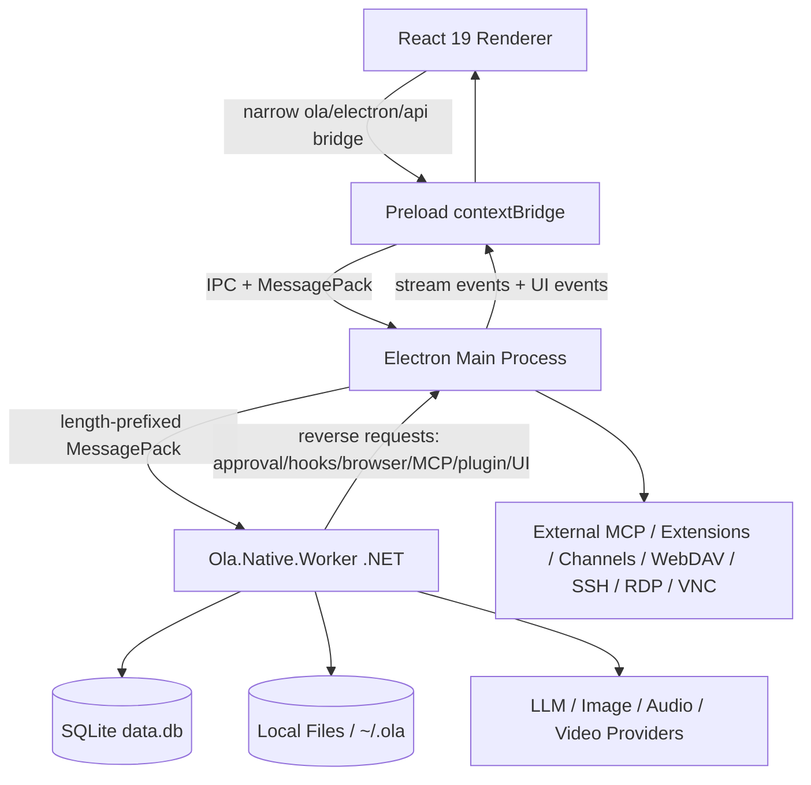

# Ola 当前项目完整功能与架构评估

> 评估日期：2026-08-21  
> 项目版本：`1.0.5`  
> 评估范围：Electron 主进程、Preload、React 渲染层、.NET Native Worker、SQLite、Agent runtime、工具注册表、插件/渠道/远程能力、构建与验证脚本。  
> 评估方式：以当前源码、运行时契约、IPC 路由、数据库迁移、README/工程规范和可执行验证脚本为依据；外部服务、真实模型、真实 SSH/RDP/VNC/MCP/WebDAV 连接未在本机建立，所以外部依赖部分标记为“源码已实现，需环境验证”。

## 1. 结论先行

Ola 不是一个单纯的聊天客户端，而是一个“本地优先的 AI 多智能体桌面工作台”。它把自然语言入口、代码工作区、原生文件与 Shell 能力、计划/目标/任务、子智能体/团队、浏览器/桌面自动化、SSH/远程桌面、MCP/扩展、消息渠道和后台调度，收敛到同一个 Agent runtime 中。

当前最重要的架构判断如下：

1. **主链路已经从渲染层 Agent loop 迁移到 .NET Native Worker。** React 负责交互、状态和工具展示；主进程负责窗口、IPC、权限、外部集成和 Worker 监管；真正的模型流式循环和大部分原生工具执行在 `Ola.Native.Worker` 中完成。[source:src/renderer/src/lib/agent/run-agent-via-sidecar.ts] [source:src/main/ipc/sidecar-manager.ts] [source:sidecars/Ola.Native.Worker/Modules/AgentRuntime/AgentRuntimeModule.cs]
2. **系统最强的地方是跨边界协议和安全控制已经成体系。** MessagePack 帧协议、运行时契约、seq 去重/重放、run owner 校验、权限策略、凭据 Vault、扩展沙箱、WebView 安全和多个 IPC 授权校验共同构成了安全底座。[source:src/main/lib/native-worker.ts] [source:src/shared/agent-runtime-contract.ts] [source:src/renderer/src/lib/ipc/agent-stream-receiver.ts] [source:src/shared/permission-policy.ts]
3. **当前最大工程风险不是功能少，而是功能很多导致的编排复杂度。** `src/main/index.ts`、`use-chat-actions.ts`、sidecar manager 和 Native Worker Agent executor 都承担了大量横向职责，未来最容易出现契约漂移、调试困难、状态重复和端到端回归不足。[source:src/main/index.ts] [source:src/renderer/src/hooks/use-chat-actions.ts] [source:src/main/ipc/sidecar-manager.ts] [source:sidecars/Ola.Native.Worker/Modules/AgentRuntime/AgentRuntimeNativeToolExecutor.cs]
4. **功能状态必须区分“已实现”“可运行但依赖外部环境”“有基础设施但默认关闭”。** 例如 MCP、渠道、SSH、RDP/VNC、WebDAV、视频生成是源码链路完整但依赖真实服务；automation hooks 目前由源码常量明确关闭，不能在产品说明中当作默认可用能力。[source:src/main/hooks/hooks-service.ts]
5. **当前静态质量是“可编译、验证脚本较丰富、格式噪声很大”。** `npm run typecheck` 通过；核心安全和运行时验证通过；`npm run lint` 退出码为 0，但报告了 48,372 个 Prettier 警告，主要是全仓库 CRLF 与配置期待 LF 的差异，而不是 TypeScript 语法错误。

## 2. 功能全景与完成度

| 功能域 | 当前能力 | 完成度判断 | 主要依赖 |
| --- | --- | --- | --- |
| 桌面壳与窗口 | 主窗口、SSH 窗口、Detached session、Pet、通知窗口、托盘、协议唤起、崩溃恢复 | 已实现 | Electron |
| 对话与 Agent | 多模式对话、流式输出、思考、工具调用、审批、重试、上下文压缩、重放 | 核心已实现 | Provider + Native Worker |
| 模型供应商 | OpenAI/Responses、Anthropic、Gemini/Vertex、OAuth 和多厂商预设、fallback、health | 已实现，配置后可用 | 模型 API / OAuth |
| 文件、Shell、Git、终端 | 本地/远程文件、读写编辑、Glob/Grep、Shell、Git、xterm、Monaco | 已实现 | 本机权限、SSH、Git |
| Plan / Task / Goal | 计划审阅、任务依赖、预算、阻塞审计、继续执行 | 已实现 | SQLite + runtime jobs |
| 子智能体 / Team | 子智能体委派、团队成员、消息、JSONL 运行时、历史 | 已实现 | Native Worker + SQLite/JSONL |
| Skills / Souls / Prompts / Memory | 动态技能、Soul/User/MEMORY、项目级覆盖、记忆自动化 | 已实现 | Worker 文件/DB |
| 浏览器与桌面自动化 | WebView 导航、点击、输入、截图、桌面截图/输入、流程录制/回放 | 已实现，需权限与真实页面验证 | Electron WebView、RobotJS |
| MCP / Extensions / App Plugins | stdio/SSE/HTTP MCP、声明式 HTTP 扩展、沙箱 JS、UI renderer、插件工具 | 已实现 | 外部 MCP/HTTP/插件 |
| SSH | SSH 配置、终端、远程文件、SFTP、断点续传、远端 Agent 工具 | 已实现，需真实主机验证 | SSH / SFTP |
| RDP / VNC / OLA device | 内置 RDP CleanPath bridge、noVNC bridge、外部客户端、输入授权、凭据租约 | RDP/VNC 主链已实现；OLA device 仍是扩展方向 | 远程主机、IronRDP/noVNC |
| Channels | 飞书、钉钉、Discord、QQ、Telegram、企业微信、微信公众号、WhatsApp | 已实现，需真实账号/网络 | 平台 API/SDK/WebSocket |
| Cron | at/every/5 段 cron、持久化、并发控制、取消、后台 Agent、多渠道交付 | 已实现，需真实环境 | node-cron/渠道/Provider |
| 凭据、Cookie、OAuth | safeStorage Vault、域名校验、Cookie 导入、登录编排、OAuth callback | 已实现，安全敏感 | OS Keychain/DPAPI、WebView |
| Draw / Image / Audio / Video | Draw Graph、图片生成/编辑、音频转写/语音、Seedance 视频任务 | 已实现；视频默认关闭 | 外部模型服务 |
| Preview / Office | Markdown/Mermaid、HTML、图片、视频、音频、PDF、DOCX、CSV/XLSX、字体、二进制 | 已实现 | React、pdf.js、mammoth、XLSX |
| Project Wiki | 代码树扫描、符号提取、缓存、Markdown 导出 | 已实现，偏静态索引 | 本地文件系统 |
| Sync | WebDAV、快照、hash、tombstone、冲突解析、条件写入、旧数据迁移 | 已实现，需真实 WebDAV | WebDAV |
| Analytics / Update / CLI | 使用量、Provider health、更新器、Native Worker headless CLI | 已实现 | SQLite、electron-updater |
| Hooks | 配置、信任、历史、取消、执行器基础设施 | **基础设施存在，但当前 `AUTOMATION_HOOKS_ENABLED=false`** | 外部可执行文件；当前关闭 |

## 3. 总体架构

### 3.1 进程与边界

```mermaid
graph TD
  UI[React 19 Renderer]
  PRE[Preload contextBridge]
  MAIN[Electron Main Process]
  WORKER[Ola.Native.Worker .NET]
  DB[(SQLite data.db)]
  FS[(Local Files / ~/.ola)]
  PROVIDER[LLM / Image / Audio / Video Providers]
  EXT[External MCP / Extensions / Channels / WebDAV / SSH / RDP / VNC]

  UI -->|narrow ola/electron/api bridge| PRE
  PRE -->|IPC + MessagePack| MAIN
  MAIN -->|length-prefixed MessagePack| WORKER
  WORKER --> DB
  WORKER --> FS
  WORKER --> PROVIDER
  MAIN --> EXT
  WORKER -->|reverse requests: approval/hooks/browser/MCP/plugin/UI| MAIN
  MAIN -->|stream events + UI events| PRE
  PRE --> UI
```

主窗口使用 `contextIsolation: true`、`nodeIntegration: false`，但主窗口 `sandbox: false` 且开启 `webviewTag`；SSH 等特殊窗口的 WebPreferences 更严格。[source:src/main/index.ts] Preload 只暴露 `ola`、`electron`、`api` 三类桥接对象，渲染层不直接获得 Node API。[source:src/preload/index.ts]

### 3.2 Native Worker 通信方案

Native Worker 在 Windows 上使用 named pipe，在 macOS/Linux 上使用 Unix domain socket；帧格式是 4 字节大端长度 + MessagePack payload。主进程维护 request id、pending map、超时、ping、启动重试、Worker generation 和 route contract 检查。[source:src/main/lib/native-worker.ts] Worker 端由 `LocalIpcWorkerServer` 接收帧，在并发信号量控制下分发到模块，并以写锁串行输出响应/事件。[source:sidecars/Ola.Native.Worker/Runtime/LocalIpcWorkerServer.cs] 模块通过统一目录注册，Agent runtime、DB、文件、Shell、SSH、MCP 配置、扩展、同步等都通过 route 暴露。[source:sidecars/Ola.Native.Worker/Hosting/WorkerModuleCatalog.cs]

这套设计解决了三个问题：

- Electron 主线程不直接承担重型 Agent loop、文件扫描和长时间工具执行。
- TS UI 与 C# runtime 之间有可生成、可验证的协议边界，而不是靠隐式对象形状。
- Worker 崩溃时，主进程可以重启 Worker，并给运行中的 Agent 标记 interrupted/recovery 状态。

### 3.3 Agent stream 方案

每条事件带 `runId`、`sessionId`、`seq`，事件类型覆盖 loop、文本/思考增量、图片、消息结束、工具参数流、工具审批、工具结果、上下文压缩、子智能体和 Team 事件。[source:src/shared/agent-stream-protocol.ts]

渲染层 receiver 为每个 run 建立串行处理链，发现重复 seq 时丢弃，发现 gap 时请求 `agent:stream-replay`；主进程按 run 缓存 replay frame，Worker 侧还保存 job/event/tool result 以支持恢复和查询。[source:src/renderer/src/lib/ipc/agent-stream-receiver.ts] [source:src/main/ipc/sidecar-manager.ts] [source:sidecars/Ola.Native.Worker/Modules/AgentRuntime/AgentRuntimeModule.cs]

这比单纯的 WebSocket 流更适合桌面应用：窗口切换、渲染卡顿、IPC 暂时拥塞或审批等待时，事件不必丢失。但它也引入了缓存上限、过期时间和“replay 不可用”分支，必须在 UI 上清楚呈现恢复失败。

## 4. 核心 Agent 与对话架构

### 4.1 责任边界

- React：消息输入、消息窗口、审批卡片、工具卡片、计划/任务显示、取消按钮、草稿和本地 UI 状态。[source:src/renderer/src/hooks/use-chat-actions.ts] [source:src/renderer/src/stores/chat-store.ts]
- Renderer Agent bridge：组装请求、订阅 stream、把 abort/stop/append/compress/snapshot 变成 IPC。[source:src/renderer/src/lib/ipc/agent-bridge.ts]
- Main sidecar manager：启动/回收 sidecar、绑定 run 到 BrowserWindow、转发反向请求、缓存 stream、做 owner authorization。[source:src/main/ipc/sidecar-manager.ts]
- Native runtime：选择 Provider adapter、发起流式请求、收集 tool call、执行工具、运行 hook/approval、重试、上下文压缩、写 runtime journal。[source:sidecars/Ola.Native.Worker/Modules/AgentRuntime/OpenAIChatRuntime.cs]

### 4.2 一次普通对话如何流转

1. 用户在会话中输入内容，`use-chat-actions` 读取当前 session、project、workingFolder、provider、model、SSH/goal/team/plan 上下文。[source:src/renderer/src/hooks/use-chat-actions.ts]
2. `buildSidecarAgentRunRequest` 将统一消息、Provider config、工具定义、权限策略、计划修订、压缩策略、插件/渠道上下文编码为 runtime request。[source:src/renderer/src/lib/ipc/sidecar-protocol.ts]
3. Renderer 通过 `agentBridge.runAgent` 请求 sidecar，主进程绑定 `runId -> sender WebContents`，并启动 stream 转发。[source:src/renderer/src/lib/ipc/agent-bridge.ts] [source:src/main/ipc/sidecar-manager.ts]
4. Worker 将 provider request 转成 OpenAI Chat/Responses、Anthropic Messages 或 Gemini 请求，解析 SSE/流式事件，发出 text/thinking/tool args 增量。[source:sidecars/Ola.Native.Worker/Modules/AgentRuntime/OpenAIChatRuntime.cs]
5. 如果模型返回工具调用，runtime 根据工具注册表和权限策略执行工具；需要人确认的工具发出 reverse approval request，主进程再回传结果。[source:src/renderer/src/lib/agent/tool-registry.ts] [source:sidecars/Ola.Native.Worker/Modules/AgentRuntime/AgentRuntimeReverseRequests.cs]
6. 工具结果和运行状态写入 `runtime_jobs`、`runtime_job_events`、`runtime_tool_results`，流事件继续发送给 UI。[source:sidecars/Ola.Native.Worker/Modules/Db/DbSchemaMigrator.cs] [source:sidecars/Ola.Native.Worker/Modules/AgentRuntime/AgentRuntimeModule.cs]
7. UI receiver 按 seq 处理并在必要时 replay；loop_end 后消息、工具调用、usage 和 change set 进入会话/消息/变更记录。[source:src/renderer/src/lib/ipc/agent-stream-receiver.ts] [source:src/renderer/src/stores/chat-store.ts] [source:src/main/db]

### 4.3 Provider 方案

渲染层维护厂商预设和 UI 配置，主进程维护 Provider metadata、模型能力和 health；Native runtime 使用 adapter 处理不同协议。当前源代码覆盖 OpenAI Chat/Responses、Anthropic、Gemini/Vertex 等主要适配面，图片、音频、视频使用单独 runtime。[source:src/renderer/src/stores/providers] [source:src/main/providers/provider-main-store.ts] [source:sidecars/Ola.Native.Worker/Modules/AgentRuntime/OpenAIChatRuntime.cs]

Provider fallback resolver 会过滤启用状态、能力和健康状态，优先选择 preferred provider，再使用 fallbacks；health registry 记录请求成功/失败、连续失败、认证/限流/服务端/网络错误分类，并对密钥进行脱敏。[source:src/main/provider/provider-fallback-resolver.ts] [source:src/main/provider/provider-health-registry.ts]

**优势**：模型供应商被隔离在 request adapter 和 provider store 之后，工具层不需要知道具体 API。  
**风险**：多厂商配置字段、模型能力和 OAuth 状态多，配置 UI、主进程 mirror、C# runtime DTO 三处如果不持续做 contract verification，容易出现“能保存但不能运行”。现有 `verify:provider-main-store` 和 Agent contract 验证已经覆盖了部分风险。[source:tools/verify-provider-main-store.ts] [source:tools/verify-agent-runtime-contract.ts]

## 5. 工具体系与权限架构

### 5.1 Tool registry

工具注册表支持 core、extension、MCP、channel namespace，记录 owner、version、capability hash，拒绝同名冲突，给 runtime 提供稳定的工具定义。[source:src/renderer/src/lib/agent/tool-registry.ts]

核心工具包含文件读写编辑、Glob/Grep、Bash/Shell、计划、任务、目标、记忆、通知、Cron、SubAgent、Team、浏览器、桌面、MCP、WebFetch/WebSearch、图像/视频、插件和 SSH 等。很多旧的 renderer tool implementation 只保留“已迁移到 .NET Native Worker”的占位，真正执行路径在 Native Tool Executor；这不是漏实现，而是迁移后的职责边界。[source:src/renderer/src/lib/tools/index.ts] [source:sidecars/Ola.Native.Worker/Modules/AgentRuntime/AgentRuntimeNativeToolExecutor.cs]

### 5.2 权限策略

权限策略默认关闭高风险能力，区分工具白名单、Bash allow/deny、通配符/正则、审批模式和 plan mode。deny 优先于 allow；包含 shell expansion、复合命令或无法证明安全的命令不会被自动放行。[source:src/shared/permission-policy.ts] Worker runtime 使用对应的 C# 镜像执行最终判定。[source:sidecars/Ola.Native.Worker/Modules/AgentRuntime/AgentRuntimePermissionPolicy.cs]

### 5.3 文件、Shell 和 Git

- 文件：Read/Write/Edit/NotebookEdit/LS/Glob/Grep 统一进入 Native Worker FileModule；主进程还负责 IPC sender、路径校验、输出上限和 watcher。[source:sidecars/Ola.Native.Worker/Modules/File/FileModule.cs] [source:src/main/ipc/fs-handlers.ts]
- Shell：由 Worker `shell/exec` 执行，主进程转发 started/output/abort，输出会压缩、截断或归档；Bash 默认需要审批。[source:src/main/ipc/shell-handlers.ts] [source:sidecars/Ola.Native.Worker/Modules/Shell/ShellModule.cs]
- Git：支持本地和 SSH target、status/query/scan/exec，带 TTL cache 和失效处理；Source Control 面板消费这些结果。[source:sidecars/Ola.Native.Worker/Modules/Git/GitModule.cs] [source:src/renderer/src/components/scm]
- 终端：xterm.js 负责展示和交互，主进程以 owner WebContents 隔离终端，维护 seq/buffer，渲染层先取 snapshot 再接 live events。[source:src/main/ipc/terminal-handlers.ts] [source:src/renderer/src/components/terminal/LocalTerminal.tsx]

## 6. 会话、消息、计划、任务、目标和多智能体

### 6.1 持久化

Native Worker 拥有 SQLite，开启 WAL 和 foreign keys；schema migrator 采用 additive migration，只建表和增加列，不删除旧列。核心表包括 sessions、messages、projects、plans、tasks、session_goals、agent_change_sets、agent_file_changes、sub_agent_history、memory、runtime_jobs、runtime_job_events、runtime_tool_results、cron、SSH、usage、provider health、sync 和 wiki。[source:sidecars/Ola.Native.Worker/Modules/Db/DbSchemaMigrator.cs] [source:sidecars/Ola.Native.Worker/Modules/Db/DbModule.cs]

Renderer 的 chat store 使用窗口化消息查询、request context、压缩和 artifact 插入，避免一个超长会话一次性灌进 React。[source:src/renderer/src/stores/chat-store.ts] 这种设计适合长时间 Agent 工作，但需要持续监控窗口边界、搜索索引和压缩后上下文一致性。

### 6.2 Plan Mode

Plan Store 的状态包含 drafting、awaiting_review、approved、implementing、completed、rejected；计划内容既可保存为文件，也可以保存结构化 specJson 和数据库状态。[source:src/renderer/src/stores/plan-store.ts] Plan mode 只允许读取、搜索、计划、任务、目标和 widget 等安全工具，写操作需要落在计划文件或在审批后进入实现阶段。[source:src/renderer/src/lib/tools/plan-tool.ts] [source:sidecars/Ola.Native.Worker/Modules/AgentRuntime/AgentRuntimePermissionPolicy.cs]

### 6.3 Tasks、Goals、SubAgents、Teams

- Tasks：TaskCreate/Get/Update/List 进入 Worker/DB，支持状态、依赖、owner、metadata，UI 在 TasksPage 和步骤面板展示。[source:src/renderer/src/lib/tools/todo-tool.ts] [source:src/renderer/src/components/tasks]
- Goals：GoalCreate/Update/Get 与 session 绑定，保存 objective、status、token budget、time、events；runtime 注入隐藏 goal context，完成前检查 pending tasks、工具失败和 plan gate。[source:src/renderer/src/lib/tools/goal-tool.ts] [source:src/main/goals/goal-runtime.ts]
- SubAgent：主 Agent 通过 catalog/registry 选择子 Agent，Worker 执行并发或串行子任务，事件回到父 run，历史写入 `sub_agent_history`。[source:src/renderer/src/lib/agent/sub-agents] [source:sidecars/Ola.Native.Worker/Modules/AgentRuntime/AgentRuntimeSubAgentExecutor.cs]
- Team：TeamCreate/Delete/Status、SendMessage、成员更新和 manifest 更新有独立 runtime routes，消息通过 JSONL 运行时持久化，并有验证脚本防止消息损坏。[source:src/main/ipc/team-runtime-handlers.ts] [source:sidecars/Ola.Native.Worker/Modules/AgentRuntime/AgentRuntimeTeamExecutor.cs] [tools/verify-team-runtime-jsonl.ts]

**架构评价**：这套模型已经从“聊天记录”升级到“可恢复的执行系统”。下一步应该把 session message、runtime job、agent change set、approval 和外部交付统一成一个可查询 execution record，否则用户遇到失败时需要在多个页面拼接因果链。

## 7. Skills、Souls、Prompts、Memory 与代码图谱

Skills 支持动态 catalog、加载、安装和运行时提示注入；Soul/User/MEMORY 采用全局和项目级覆盖，配置和文件通过 Worker route 读取。Prompts、commands、agents 和 skills 都是 Agent context 的可选来源。[source:src/renderer/src/lib/tools/index.ts] [source:sidecars/Ola.Native.Worker/Modules/Skills/SkillModule.cs] [source:sidecars/Ola.Native.Worker/Modules/UserContent/UserSoulCatalog.cs]

Memory 是分层且带自动化的模块，数据库有 memory roots、stage1 outputs、jobs、citation usage 和 rollups 等表，说明系统不仅保存文本，还试图管理记忆生成、引用和使用统计。[source:sidecars/Ola.Native.Worker/Modules/Db/DbSchemaMigrator.cs] [source:src/renderer/src/components/memory]

CodeGraph 负责把代码库变成可查询的符号/依赖图，Worker 负责扫描和索引，renderer 提供 dashboard。它适合在 Agent 进行“先理解再修改”时减少重复 Grep，但需要在大仓库、语言 grammar 缺失和增量变更下做性能验证。[source:scripts/validate-codegraph-grammars.mjs] [source:scripts/verify-codegraph-worker.mjs] [source:src/main/ipc/codegraph-handlers.ts] [source:src/renderer/src/lib/tools/codegraph-tool.ts]

## 8. 浏览器、登录和桌面自动化

### 8.1 内置浏览器

BrowserWindow/webview 配合自定义 session、storage profile、权限处理和浏览器 IPC。Agent 可以导航、读取内容、截图、点击、输入、滚动；工具请求可能由 Worker reverse 到主进程，再由渲染层浏览器组件完成。[source:src/main/browser/browser-emulation.ts] [source:src/main/ipc/browser-handlers.ts] [source:src/renderer/src/lib/tools/browser-tool.ts]

WebView 的安全脚本会检查 nodeIntegration、contextIsolation、权限和导航边界；本次 `verify:webview-security` 通过。[source:tools/verify-webview-security.ts]

### 8.2 登录与凭据

登录编排器用 site profile、step driver 和 challenge detector 操作 WebView；密码不从 renderer 直接拿明文，而是由 main process 从 SecretVault 验证后进行目标绑定注入。[source:src/renderer/src/lib/tools/login-to-site-tool.ts] [source:src/renderer/src/lib/credentials/login-orchestrator.ts] [source:src/main/ipc/credentials-handlers.ts]

### 8.3 桌面控制与流程

桌面工具覆盖截图、点击、输入、滚动等动作，通常需要审批；desktop flow recorder/store 把动作序列保存到 DB，可用于重复执行。[source:src/main/ipc/desktop-control.ts] [source:src/main/ipc/desktop-flow-handlers.ts] [source:src/shared/desktop-flow.ts]

**关键风险**：桌面输入是系统级副作用，必须保持显式授权、owner 绑定、事件限速和撤销时释放 held keys/buttons。当前 remote input controller 已有这些控制，但普通 desktop automation 也应保持同等级的审计记录。[source:src/main/remote/input-controller.ts]

## 9. MCP、Extensions 与 App Plugins

### 9.1 MCP

MCP manager 使用官方 SDK，支持 stdio、SSE、streamable HTTP；HTTP 失败时可回落 SSE，工具、resource、prompt 支持分页缓存。自动连接 coordinator 对启用 server 限制并发、尝试次数、backoff 和 circuit。[source:src/main/mcp/mcp-manager.ts] [source:src/main/mcp/mcp-client.ts] [source:src/main/mcp/autoconnect-coordinator.ts]

MCP 配置通过 Native Worker route 持久化，主进程处理真实连接和 tool call，Agent executor 通过 reverse `mcp:call-tool`/`read-resource` 获得结果。[source:src/main/ipc/mcp-handlers.ts] [source:sidecars/Ola.Native.Worker/Modules/Mcp/McpConfigModule.cs]

### 9.2 Extensions

扩展有 manifest、安装目录原子替换、配置、声明式 HTTP tool、JS handler 和 renderer。JS 在隐藏 iframe 沙箱中运行，只能使用 `ctx.fetch`、storage、config 等受限能力；HTTP network 访问受 allowlist 约束。工具名使用 `extension__<id>__<name>`，非 GET 和 JS 默认需要审批。[source:src/shared/extension-types.ts] [source:src/main/ipc/extension-handlers.ts] [source:src/renderer/src/lib/extensions]

扩展结果可以渲染 card/table/form/chart/html；这样扩展不仅是 API wrapper，也是一种可插拔 UI 协议。[source:src/renderer/src/lib/extensions/extension-result.ts]

### 9.3 App Plugins

App plugin 把浏览器、桌面、渠道等应用级能力接入 tool registry，工具执行时通过 reverse request 回到主进程或 renderer。它让系统可以继续扩展，但也使 tool owner、approval、capability hash 和 UI renderer 必须统一治理。[source:src/renderer/src/lib/app-plugin] [source:src/renderer/src/lib/agent/tool-registry.ts]

## 10. SSH 与远程桌面

### 10.1 SSH

SSH 是“远程开发工作区”能力，不只是一个终端：

1. 用户创建 SSH connection/group，配置进入受保护的 store，密码进入 SecretVault，不写入连接 JSON。[source:src/main/ipc/ssh-handlers.ts] [source:src/main/credentials/secret-vault.ts]
2. UI 建立连接后创建 xterm session，同时提供远程文件列表、读写、Glob/Grep 和 SFTP。[source:src/renderer/src/components/ssh] [source:sidecars/Ola.Native.Worker/Modules/Ssh/SshModule.cs]
3. Agent request 带 `sshConnectionId`，Native Tool Executor 将 File/Shell/Git 路由到远端，而对话、审批、变更展示仍然在本地。[source:src/renderer/src/lib/ipc/sidecar-protocol.ts] [source:sidecars/Ola.Native.Worker/Modules/AgentRuntime/AgentRuntimeNativeToolExecutor.cs]
4. 大文件传输支持暂停、取消、恢复、冲突策略和进度，配置导入/导出也有完整链路。[source:src/main/ipc/ssh-handlers.ts] [source:src/renderer/src/components/ssh]

这是一种很有价值的“控制平面本地、数据平面远端”架构。主要风险是网络断线、远端权限差异、路径语义和本地 Agent change set 之间的一致性，需要在 UX 中显示明确的 remote target。

### 10.2 RDP / VNC

远程桌面使用独立的 RemoteControlEngine。connection JSON 只保存连接元数据，凭据引用 SecretVault；连接时：

- RDP 在本地启动 CleanPath bridge，先解析 RDCleanPath 请求，连接目标、完成 X224 协商、升级 TLS，再把二进制帧通过单次 token WebSocket bridge 转给 IronRDP viewer。[source:src/main/remote/rdp/rdp-cleanpath-bridge.ts] [source:src/main/remote/engine.ts]
- VNC 使用本地随机 token WebSocket bridge 连接 TCP RFB，关闭 per-message deflate 避免重复压缩，并调整安全类型顺序让 viewer 优先选择安全方式。[source:src/main/remote/lan-tcp-websocket-bridge.ts] [source:src/main/remote/vnc/novnc-proxy.ts]
- viewer credential 是短期 lease，绑定 session、owner WebContents，claim 后立即删除；session 断开或窗口销毁时撤销。[source:src/main/remote/viewer-credential-lease.ts] [source:src/main/remote/engine.ts]
- 输入必须先授权 session，支持 owner 检查、速率限制、坐标归一化、按键/鼠标释放和 revoke 清理。[source:src/main/remote/authorization-state.ts] [source:src/main/remote/input-controller.ts]
- 连接/断开/输入授权/输入动作写入 remote audit。[source:src/main/remote/remote-audit.ts]

这是当前项目里安全边界设计较成熟的一块；已通过 `verify:remote-authorization`、`verify:remote-credential-lease` 和 remote store 验证。[source:tools/verify-remote-authorization.ts] [source:tools/verify-remote-credential-lease.ts] [source:tools/verify-remote-connection-store.ts]

## 11. Channels 与 Cron

### 11.1 消息渠道

ChannelManager 通过 factory registry 和 lazy parser loader 管理飞书、钉钉、Discord、QQ、Telegram、企业微信、微信公众号、WhatsApp。Base service 对 stale message 和 message id 做去重，服务生命周期由 start/stop 管理。[source:src/main/channels/channel-manager.ts] [source:src/main/channels/base-plugin-service.ts]

典型入站流程：

1. 平台 WebSocket/Webhook/SDK 收到消息。
2. Channel service 校验、过滤过期消息、按 provider+chat 去重。
3. `auto-reply` 根据 plugin/chat route 找到持久 session、project、workingFolder、provider/model、SSH context。[source:src/main/channels/auto-reply.ts] [source:sidecars/Ola.Native.Worker/Modules/Db/DbModule.cs]
4. `/help`、`/new`、`/init`、`/status` 等命令在渠道层拦截；普通内容进入与桌面相同的 sidecar request。[source:src/renderer/src/hooks/use-plugin-auto-reply.ts]
5. Agent 流式结果可以边生成边发送或在完成后发送，最终由对应 Channel service 回复。

这样做的核心价值是“渠道只是输入输出适配器，Agent 执行上下文仍然统一”。验证脚本已覆盖 lazy providers、dedup 和 reply routing。[source:tools/verify-channel-lazy-providers.ts] [source:tools/verify-channel-message-dedup.ts] [source:tools/verify-channel-reply-routing.ts]

### 11.2 Cron

Cron jobs 存储 at、every、5 段 cron 表达式、prompt、provider/model、workingFolder、SSH、delivery target 和 deleteAfterRun 等字段。启动时加载 persisted jobs；scheduler 负责时间触发、并发控制、取消和 skipped run 记录。[source:src/main/cron/cron-scheduler.ts] [source:src/main/ipc/cron-handlers.ts]

Cron agent background 创建后台运行上下文，调用同一套 Native Agent runtime，产生的历史、日志、消息和投递状态进入 cron_runs、cron_run_messages、cron_run_logs；结果可以发到桌面 session、channel 或仅保存。[source:src/main/cron/cron-agent-background.ts] [source:sidecars/Ola.Native.Worker/Modules/Db/DbSchemaMigrator.cs]

**典型价值**：每天检查 SSH 服务器日志，Agent 使用远端 Grep/Shell，发现错误后将摘要发到飞书，同时把完整执行记录留在 Ola。  
**关键风险**：后台任务可能在用户不知情时执行高风险工具，因此 cron context 必须继承 permission policy、working folder 和 target ownership，不能因为“无人值守”而自动放宽权限。

## 12. Credentials、Cookie 与 OAuth

SecretVault 使用 Electron safeStorage，在 Windows 对应 DPAPI，在 macOS/Linux 使用系统安全存储；vault 数据和 index 分开，renderer 只能看到 metadata，不能读取明文 secret。[source:src/main/credentials/secret-vault.ts]

凭据注入路径包含：

1. renderer 请求 credential ref，而不是传递明文。
2. main 验证 sender、目标 WebContents、URL 必须 HTTPS、域名必须精确匹配。
3. main 从 Vault 读取并只在当前 injection target 中填充，记录 touch/audit。
4. browser cookie import 使用浏览器 cookie 加密解密和 profile 约束，不能把任意本地数据库当作可读凭据。[source:src/main/browser/browser-cookie-import.ts] [source:src/main/browser/chromium-cookie-crypto.ts]

OAuth 支持 auth code/PKCE/device code 和自定义 `ola://auth/callback`；Codex/Copilot 等 provider 的授权状态由 renderer auth 和 main OAuth handlers 协作。[source:src/main/ipc/oauth-handlers.ts] [source:src/renderer/src/lib/auth]

本次凭据注入授权、OAuth/credential IPC authorization 相关验证通过。[source:tools/verify-credential-injection-authorization.ts] [tools/verify-api-oauth-ipc-authorization.ts] [tools/verify-credential-ssh-remote-ipc-authorization.ts]

## 13. Draw、媒体、翻译与文件预览

### 13.1 Draw Graph

Draw Graph 项目以本地 JSON 项目文件和 asset protocol 保存，主进程做 project id 校验、asset 保存、路径限制和 MessagePack handler；renderer 负责 canvas、历史、节点操作和 assistant 交互。[source:src/main/ipc/draw-graph-handlers.ts] [source:src/renderer/src/components/draw/DrawGraphCanvas.tsx] [source:src/renderer/src/stores/draw-graph-store.ts]

图片操作和 prompt optimizer 可将模型生成接入 canvas；验证覆盖 graph core、image ops、project store 和 canvas assistant。[source:tools/verify-draw-graph-core.ts] [source:tools/verify-draw-image-ops.ts] [source:tools/verify-draw-projects.ts] [source:tools/verify-draw-canvas-assistant.ts]

### 13.2 Image / Audio / Video

图片生成/编辑通过 OpenAI Images 等 provider route；音频提供转写和 speech；视频 runtime 使用 Seedance task API，具备 create/poll/cancel、指数退避、断点恢复、HTTPS 下载、大小/MIME/redirect 限制、本地 `ola-media` protocol 和 cache cleanup。[source:sidecars/Ola.Native.Worker/Modules/OpenAIImages/OpenAIImagesModule.cs] [source:sidecars/Ola.Native.Worker/Modules/OpenAIAudio/OpenAIAudioModule.cs] [source:src/main/media/seedance-video-adapter.ts] [source:src/main/ipc/media-runtime-handlers.ts]

视频生成默认由 `videoGenerationEnabled=false` 关闭，需要用户显式开启并配置 `seedance-video` 模型；本次 media runtime verification 通过。[source:src/main/ipc/media-runtime-handlers.ts] [source:tools/verify-media-runtime.ts]

### 13.3 翻译

翻译页没有另造一套模型循环，而是把源文本、目标语言、translation buffer 和有限工具定义包装成 sidecar Agent；Write/Edit/Read/FileRead 让模型逐步维护输出缓冲区，并以 `TRANSLATION_DONE` 作为完成信号。[source:src/renderer/src/lib/translate-agent-service.ts] [source:src/renderer/src/components/translate/TranslatePage.tsx]

### 13.4 Preview

viewer registry 按扩展名和文件类型懒加载 Markdown/Mermaid、HTML、图片、SVG、视频、音频、字体、二进制、Office Online、DOCX、PDF、CSV/XLSX viewer。PDF 使用 pdf.js，DOCX 使用转换器，Spreadsheet 对文件大小、sheet 数、cell 数做安全上限。[source:src/renderer/src/lib/preview/register-viewers.ts] [source:src/renderer/src/lib/preview/viewers/pdf-viewer.tsx] [source:src/renderer/src/lib/preview/viewers/docx-viewer.tsx] [source:src/renderer/src/lib/preview/viewers/spreadsheet-viewer.tsx]

## 14. Project Wiki、Sync、Analytics、Update 与 CLI

### 14.1 Project Wiki

Project Wiki 扫描项目目录，忽略 `.git`、`node_modules`、构建目录、密钥/凭据目录和敏感文件；文本文件提取 hash 与符号，最多扫描 5000 个文件，每个文本文件最多 2 MB；结果按项目 root hash 缓存到 `~/.ola/wiki`，可导出 Markdown。[source:src/main/wiki/wiki-service.ts] [source:src/main/ipc/wiki-handlers.ts]

它是“静态结构索引”，不是完整语义 code intelligence。优点是安全边界清楚、可离线、可缓存；不足是符号提取主要是 regex，复杂语言语义、跨文件调用和增量更新需要 CodeGraph 补充。

### 14.2 Sync

Sync engine 先捕获本地 DB/file snapshot，以稳定 JSON hash 生成 record；删除使用 tombstone，远端 WebDAV 使用 conditional write 防止两台设备互相覆盖。合并时对同一 record 的 local/remote update/delete 形成 conflict，用户选择 local/remote/delete 后再 apply 和 upload。[source:src/main/sync/sync-engine.ts] [source:src/main/sync/webdav-provider.ts] [source:src/shared/sync-types.ts]

当前同步边界的优点是把“记录值”和“删除状态”都纳入冲突模型；风险是同步对象很多，必须明确哪些内容不应同步，尤其是 SecretVault 明文、临时 runtime cache、外部连接凭据和大媒体文件。WebDAV 条件写、旧数据迁移验证通过。[source:tools/verify-webdav-conditional-write.ts] [source:tools/verify-sync-legacy-migration.ts]

### 14.3 Analytics / Update / Crash

Usage events、daily activity、model/provider usage 和 provider health 写入 DB，用于 Analytics 页面和 provider fallback；electron-updater 监听 available/download-progress/downloaded/error，并支持 SHA-512 校验和安装重启；crash logger 记录启动步骤、renderer crash/unresponsive/load failure、Worker restart 和 native dump。[source:src/main/db/usage-events-dao.ts] [source:src/renderer/src/lib/usage-analytics.ts] [source:src/main/updater.ts] [source:src/main/crash-logger.ts]

### 14.4 Headless CLI

`cli/src/index.ts` 是一个直接连接 Native Worker 的 headless client，支持 `jobs`、`job <jobId>`、`cancel <jobId>`、`run --params <json-file>`。它自己实现 Worker 启动、named pipe/Unix socket 连接、MessagePack frame、事件订阅和 job status polling，可用于 CI、服务器任务或桌面 UI 之外的执行。[source:cli/src/index.ts]

## 15. 端到端操作示例

### 示例 A：在当前项目中修复一个登录 Bug

| 步骤 | 用户看到的动作 | 系统实际技术方案 |
| --- | --- | --- |
| 1 | 选择项目目录并输入“定位并修复登录 Bug” | session/project/workingFolder 写入 SQLite，当前 Provider/权限/模式载入；[source:src/renderer/src/stores/chat-store.ts] [source:sidecars/Ola.Native.Worker/Modules/Db/DbModule.cs] |
| 2 | Agent 开始输出思路 | renderer 构建 sidecar request，Worker 发 provider SSE，MessagePack stream 返回 text/thinking delta；[source:src/renderer/src/lib/ipc/sidecar-protocol.ts] [source:sidecars/Ola.Native.Worker/Modules/AgentRuntime/OpenAIChatRuntime.cs] |
| 3 | Agent 调用 Read/Grep | Tool registry 给出 schema；Native Tool Executor 在 workingFolder 内执行 FileModule，结果写 runtime tool journal；[source:src/renderer/src/lib/agent/tool-registry.ts] [source:sidecars/Ola.Native.Worker/Modules/File/FileModule.cs] |
| 4 | Agent 需要改文件 | permission policy 判断 Write/Edit 是否需要 approval；主进程把审批卡片发给当前窗口；[source:src/shared/permission-policy.ts] [source:src/main/ipc/sidecar-manager.ts] |
| 5 | 用户点击允许 | approval response 回到 Worker；Edit/Write 执行并生成 agent change set/file change，UI 更新 diff；[source:sidecars/Ola.Native.Worker/Modules/AgentRuntime/AgentRuntimeNativeToolExecutor.cs] [source:src/main/db] |
| 6 | Agent 运行测试 | Bash 命令再次走权限策略和 approval；Shell output 分片、截断和归档后回到 Agent；[source:src/main/ipc/shell-handlers.ts] [source:sidecars/Ola.Native.Worker/Modules/Shell/ShellModule.cs] |
| 7 | 中途窗口卡顿或消息缺 seq | receiver 发现 seq gap，向 `agent:stream-replay` 请求缓存事件，恢复后继续按序消费；[source:src/renderer/src/lib/ipc/agent-stream-receiver.ts] [source:src/main/ipc/sidecar-manager.ts] |
| 8 | 修复完成 | loop_end、message_end、usage、tool result、change set 和消息写入持久化；用户可以继续追问或回滚/查看变更。[source:src/renderer/src/stores/chat-store.ts] [source:sidecars/Ola.Native.Worker/Modules/Db/DbSchemaMigrator.cs] |

这条链路体现了 Ola 的核心价值：模型只提出意图，真正的文件和 Shell 副作用必须经过工具、权限、IPC owner 和持久化记录。

### 示例 B：先规划，再并行委派子任务

用户说：“分析这个项目，给出改造计划，等我批准后实施。”

1. Clarify/Plan mode 限制工具集合，只允许读取、搜索、生成计划，不允许直接写业务文件。[source:src/renderer/src/lib/tools/plan-tool.ts]
2. Agent 写入 plan file/specJson，Plan Store 进入 `awaiting_review`。[source:src/renderer/src/stores/plan-store.ts]
3. 用户批准后，Plan Executor 将计划变成 Tasks，保存依赖关系。[source:sidecars/Ola.Native.Worker/Modules/AgentRuntime/AgentRuntimePlanExecutor.cs] [source:src/renderer/src/lib/tools/todo-tool.ts]
4. 主 Agent 创建多个 SubAgent 或 Team member，让一个分析数据库，一个分析 UI，一个分析发布链路。[source:sidecars/Ola.Native.Worker/Modules/AgentRuntime/AgentRuntimeSubAgentExecutor.cs] [source:sidecars/Ola.Native.Worker/Modules/AgentRuntime/AgentRuntimeTeamExecutor.cs]
5. 子任务事件通过统一 stream 回到父 session，历史写入 sub-agent history，Team 消息写 JSONL。[source:src/shared/agent-stream-protocol.ts] [tools/verify-team-runtime-jsonl.ts]
6. 所有任务完成后，Goal completion gate 检查任务、工具失败和计划状态，再允许 goal complete。[source:src/main/goals/goal-runtime.ts]

### 示例 C：通过 SSH 让 Agent 修改远程服务器

1. 用户填写 host、port、user、password，main 将 password 放入 SecretVault，连接 JSON 只保留 credentialRef。[source:src/main/ipc/ssh-handlers.ts] [source:src/main/credentials/secret-vault.ts]
2. SSH 页面建立连接，xterm 显示交互终端，SFTP panel 获取远程目录。[source:src/renderer/src/components/ssh] [source:sidecars/Ola.Native.Worker/Modules/Ssh/SshModule.cs]
3. Agent request 携带 sshConnectionId 和 remote workingFolder。[source:src/renderer/src/lib/ipc/sidecar-protocol.ts]
4. Worker executor 将 Read/Grep/Edit/Bash 路由到 SSH module，结果仍作为本地 Agent stream 返回；本地 UI 展示 remote target、审批和变更。[source:sidecars/Ola.Native.Worker/Modules/AgentRuntime/AgentRuntimeNativeToolExecutor.cs]
5. 网络中断时，SSH transport、terminal buffer、transfer resume 和 Agent cancellation 分别处理；这几种状态需要在 UI 中区分“命令失败”“连接断开”“文件传输未完成”。[source:src/main/ipc/ssh-handlers.ts]

### 示例 D：每天定时检查日志并发到飞书

1. 用户创建 Cron，设置 `every`/cron expression、远程工作目录和 delivery channel。[source:src/renderer/src/lib/tools/cron-tool.ts] [source:src/main/ipc/cron-handlers.ts]
2. Scheduler 将 job 持久化，应用重启后重新加载；如果上一次仍在运行，按照并发策略记录 skipped run。[source:src/main/cron/cron-scheduler.ts] [tools/verify-cron-skipped-runs.ts]
3. 触发后 background agent 使用和桌面相同的 provider、工具、权限和 SSH context。[source:src/main/cron/cron-agent-background.ts]
4. Agent 在远端执行 Grep/Shell，结果写 cron run logs/messages。[source:sidecars/Ola.Native.Worker/Modules/AgentRuntime/AgentRuntimeNativeToolExecutor.cs] [sidecars/Ola.Native.Worker/Modules/Db/DbSchemaMigrator.cs]
5. Delivery adapter 调用 ChannelManager 的飞书服务，回复发送到原 chat；桌面可以查看状态、完整日志和运行历史。[source:src/main/channels/channel-manager.ts] [source:src/main/ipc/cron-handlers.ts]

### 示例 E：接入 MCP 或扩展工具

1. 用户在设置中配置 MCP server 或安装 extension manifest。[source:src/renderer/src/components/settings] [source:src/shared/extension-types.ts]
2. main 负责启动 MCP transport、分页发现 tools/resources/prompts，或者原子安装扩展目录并加载 allowlist。[source:src/main/mcp/mcp-manager.ts] [source:src/main/ipc/extension-handlers.ts]
3. discovered tool 进入 registry，带 namespace、owner 和 capability hash，避免覆盖核心工具。[source:src/renderer/src/lib/agent/tool-registry.ts]
4. Agent 调用工具时，MCP 由 main 调用远端 server；扩展 HTTP 在主进程做 allowlist，JS handler 在沙箱 iframe 中执行；结果结构化回到 Agent。[source:src/main/mcp/mcp-client.ts] [source:src/renderer/src/lib/extensions]
5. 非只读动作触发审批，扩展结果可渲染成卡片/表格/表单，而不是只能返回纯文本。[source:src/shared/extension-types.ts]

### 示例 F：在浏览器中登录一个网站并执行操作

1. 用户配置站点 profile 和 credential ref；明文密码保留在 Vault。[source:src/renderer/src/lib/credentials/site-profiles.ts] [source:src/main/credentials/secret-vault.ts]
2. Login orchestrator 打开受控 WebView，执行导航、输入、challenge detection。[source:src/renderer/src/lib/credentials/login-orchestrator.ts]
3. 注入前 main 校验 HTTPS、精确域名、目标 WebContents owner；不满足条件直接拒绝。[source:src/main/ipc/credentials-handlers.ts]
4. 登录成功后，浏览器工具执行 click/type/scroll/screenshot，桌面或网页登录结果作为 Agent tool result。[source:src/main/ipc/browser-handlers.ts] [source:src/renderer/src/lib/tools/browser-tool.ts]
5. 由于 challenge、验证码和二次认证不可完全自动化，流程需要保留 ask-user/approval 分支，而不是假设所有网站都能无头登录。[source:src/renderer/src/lib/tools/ask-user-tool.ts]

### 示例 G：连接 RDP/VNC 并允许远程输入

1. 用户保存 remote connection，密码只保存到 SecretVault，connection JSON 仅有 credentialRef。[source:src/main/remote/connection-store.ts] [source:src/main/credentials/secret-vault.ts]
2. RemoteControlEngine 创建 session；RDP 创建 CleanPath bridge，VNC 创建 tokenized TCP-WebSocket bridge。[source:src/main/remote/engine.ts] [source:src/main/remote/rdp/rdp-cleanpath-bridge.ts] [source:src/main/remote/vnc/novnc-proxy.ts]
3. Viewer 获取短期 credential lease，claim 只能由创建 session 的 WebContents 使用。[source:src/main/remote/viewer-credential-lease.ts]
4. 用户显式开启 remote control 后，输入事件绑定 session、owner 和 display，并限速；关闭授权会释放 held key/button。[source:src/main/remote/input-controller.ts] [source:src/main/remote/authorization-state.ts]
5. 连接、输入授权和输入动作记录 remote audit，断开时清理 proxy/session/lease。[source:src/main/remote/remote-audit.ts] [source:src/main/remote/session-manager.ts]

### 示例 H：多设备 WebDAV 同步

1. 设备 A 捕获本地 DB/file records、hash 和 tombstones。[source:src/main/sync/sync-engine.ts]
2. 从 WebDAV 下载 bundle，比较 base metadata、local、remote，生成 merged records/conflicts。[source:src/main/sync/sync-engine.ts] [source:src/main/sync/webdav-provider.ts]
3. 如果用户未改远端，使用 ETag/conditional write 上传；如果远端在下载后变化，抛出 RemoteStateChangedError 并重新同步。[source:src/main/sync/webdav-provider.ts]
4. 冲突页面让用户选择 local/remote/delete，再 apply 到本地并上传新 bundle。[source:src/renderer/src/components/sync/SyncPage.tsx]

## 16. 安全与可靠性评估

### 已做得比较好的部分

- contextIsolation/nodeIntegration 配置、Preload narrow bridge、main sender/frame 校验。[source:src/preload/index.ts] [source:src/main/ipc/messagepack-handler.ts]
- 文件、Shell、MCP、Desktop、Credential、OAuth、Terminal、Agent run、Remote 等多域 owner authorization。[source:src/main/ipc/fs-handlers.ts] [source:src/main/ipc/shell-handlers.ts] [source:src/main/ipc/remote-handlers.ts]
- SecretVault、域名绑定、credential lease、密钥脱敏和触达审计。[source:src/main/credentials/secret-vault.ts] [source:src/main/remote/viewer-credential-lease.ts]
- Agent stream seq/replay、runtime job/tool result journal、run owner isolation。[source:src/renderer/src/lib/ipc/agent-stream-receiver.ts] [source:sidecars/Ola.Native.Worker/Modules/AgentRuntime/AgentRuntimeModule.cs]
- Permission policy deny precedence、计划模式工具限制、Bash shell expansion 检查。[source:src/shared/permission-policy.ts]
- Extension JS iframe sandbox、网络 allowlist、目录原子安装和 capability namespace。[source:src/main/ipc/extension-handlers.ts] [source:src/renderer/src/lib/agent/tool-registry.ts]
- RDP/VNC 输入授权、速率限制、held input release、remote audit。[source:src/main/remote/input-controller.ts] [source:src/main/remote/remote-audit.ts]
- SQLite additive migration、WebDAV conditional write、cron skipped run、Team JSONL 等对异常状态有明确处理。[source:sidecars/Ola.Native.Worker/Modules/Db/DbSchemaMigrator.cs] [source:src/main/sync/webdav-provider.ts]

### 需要重点关注的风险

1. **Hooks 当前关闭。** `HooksService.emit` 在 `AUTOMATION_HOOKS_ENABLED=false` 时直接返回空数组，UI/IPC 存在但不会真正触发自动化 hooks。[source:src/main/hooks/hooks-service.ts]
2. **IPC 面很宽。** 主进程拥有文件、Shell、桌面输入、WebView、凭据、远程、MCP、扩展等大量高权限 handler；现有授权验证不错，但每新增 handler 都可能绕过统一 policy，建议继续保持逐域 verifier。[source:src/main/index.ts]
3. **主进程和聊天 action 编排过重。** 大量窗口、注册、启动顺序、插件、cron、MCP、更新和崩溃逻辑集中在主入口；聊天 action 同时处理 session、provider、stream、goal、plan、attachments、channel 和多种模式。[source:src/main/index.ts] [source:src/renderer/src/hooks/use-chat-actions.ts]
4. **运行记录分散。** messages、runtime jobs、cron logs、sub-agent history、agent changes、remote audit 和 provider health 各自有模型，用户看到的最终结果缺少统一 execution timeline。
5. **外部环境验证不足。** 真实 provider、OAuth、渠道、MCP server、SSH 主机、RDP/VNC、WebDAV、视频服务的连接稳定性、重连和权限差异仍需要集成环境覆盖。
6. **格式质量噪声会掩盖真正问题。** lint 目前 0 errors 但 48,372 warnings，主要是 CRLF/Prettier；建议将行尾统一和将 warnings 降为可管理范围作为单独维护任务。
7. **文档存在版本/实现漂移。** README 的版本徽章和部分架构描述可能落后于 package.json 与当前 Native Worker 主链，尤其应避免把 renderer agent loop、旧 provider 数量或旧打包流程当成事实。[source:README.zh.md] [source:package.json]
8. **`npm run build` 与完整发布不同。** `build` 做 typecheck + electron-vite build；完整 `build:win/mac/linux` 通过 `package:prepare` 先发布 Native Worker 并校验 assets。开发者若只执行 build，不能证明安装包内 Worker 资产完整。[source:package.json]

## 17. 本次验证结果

### 通过

- `npm run typecheck`：通过，node 与 web 两套 TypeScript project 均通过。
- `npm run verify:main-safety`、`verify:permission-policy`、`verify:agent-runtime-contract`：通过。
- `verify:agent-stream-replay`、`verify:agent-run-owner-authorization`、`verify:terminal-owner-isolation`：通过。
- `verify:credential-injection-authorization`、`verify:remote-authorization`、`verify:remote-credential-lease`、`verify:remote-store`：通过。
- `verify:mcp-autoconnect`、`verify:channel-message-dedup`、`verify:webview-security`：通过。
- `verify:extension-directory-atomicity`、`verify:cron-skipped-runs`、`verify:team-runtime-jsonl`：通过。
- `verify:webdav-conditional-write`、`verify:sync-legacy-migration`、`verify:release-gates`：通过。
- Draw Graph、draw image ops、draw projects、canvas assistant、media runtime、provider main store：通过。
- `npm run lint`：退出码 0，无 error；但有 48,372 个 warning，主要为 Prettier 行尾警告。

### 未通过或需要解释

- `npm run verify:hooks`：验证脚本在 Windows 临时目录创建 symlink 时收到 `EPERM`。这是当前执行环境缺少 symlink 权限导致的验证阻塞；但源码同时显示 hooks feature flag 关闭，因此 hooks 仍应按“暂不可用功能”管理，而不是按“已通过”宣传。[source:tools/verify-hooks-framework.ts] [source:src/main/hooks/hooks-service.ts]

## 18. 建议的演进顺序

### P0：先提高可观察性和真实可用性

1. 建立统一 Execution Record：把 session message、run、tool call、approval、change set、cron delivery、sub-agent/team、remote audit 通过 `executionId` 串起来，并提供时间线查询。
2. 建立最小真实 E2E 环境：一个本地 fake provider、一个 fake MCP、一个 SFTP/SSH container、一个 WebDAV test server、一个 channel mock；覆盖“发送→工具→审批→恢复→完成”。
3. 对 Native Worker route、TS/C# DTO、provider capability、tool registry 做持续生成和 CI diff 检查。
4. 在 hooks 重新设计完成前，在 UI、README 和 Agent tool catalog 中明确标注 disabled，避免用户误以为 hook 会触发。

### P1：降低维护复杂度

1. 将 `src/main/index.ts` 按 startup phase、window lifecycle、IPC registration、external integrations 拆分。
2. 将 `use-chat-actions.ts` 按 message preparation、run lifecycle、approval、attachments、channel auto-reply、goal/plan 拆成 domain hooks。
3. 统一 legacy `window.electron`/`window.api` 与 MessagePack IPC 的边界，逐步减少任意字符串 channel 的直接调用。[source:src/preload/index.ts]
4. 统一 runtime errors：Provider、permission、owner、external transport、user cancellation、recoverable replay failure 应有稳定 error code，而不是只依赖 message string。

### P2：提升产品一致性

1. UI 中所有会造成副作用的操作都显示 target：local project、SSH host、browser origin、desktop display、RDP/VNC session、cron delivery channel。
2. 为每个长任务提供 resume/cancel/retry/partial result 语义，尤其是视频、同步、SFTP、Cron 和 Agent。
3. 统一 README、docs、settings labels 和实际 route/feature flags，移除过时架构描述。
4. 清理全仓库行尾和 lint warning，保证 lint 输出能真正发现新问题。

## 19. 总体评价

Ola 当前已经具备一个完整 AI 桌面操作系统雏形：它有统一 Agent runtime、有本地能力、有远程能力、有可组合工具、有后台调度、有外部生态，也有比较成熟的安全/恢复意识。系统不是“功能没做完”，而是已经进入“功能之间如何变成可证明、可观测、可维护的产品”的阶段。

最值得保护的设计是：**Native Worker 执行 + 主进程安全编排 + Renderer 交互展示 + MessagePack/contract/replay 可靠通信**。最需要投入的设计是：**统一执行记录、真实端到端测试、拆分横向编排层、关闭功能的明确产品标识、以及跨 TS/C#/外部集成的契约治理**。
