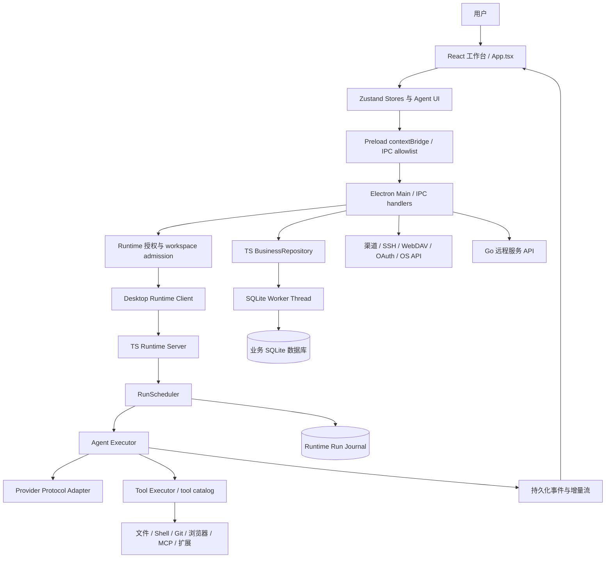
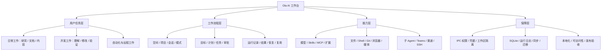
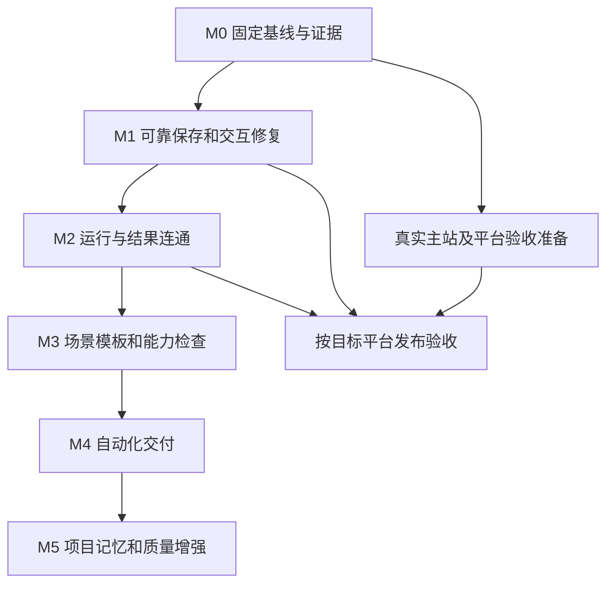

# Ola 当前项目完整架构与功能分析

> 分析日期：2026-09-28  
> 项目版本：`1.0.5`（`package.json`）  
> 分析范围：当前工作区源码、桌面端/独立 TypeScript Runtime、IPC 与安全边界、数据持久化、Go 远程服务、迁移验收台账、构建和现有未提交变更。  
> 方法：读取仓库结构与入口、关键运行时代码、项目说明、迁移验收文档及当前 Git 状态；本次未运行构建、测试或连接外部服务。

## 1. 项目概览

Ola 是一个本地优先的 AI 多智能体协作桌面平台。它以 Electron 为桌面容器，以 React 19 提供工作台界面，并把模型对话、工具调用、代码工作区、自动化、远程访问和外部消息入口汇集到统一的 TypeScript Runtime 与业务数据库中。[source:README.md] [source:package.json] [source:AGENTS.md]

它的产品定位已超出聊天客户端：用户可以配置多个模型供应商，在不同工作区和会话中运行 Agent；Agent 可使用文件、Shell、Git、终端、浏览器、计划/任务/目标、记忆、子 Agent/团队、MCP、扩展和渠道工具。图像/音视频、Draw、CodeGraph、SSH/远程桌面、WebDAV 同步、Cron 等构成外围能力。多项外围能力需要用户配置模型、账户、服务或权限，源码存在不代表当前机器已连接或已完成端到端验收。[source:src/renderer/src/lib/tools/index.ts] [source:src/main/index.ts] [source:src/main/channels/channel-manager.ts]

**整体判断：** Ola 已从旧 Worker 迁移方向转为 TypeScript/WASM 主运行时架构。迁移台账当前记录 358/358 条路由和 18/18 种 CodeGraph 语言为“通过”；产品级退出仍未完成，主要缺口是完整 Electron 功能页验收、真实主站联调、以及多平台原生安装/升级/启动等发布证据。[source:docs/migrations/ts-runtime/acceptance-ledger.json] [source:docs/migrations/ts-runtime/SUPPLEMENTAL-ACCEPTANCE.md] [source:docs/migrations/ts-runtime/acceptance-report-2026-09-20.md]

## 2. 技术栈与仓库构成

| 层/子项目      | 技术与职责                                                                                | 主要源码                                                                                                                                         |
| -------------- | ----------------------------------------------------------------------------------------- | ------------------------------------------------------------------------------------------------------------------------------------------------ |
| 桌面主进程     | Electron 43、Node.js 22+；窗口生命周期、IPC handler、权限/授权、外部服务和 OS 集成        | [source:src/main/index.ts]                                                                                                                       |
| 安全预加载层   | Electron contextBridge；暴露受控 API，检查 IPC channel，支持普通 IPC 与 MessagePack       | [source:src/preload/index.ts] [source:src/shared/ipc/contract.ts]                                                                                |
| 渲染层         | React 19、TypeScript、Vite、Zustand、i18next；聊天/工作区/设置/工具界面                   | [source:src/renderer/src/App.tsx] [source:src/renderer/src/stores] [source:src/renderer/src/locales]                                             |
| Agent Runtime  | TypeScript；Agent loop、Provider 协议、调度、工具执行、Runtime 服务端/客户端、运行记录    | [source:src/runtime/core/agent.ts] [source:src/runtime/scheduler/run-scheduler.ts]                                                               |
| 持久化         | SQLite；TS BusinessRepository 在 Worker Thread 中执行数据库操作，另有 Runtime run journal | [source:src/runtime/storage/business-repository.ts] [source:src/runtime/storage/business-worker.mjs] [source:src/runtime/storage/run-journal.ts] |
| 共享契约       | TypeScript 跨进程类型、IPC channel 与 schema、Runtime/模型/权限契约                       | [source:src/shared]                                                                                                                              |
| 远程服务       | 独立 Go 模块 `ola-remote-server`，含内部服务、部署、迁移和脚本                            | [source:server/go.mod] [source:server/internal] [source:server/deploy]                                                                           |
| 文档站         | 独立 Next.js/Fumadocs 项目，不属于 Electron 运行时                                        | [source:docs/README.md] [source:docs/package.json]                                                                                               |
| 内置扩展与技能 | 可安装扩展、模板、Agent 资源、skills 和 CodeGraph grammar 资源                            | [source:resources] [source:examples/extensions/demo-extension/README.md]                                                                         |

根项目要求 Node.js >=22、npm >=10。桌面构建由 electron-vite/electron-builder 完成，运行时代码另行构建/打包。Go 服务端使用 Go 1.23 和 PostgreSQL/Redis 相关依赖。[source:package.json] [source:server/go.mod]

## 3. 全局架构与关键数据流


```mermaid
graph TD
  User[用户] --> UI[React 工作台 / App.tsx]
  UI --> Stores[Zustand Stores 与 Agent UI]
  Stores --> Preload[Preload contextBridge / IPC allowlist]
  Preload --> Main[Electron Main / IPC handlers]
  Main --> Admission[Runtime 授权与 workspace admission]
  Admission --> RuntimeClient[Desktop Runtime Client]
  RuntimeClient --> RuntimeServer[TS Runtime Server]
  RuntimeServer --> Scheduler[RunScheduler]
  Scheduler --> Agent[Agent Executor]
  Agent --> Provider[Provider Protocol Adapter]
  Agent --> ToolExec[Tool Executor / tool catalog]
  ToolExec --> LocalTools[文件 / Shell / Git / 浏览器 / MCP / 扩展]
  Scheduler --> Journal[(Runtime Run Journal)]
  Main --> BusinessRepo[TS BusinessRepository]
  BusinessRepo --> BusinessWorker[SQLite Worker Thread]
  BusinessWorker --> DB[(业务 SQLite 数据库)]
  Main --> Integrations[渠道 / SSH / WebDAV / OAuth / OS API]
  Main --> Remote[Go 远程服务 API]
  Agent --> Events[持久化事件与增量流]
  Events --> UI
```

**Agent 一次运行：** Renderer 根据会话、workspace、模型绑定、上下文和当前能力发起请求；Main 校验调用者窗口及 workspace 注册状态，再通过 Runtime client 提交。Runtime server 鉴权并检查 workspace authority，`RunScheduler` 负责排队、并发、取消及交互等待；Agent loop 调用 Provider adapter 获取流式文本/工具调用，再由 ToolExecutor 执行已登记工具。事件先写入运行 journal，再被 Runtime client/IPC 投影给 UI。[source:src/main/ipc/ts-runtime-handlers.ts] [source:src/runtime/host/runtime-server.ts] [source:src/runtime/scheduler/run-scheduler.ts] [source:src/runtime/core/agent.ts] [source:src/runtime/tools/tool-executor.ts]

**桌面与 Runtime 的边界：** Runtime 独立监听本机 socket 或 Windows named pipe，连接握手需要随机 token，并协商 protocol version 与 capabilities；Unix socket 权限收紧，帧大小、in-flight 请求数和输出缓冲都有上限。Main 持有 workspace、SSH 连接和凭据等权威状态，Renderer 不应通过 Runtime 请求自带秘密或任意扩大工具能力。[source:src/runtime/host/standalone.ts] [source:src/runtime/host/runtime-server.ts] [source:src/runtime/host/runtime-client.ts] [source:src/shared/runtime/contracts.ts]

## 4. 核心模块与功能清单

### 4.1 Electron 主进程与 IPC

主进程创建窗口、托盘和特殊窗口，注册桌面运行时、业务服务及各类 IPC handler；IPC handler 按领域拆分在 `src/main/ipc/`。工作区注册、调用者 frame 校验和资源归属检查是敏感请求的授权基础。Main 还负责模型/凭据、安全存储、浏览器、MCP、渠道、SSH、终端、文件系统、图像/媒体、Cron 和同步等系统能力。[source:src/main/index.ts] [source:src/main/ipc/ts-runtime-handlers.ts] [source:src/main/ipc/runtime-job-handlers.ts] [source:src/main/window-ipc.ts]

Preload 的通用 IPC 包装先执行 channel 合法性校验，再转到 Electron IPC；生产环境启用严格 allowlist。部分专用 API 通过 MessagePack 传输以处理较大 payload。共享 IPC channel 清单、schema 和类型门面承载 renderer/main 契约。[source:src/preload/index.ts] [source:src/shared/ipc/contract.ts] [source:src/shared/ipc/types.ts] [source:src/shared/messagepack/binary-ipc.ts]

### 4.2 Renderer 工作台

Renderer `App.tsx` 初始化 Provider、渠道、扩展、工具和事件监听，并根据 URL/appView 呈现主工作台、远程页、独立会话等视图。Zustand store 管理聊天、会话、模型、workspace、计划、任务、团队、SSH、Cron 和 UI 状态。聊天功能集中于 chat components/hooks/stores，界面还包含 cowork、代码编辑器、SCM、远程、Draw、设置、任务、skills、凭据、同步和终端等产品区域。[source:src/renderer/src/App.tsx] [source:src/renderer/src/stores] [source:src/renderer/src/components] [source:src/renderer/src/hooks]

内置工具以 registry 为中心，通过 `registerAllTools()` 分阶段装配基础工具、动态 skills/sub-agent 工具、代码兼容工具、Team 工具；Web Search、Canvas、Video、渠道插件工具根据设置或启用状态动态注册。[source:src/renderer/src/lib/tools/index.ts] [source:src/renderer/src/lib/tools/dynamic-tool-catalog.ts] [source:src/renderer/src/lib/agent/tool-registry.ts]

### 4.3 TypeScript Runtime

- **Agent loop：** 逐轮请求模型、发出文本/思考/usage/工具增量事件；设有轮次、工具调用和输出大小限制，能在取消时中止运行。[source:src/runtime/core/agent.ts]
- **调度与交互：** `RunScheduler` 将提交、取消等命令串行化，运行并发有上限；支持排队/运行/等待交互/终态、恢复 journal、用户审批和嵌套运行。[source:src/runtime/scheduler/run-scheduler.ts] [source:src/runtime/storage/run-journal.ts]
- **模型适配：** OpenAI Chat/Responses、Anthropic、Gemini/Vertex 编码/解码统一由 protocol adapter 接口封装；transport 与模型绑定分层。[source:src/runtime/providers/protocol-adapter.ts] [source:src/runtime/providers/transport.ts] [source:src/runtime/providers/model-catalog.ts]
- **工具执行：** Runtime 本地工具覆盖文件读写、Shell、目录/文件搜索与 Git 状态；其他桌面能力通过受控宿主服务/IPC 完成。[source:src/runtime/tools/workspace-tools.ts] [source:src/runtime/tools/tool-executor.ts] [source:src/runtime/host/local-file-service.ts] [source:src/runtime/host/local-shell-executor.ts]
- **独立服务/CLI：** Desktop 启动和 CLI 可连接 standalone Runtime；服务使用租约避免重复拥有者，shutdown 时回收 socket、journal 和 lease。[source:src/runtime/host/standalone.ts] [source:src/runtime/host/cli.ts] [source:scripts/run-ts-runtime-cli.mjs]

### 4.4 数据层与工作区

桌面业务数据由 `BusinessRepository` 对 Worker Thread 中的 SQLite worker 发出请求；Worker 持有 SQLite 连接并执行迁移和事务，避免在 renderer 或业务调用点随意写库。运行状态另由 Runtime `RunJournal` 持久化事件、快照和交互状态。业务库涵盖会话/项目/消息、Provider 使用记录、Cron/任务、团队/扩展及同步等领域，数据目录位于用户配置目录 `~/.ola/`（Windows/macOS/Linux 按平台解析）。[source:src/runtime/storage/business-repository.ts] [source:src/runtime/storage/business-worker.mjs] [source:src/runtime/storage/business-schema.mjs] [source:src/runtime/storage/run-journal.ts] [source:src/main/lib/ola-data-root.ts]

跨设备工作区同步使用 WebDAV、快照/hash/tombstone 和冲突合并机制；账户/远程工作区有在线与离线状态处理。用户数据兼容和数据库 writer handover 是架构关键点，任何 schema 变更都需要保持旧库迁移、备份/恢复及单写入者语义。[source:src/runtime/storage/workspace-sync.ts] [source:src/runtime/storage/workspace-sync-merge.ts] [source:src/runtime/storage/business-handover-coordinator.ts] [source:src/runtime/storage/legacy-database-handover.ts]

### 4.5 外部集成和扩展能力

| 能力                                                                        | 当前源码位置                                                                                                                     | 使用条件/边界                                      |
| --------------------------------------------------------------------------- | -------------------------------------------------------------------------------------------------------------------------------- | -------------------------------------------------- |
| 模型 Provider 与 OAuth                                                      | [source:src/main/provider] [source:src/runtime/providers]                                                                        | 需配置供应商、模型和有效凭据                       |
| MCP                                                                         | [source:src/main/mcp] [source:src/main/ipc/mcp-handlers.ts]                                                                      | 依赖用户配置的远端/本地 MCP server                 |
| 消息渠道：飞书、钉钉、Discord、QQ、Telegram、企业微信、微信公众号、WhatsApp | [source:src/main/channels/providers]                                                                                             | 需平台应用配置、账号和网络                         |
| SSH/SFTP、终端与远程桌面                                                    | [source:src/main/ssh] [source:src/main/ipc/remote-handlers.ts]                                                                   | 需远端主机与授权凭据                               |
| 浏览器/WebView、Cookie 与桌面流程                                           | [source:src/main/browser] [source:src/main/ipc/browser-handlers.ts] [source:src/main/ipc/desktop-flow-handlers.ts]               | 使用隔离 session/profile 和 Main 侧控制权校验      |
| 扩展与应用插件                                                              | [source:src/main/ipc/extension-handlers.ts] [source:src/renderer/src/lib/extensions] [source:examples/extensions/demo-extension] | 受声明式权限、网络白名单和执行边界约束             |
| Cron、Goals、Tasks、Teams                                                   | [source:src/main/cron] [source:src/main/goals] [source:src/renderer/src/components/tasks]                                        | 持久化调度与 workspace 授权；后台运行需要模型可用  |
| 图像、Draw、音频、视频                                                      | [source:src/main/draw] [source:src/main/media] [source:src/main/ipc/image-generation-handlers.ts]                                | 各自依赖外部模型或媒体处理服务，部分功能可配置关闭 |
| CodeGraph                                                                   | [source:src/runtime/codegraph] [source:resources/codegraph/grammars/NOTICE.md]                                                   | TypeScript/WASM 解析并索引工作区代码               |
| 远程协作服务                                                                | [source:server]                                                                                                                  | 独立 Go 服务；需单独部署及配置基础设施             |

## 5. 安全与可靠性设计

1. **进程隔离：** 主进程负责受信系统操作，Preload 暴露有限桥接，Renderer 以 IPC 访问能力；生产 IPC channel 严格校验。[source:src/preload/index.ts] [source:src/shared/ipc/contract.ts]
2. **运行调用者与工作区校验：** Runtime IPC 检查 BrowserWindow、主 frame 和窗口 workspace；workspace 请求还需经过 workspace authority。关键 handler 在执行前后重新检查窗口注册关系，避免异步过程中切换工作区造成越权。[source:src/main/ipc/ts-runtime-handlers.ts] [source:src/main/ipc/runtime-job-handlers.ts] [source:src/main/window-ipc.ts]
3. **能力最小化：** RunSpec 仅允许明确列出的工具名；模型选项过滤凭据类字段，路径、图像、JSON 等输入有大小/结构限制；执行前还应由宿主授权工具。[source:src/shared/runtime/contracts.ts] [source:src/runtime/tools/tool-executor.ts] [source:src/shared/permission-policy.ts]
4. **本机 Runtime 连接保护：** 随机 token、常量时间比较、版本/能力协商、长度前缀帧、请求并发限制和 socket 文件权限共同限制本地服务访问面。[source:src/runtime/host/runtime-server.ts] [source:src/runtime/host/framing.ts] [source:src/runtime/host/standalone.ts]
5. **密钥与数据库：** Provider secret 由 Main 安全存储负责；Renderer/RunSpec 不应携带 secret。TS BusinessRepository writer、手动 handover、锁和回滚证据用于避免旧库数据分叉。[source:src/main/ipc/secure-key-store.ts] [source:src/runtime/storage/business-worker.mjs] [source:src/runtime/storage/business-handover-coordinator.ts]

安全设计覆盖面较大，后续维护重点是确保 IPC channel、schema、Main handler、workspace authorization 和 Renderer 调用点同步演进；对高风险文件、shell、browser、credential、terminal 和桌面输入功能，新增路径应持续纳入权限检查和专门契约覆盖。[source:src/shared/ipc/types.ts] [source:tools/verify-desktop-ipc-authorization.ts] [source:tools/verify-permission-policy.ts]

## 6. TypeScript 运行时迁移与验收状态

当前验收台账数据：

| 条目                              | 状态                 | 解读                                                                                                                   |
| --------------------------------- | -------------------- | ---------------------------------------------------------------------------------------------------------------------- |
| 358 条旧路由映射                  | 358 条“通过”         | 台账记录 TS 实现、生产路径及对应合同/测试证据，不代表全部真实外部场景已完成                                            |
| CodeGraph 语言                    | 18/18“通过”          | 包含语法加载、固定语料、索引/增量和性能专项证据                                                                        |
| P0 基线                           | 通过                 | 基线及验收报告已经登记                                                                                                 |
| P1 Electron 行为/视觉与端到端基线 | 实现中               | 需要继续完整的旧新行为和 Electron E2E 验收                                                                             |
| P2–P9、P11                        | 通过                 | 本地服务、离线/团队 workspace、Agent、调度、业务路由、CodeGraph、数据库 handover、工作台/窗口和浏览器主体有登记证据    |
| P10 全功能页验收                  | 实现中               | 已有启动脚本/日志/截图证据，但台账仍未通过                                                                             |
| P12 总迁移退出                    | 实现中               | 真实主站仍未开始；六个平台原生签名/安装/升级/启动验收尚未齐备                                                          |
| 六个 release target               | 全部“受外部条件阻塞” | Windows/Linux 有 staging build 证据但缺 install/upgrade/launch；macOS 两架构有安装/升级/启动记录但整体仍受发布条件阻塞 |

严格退出门禁与可用性/代码级迁移验收不是同一个概念。即使路由与语言项全过，也不能据此宣称全平台产品迁移和发布验收已完成；最终状态以最新台账、逐平台证据和退出门禁为准。[source:docs/migrations/ts-runtime/acceptance-ledger.json] [source:docs/migrations/ts-runtime/SUPPLEMENTAL-ACCEPTANCE.md] [source:docs/migrations/ts-runtime/evidence/release-staging-current-2026-09-20.md] [source:docs/migrations/ts-runtime/acceptance-report-2026-09-20.md]

## 7. 当前工作区状态与正在进行的改动

分析时 Git 状态为 `main-ts...origin/main-ts [ahead 6]`，并有未提交修改/未跟踪文件。`AI_ANALYSIS.md` 此次被用于刷新本分析。以下变更是**工作区正在进行中的改动**，不应误当作已经合并或通过全部验证：[source:src/runtime/storage/business-schema.mjs] [source:src/shared/ipc/types.ts] [source:tests/runtime/ipc-contract.test.ts] [source:tests/runtime/business-schema-legacy-columns.test.ts] [source:scripts/verify-electron-startup.mjs] [source:docs/migrations/ts-runtime/acceptance-ledger.json] [source:docs/architecture-remediation-plan.md]

- `business-schema.mjs` 增加缺失旧表列的 additive migration/backfill，目标是修复真实旧数据库中 `CREATE TABLE IF NOT EXISTS` 不会补列的问题；未跟踪的 `business-schema-legacy-columns.test.ts` 对应此兼容性改动。需要确认默认 `workspace_id` 归属和旧列类型与现有历史数据契约完全一致。
- `src/shared/ipc/types.ts` 增补了大量 IPC payload schema；`ipc-contract.test.ts` 增加高敏 channel 必须登记 schema 的约束。这样可提高可发现性和类型覆盖，但需要持续维护 push channel 排除规则和真实 handler payload 的一致性。
- Electron 启动验证脚本改为通过 Electron 包入口定位二进制，解决 Windows extension-less shim 启动问题；P10 台账登记了启动证据，但阶段仍是“实现中”。
- 架构优化计划补充了指向专项 remediation plan 的链接；未跟踪的 remediation plan 记录 IPC allowlist/type schema、路径策略共享、工具授权一致性、死代码清理及发布验收缺口。
- 台账和启动截图有本地变化。本次没有运行相关测试或核对截图内容，因此不能判定这些新增证据或兼容性迁移已验证通过。

## 8. 优势、复杂度与主要风险

### 优势

- Runtime 契约和服务可独立于 Electron 主窗口运行，Agent loop、调度与 transport 责任有单独模块边界。[source:src/shared/runtime/contracts.ts] [source:src/runtime/host/standalone.ts]
- 运行事件持久化并支持恢复/查询，交互与取消是调度器的明确状态，不完全依赖 UI 进程内存。[source:src/runtime/scheduler/run-scheduler.ts] [source:src/runtime/storage/run-journal.ts]
- Provider 编解码器、工具 catalog、工作区授权和 BusinessRepository 分层，方便扩展模型与工具并控制宿主权限。[source:src/runtime/providers/protocol-adapter.ts] [source:src/runtime/tools/tool-executor.ts] [source:src/runtime/storage/business-repository.ts]
- 迁移台账对路由、语言、产品阶段、真实主站和平台发布目标分项，降低把“代码存在”误报成“产品已验收”的风险。[source:docs/migrations/ts-runtime/acceptance-ledger.json]
- 静态验证脚本较多，覆盖 IPC、安全授权、浏览器、channel、Runtime 资产、发布和迁移门禁。[source:package.json] [source:.github/workflows/build.yml]

### 复杂度与风险

- 产品范围大、领域多、外部连接多。主进程仍集中注册大量 handler，`App.tsx` 负责多个初始化和状态联接点；改动容易跨越共享类型、Main handler、Renderer store、Runtime 和本地数据库。[source:src/main/index.ts] [source:src/renderer/src/App.tsx]
- `src/shared/ipc/` 的 allowlist、schema 与多个 IPC handler 是高敏契约面；需要防止只新增类型、不对齐注册/授权/调用，或者新增 channel 落入宽松 fallback。[source:src/shared/ipc/contract.ts] [source:src/shared/ipc/types.ts] [source:src/preload/index.ts]
- 用户数据库迁移与历史兼容比新建空库更复杂；当前工作区正补充旧列回填逻辑，后续应重点看多版本旧库、部分迁移失败、备份/回滚和单写入者场景。[source:src/runtime/storage/business-schema.mjs] [source:src/runtime/storage/legacy-database-handover.ts]
- 18 种语法 parser 的加载/解析通过不等于每种语言具备相同的语义精度；实际索引质量仍依赖固定语料覆盖、增量操作和性能预算。[source:src/runtime/codegraph/wasm-parser.ts] [source:tests/runtime/codegraph-all-grammars.acceptance.test.ts]
- 外部 Provider、MCP、消息渠道、SSH、WebDAV、OAuth 和 Go 服务不能只用本地代码检查证明可用；关键使用路径仍需真实账号/环境验证。[source:src/main/channels] [source:src/main/ssh] [source:src/main/sync] [source:server]
- Release evidence 是迁移完成的剩余硬缺口：staging 资产扫描不能代替原生机器签名、安装、升级和冷启动验证；当前台账已把这一差异显式标注。[source:docs/migrations/ts-runtime/evidence/release-staging-current-2026-09-20.md] [source:docs/migrations/ts-runtime/acceptance-ledger.json]

## 9. 构建、开发与质量门禁

常用命令与定义以当前 `package.json` 为准：[source:package.json]

```bash
npm install
npm run dev              # Electron + Vite 开发模式
npm run typecheck        # Main/Node 与 Renderer/Web 类型检查
npm run typecheck:runtime
npm run test:runtime     # Runtime Vitest 行为测试
npm run lint
npm run build            # 类型检查、Electron 资源构建、TS Runtime 构建
npm run build:win        # Windows 安装包
npm run build:mac        # macOS 安装包
npm run build:linux      # Linux 安装包
npm run verify:ts-migration-ledger
npm run verify:ts-migration-exit  # 迁移未完成前预期不通过
```

CI 配置在 GitHub Actions；当前仓库规范说明 CI 覆盖 TypeScript Runtime、Electron、CodeGraph 和 Go 服务端门禁。文档站有独立的 `npm run dev/build/types:check`。[source:.github/workflows/build.yml] [source:docs/package.json] [source:docs/README.md]

本次分析没有执行以上任何验证命令；这里的迁移状态引用仓库已登记的证据，而非本轮新跑出的结果。开发启动和外部服务也未在本次分析中现场启动/连接。

## 10. 建议的阅读顺序

1. 从项目约定、脚本和总览开始：[source:AGENTS.md] [source:package.json] [source:README.zh.md]
2. 看 Renderer 启动及工具装配：[source:src/renderer/src/App.tsx] [source:src/renderer/src/lib/tools/index.ts]
3. 顺着 IPC 和桌面 Runtime 路径阅读：[source:src/preload/index.ts] [source:src/main/ipc/ts-runtime-handlers.ts] [source:src/runtime/host/runtime-client.ts] [source:src/runtime/host/runtime-server.ts]
4. 读调度、Agent、Provider 和工具执行：[source:src/runtime/scheduler/run-scheduler.ts] [source:src/runtime/core/agent.ts] [source:src/runtime/providers/protocol-adapter.ts] [source:src/runtime/tools/tool-executor.ts]
5. 最后看数据库兼容与迁移验收：[source:src/runtime/storage/business-schema.mjs] [source:src/runtime/storage/business-handover-coordinator.ts] [source:docs/migrations/ts-runtime/acceptance-ledger.json] [source:docs/migrations/ts-runtime/SUPPLEMENTAL-ACCEPTANCE.md]

## 11. 结论

Ola 的核心架构已经形成“React Renderer → 受限 Preload/IPC → Electron Main 权限与集成层 → TS Runtime/SQLite”的清晰主干，并有独立 Go 远程服务。Agent、模型适配、工具执行、workspace 授权、调度与数据层均有明确的代码模块和契约。当前最值得关注的工作不是再增加顶层功能，而是持续压低 IPC/Main 的横向耦合、保护旧数据库兼容性，并完成台账剩余的 Electron、真实主站与六平台验收。

从仓库登记证据看，路由和 CodeGraph 迁移已经达到代码级通过；从产品退出标准看，迁移仍未完成。当前未提交的旧库列迁移、IPC schema 覆盖和 Electron 启动修复与这些收口工作直接相关，后续状态应以相应测试结果、最新台账及实际发布证据更新。

<!-- feature-roadmap-2026-10-01 -->

# Ola 功能全景、现有问题与产品路线图

日期：2026-10-01｜版本：1.0.5｜对象：当前工作区，包含未提交改动。

本报告按用户功能而非目录层级组织。依据页面入口、注册表、Store、主进程服务、Runtime 和已有验收记录进行静态分析；本轮没有运行应用、测试、构建或连接外部服务。已有截图只作为历史证据重新审阅。覆盖主要功能域，不宣称每个按钮、每个外部渠道均已逐项验收。

## 1. 产品判断

Ola 已具备“AI 工作台”的功能宽度：对话、执行、项目、代码、浏览器、文档、多智能体、自动化、远程、扩展与个人/团队空间都已有实现。当前更值得投入的是把这些能力连接成稳定的任务闭环：**选场景 → 检查条件 → 执行与审批 → 查看结果 → 恢复失败 → 复用成功经验**。

建议明确两条主线：

- **日常工作**：资料研究、文档处理、内容产出和定时任务。
- **开发工作**：理解项目、修改代码、验证变更和远程诊断。

两条主线共用同一套空间、运行、审批、结果与能力管理。工作/代码配置已经存在，不需要重做一个新平台。[source:src/renderer/src/lib/task-profile.ts]

能力成熟度必须分开表示：**源码已实现、当前可配置使用、完成专项验收、完成真实环境交付**。代码中的 GA/Beta 标签是声明，不能代替运行证据。目前本地 Agent 被声明为 GA，SSH、渠道、Cookie 导入、媒体和统一执行审计声明为 Beta；迁移台账仍有未关闭事项。[source:src/shared/capability-lifecycle.ts] [source:docs/migrations/ts-runtime/acceptance-ledger.json]

## 2. 功能层级


```mermaid
graph TD
  A[Ola AI 工作台] --> B[用户任务层]
  B --> B1[日常工作：研究 / 文档 / 内容]
  B --> B2[开发工作：理解 / 修改 / 验证]
  B --> B3[自动化与远程工作]
  A --> C[工作流程层]
  C --> C1[空间 / 项目 / 会话 / 模式]
  C --> C2[目标 / 计划 / 任务 / 审批]
  C --> C3[运行记录 / 结果 / 恢复 / 复用]
  A --> D[能力层]
  D --> D1[模型 / Skills / MCP / 扩展]
  D --> D2[文件 / Shell / Git / 浏览器 / 媒体]
  D --> D3[子 Agent / Teams / 渠道 / SSH]
  A --> E[保障层]
  E --> E1[IPC 权限 / 凭据 / 工作区隔离]
  E --> E2[SQLite / 运行日志 / 同步 / 迁移]
  E --> E3[本地化 / 可访问性 / 发布验收]
```

以上是产品分层，不是新增导航菜单。技术支撑为 Renderer → Preload → Main → TypeScript Runtime；业务数据与运行日志分开持久化。[source:src/renderer/src/App.tsx] [source:src/preload/index.ts] [source:src/main/index.ts] [source:src/runtime/storage/business-repository.ts] [source:src/runtime/storage/run-journal.ts]

### 2.1 全景功能清单

“已有”表示找到实现与入口，外部服务可用性和发布质量仍需相应验收。

| 一级域               | 二级功能及具体能力                                                                                    | 用户价值与当前判断                                                     | 代码依据                                                                                                                                                                                                                             |
| -------------------- | ----------------------------------------------------------------------------------------------------- | ---------------------------------------------------------------------- | ------------------------------------------------------------------------------------------------------------------------------------------------------------------------------------------------------------------------------------ |
| F01 空间与项目       | 本地个人、个人/团队空间；项目/工作目录；空间切换；会话归属与隔离                                      | 组织上下文和数据；已有，真实主站联调未完成                             | [source:src/renderer/src/stores/workspace-store.ts] [source:src/renderer/src/components/chat/WorkspaceHome.tsx]                                                                                                                      |
| F02 会话工作台       | 新建/搜索/归档；历史；会话标签；空间标签；独立窗口；分屏；导出                                        | 多任务连续工作；已有，恢复场景仍有验收缺口                             | [source:src/renderer/src/components/layout/Layout.tsx] [source:src/renderer/src/stores/chat-store.ts]                                                                                                                                |
| F03 对话与执行       | chat/clarify/execute/acp；工作/代码配置；附件与消息呈现；输入草稿；待发送队列；停止与恢复             | 从问答进入执行；已有，模式与配置需统一解释                             | [source:src/renderer/src/stores/ui-store.ts] [source:src/renderer/src/lib/task-profile.ts] [source:src/renderer/src/hooks/use-chat-actions.ts]                                                                                       |
| F04 目标、计划与任务 | Goal 生命周期；Plan；任务依赖/负责人/状态；跨会话看板；仪表盘/列表/看板/甘特                          | 跟踪长任务；已有，看板有确定功能缺陷，见问题表                         | [source:src/renderer/src/stores/goal-store.ts] [source:src/renderer/src/stores/plan-store.ts] [source:src/renderer/src/components/tasks/TaskBoardPage.tsx]                                                                           |
| F05 编码与项目理解   | 文件浏览/编辑/预览；Shell；终端停靠；Git/变更；CodeGraph；项目 Wiki；AI Coding/ACP                    | 支持理解、修改和验证代码；主体已有，不能把索引验收等同完整开发旅程验收 | [source:src/renderer/src/components/editor] [source:src/renderer/src/components/chat/GitPage.tsx] [source:src/runtime/codegraph] [source:src/renderer/src/components/terminal/ProjectTerminalDock.tsx]                               |
| F06 执行与协作       | Agent 循环；工具调用；审批/提问；子 Agent；Teams；执行详情；后台运行与调度                            | 完成复杂任务；已有，需将多处状态和恢复入口整合                         | [source:src/runtime/core/agent.ts] [source:src/runtime/scheduler/run-scheduler.ts] [source:src/renderer/src/lib/agent/teams] [source:src/renderer/src/components/layout/SubAgentExecutionDetail.tsx]                                 |
| F07 自动化           | 单次/间隔/Cron；时区；启停/立即运行/停止；计划时间线；运行记录；桌面/会话结果投递                     | 重复工作自动执行；已有，需要强化“执行成功”和“投递成功”的分别解释       | [source:src/renderer/src/components/tasks/TasksPage.tsx] [source:src/main/cron] [source:src/renderer/src/stores/cron-store.ts]                                                                                                       |
| F08 能力生态         | Skills 本地管理/市场；MCP；内置应用插件；自定义扩展；Agent/命令资源；Hooks；扩展命令及静态工作台视图  | 扩充任务能力；已有，多个入口术语和可用性需要统一                       | [source:src/renderer/src/components/settings/CapabilityCenterPanel.tsx] [source:src/renderer/src/components/skills/SkillsPage.tsx] [source:src/renderer/src/stores/resources-store.ts] [source:src/renderer/src/lib/extensions]      |
| F09 浏览器与桌面     | Main 浏览器；页面操作；Cookie 导入；网站凭据；桌面控制/流程；截图；网页搜索                           | 跨网页、桌面完成任务；已有且高权限，必须按来源和工作区约束             | [source:src/main/ipc/browser-handlers.ts] [source:src/main/ipc/desktop-flow-handlers.ts] [source:src/main/ipc/desktop-control.ts] [source:src/main/ipc/credentials-handlers.ts]                                                      |
| F10 产物与创作       | 写入/修改文件产物；Markdown/HTML/DOCX/PDF/表格/图片/音视频预览；Draw/图像编辑；Canvas；视频生成；翻译 | 查看和加工交付结果；已有，产物面板是工具记录投影，跨运行管理需增强     | [source:src/renderer/src/components/cowork/ArtifactsPanel.tsx] [source:src/renderer/src/lib/preview/viewers] [source:src/renderer/src/components/draw/DrawPage.tsx] [source:src/renderer/src/components/translate/TranslatePage.tsx] |
| F11 消息渠道         | 飞书、钉钉、Discord、QQ、Telegram、企业微信、微信、WhatsApp 的 Provider；接收/回复/会话路由           | 从外部通讯工具进入任务；已有实现，逐渠道需要真实账户验收               | [source:src/main/channels/providers] [source:src/main/channels/channel-manager.ts]                                                                                                                                                   |
| F12 SSH 与远程       | 连接/分组/导入/密钥；终端；SFTP/文件预览编辑；传输与恢复；进程监控；直接/托管/移动相关远程入口        | 远程开发和诊断；已有，远程桌面与 SSH 是不同能力，不宜混称为都可用      | [source:src/renderer/src/components/ssh] [source:src/renderer/src/components/remote/RemotePage.tsx] [source:src/renderer/src/stores/remote-store.ts] [source:server]                                                                 |
| F13 模型与账户       | 多 Provider；模型目录/参数；主/快模型绑定；账户与额度；Provider 健康；用量统计                        | 可用模型、成本和错误定位；已有，需区分未检测、健康和授权失效           | [source:src/renderer/src/components/settings/settings-registry.ts] [source:src/main/provider/provider-health-registry.ts] [source:src/renderer/src/components/settings/UsagePage.tsx]                                                |
| F14 记忆与个性化     | 全局记忆及自动化；Souls；用户资料；主题/语言；宠物及工作室                                            | 持续上下文和个人偏好；已有，建议作为按需能力，避免挤占任务主入口       | [source:src/renderer/src/components/memory] [source:src/renderer/src/components/souls/SoulsPage.tsx] [source:src/renderer/src/components/settings/PetStudioPage.tsx]                                                                 |
| F15 数据与维护       | SQLite 业务存储；Run Journal；WebDAV 同步/合并；迁移/备份交接；更新；错误恢复；诊断                   | 长期可靠使用；已有，Windows handover 与多平台交付仍需收口              | [source:src/runtime/storage] [source:src/renderer/src/components/sync/SyncPage.tsx] [source:src/renderer/src/App.tsx]                                                                                                                |
| F16 安全与治理       | IPC allowlist/发送 frame；空间授权；工具审批；密钥存储；扩展 sandbox；运行权限                        | 对外部输入和高权限动作建立边界；已有安全修复证据，后续新功能须延续     | [source:src/main/renderer-security.ts] [source:src/main/ipc/db-workspace-authorization.ts] [source:src/shared/permission-policy.ts] [source:src/main/ipc/secure-key-store.ts]                                                        |

### 2.2 应统一的产品概念

| 概念           | 建议定义                         | 界面表达                                   |
| -------------- | -------------------------------- | ------------------------------------------ |
| 工作空间       | 数据、账户与权限边界             | 当前属于哪个空间始终可辨认                 |
| 项目           | 一组工作材料及目录               | 可包含多个会话和结果                       |
| 会话           | 讨论和交互上下文                 | 可多次发起运行，不等同一个任务             |
| 工作/代码配置  | 模型、工具与输出偏好             | 两个主场景配置，默认简化选择               |
| 对话/澄清/执行 | 当前交互方式                     | 普通用户看到动作含义，ACP 放进高级能力     |
| 目标/计划/任务 | 目标描述、步骤安排、可跟踪工作项 | 默认先显示任务；有需要才展开计划和目标     |
| 运行           | 一次具体执行尝试                 | 每次重试有单独记录，关联原任务             |
| 产物           | 可交付文件、内容或链接           | 必须能追溯运行与工作区，明确文件是否仍存在 |

当前 UI 已将旧 cowork/code 模式归一为 execute，不能继续按历史“五模式”描述新界面；工作/代码配置与模式是两个维度。[source:src/renderer/src/stores/ui-store.ts] [source:src/renderer/src/lib/task-profile.ts]

## 3. 现有问题台账

优先级：P0 阻断可靠性/数据正确性；P1 影响主流程；P2 提升效率或交付质量。**静态确认**表示代码能直接支撑；**历史失败**表示引用已有记录、本轮未复跑；**设计缺口/待验证**不作为已复现故障。

| 编号 | 优先级/性质          | 问题与影响                                                                                                                   | 具体整改与验收                                                                                                                                                                                                                                                                                                                     |
| ---- | -------------------- | ---------------------------------------------------------------------------------------------------------------------------- | ---------------------------------------------------------------------------------------------------------------------------------------------------------------------------------------------------------------------------------------------------------------------------------------------------------------------------------- |
| I01  | P0 静态确认          | 任务创建/更新/删除的 DB Promise 使用空 catch，UI 先更新；写库失败时用户可能以为保存成功                                      | 返回保存结果；saving/saved/error 状态；失败回滚或保留可重试草稿。断开存储时不显示成功，重启后与确认成功的数据一致。[source:src/renderer/src/stores/task-store.ts:51]                                                                                                                                                               |
| I02  | P1 静态确认          | TaskStatus 含 failed/cancelled，看板仅五状态；失败/取消任务没有列，列表标签还可能退回 Pending                                | 七状态统一映射；终态可折叠而不可消失；总数、列表和看板可对账。[source:src/renderer/src/stores/task-store.ts:13] [source:src/renderer/src/components/tasks/TaskBoardPage.tsx:25]                                                                                                                                                    |
| I03  | P1 静态确认          | 日期按本地午夜解析，却以 toISOString UTC 回填；东八区选 10 月 1 日可显示 9 月 30 日                                          | 日期字段采用本地年月日或日期字符串；分别定义全天截止与精确时间。UTC+8/UTC-7 的输入、保存、重开保持同日。[source:src/renderer/src/components/tasks/TaskBoardPage.tsx:34]                                                                                                                                                            |
| I04  | P1 静态确认          | 看板、优先级、按钮/ARIA 文案硬编码英文；中文页面不完整                                                                       | 接入 locale，统一状态词；中英文所有视图、详情、空态和辅助文本覆盖。[source:src/renderer/src/components/tasks/TaskBoardPage.tsx]                                                                                                                                                                                                    |
| I05  | P1 历史截图确认      | 760×560 截图中队列 top=603.5，已低于窗口；原测试只验横向边界，因此“可见”的结论不成立                                         | 重新打开 U3；输入区保持可达，状态面板限高且正确分配滚动容器；验证元素上下左右及点击命中，不能只看宽度。[source:analysis/audits/2026-10-01-security-ui/queue-minimum-window.png] [source:analysis/audits/2026-10-01-security-ui/queue-minimum-window-layout.json] [source:tests/runtime/pending-session-queue-electron.test.ts:539] |
| I06  | P1 静态候选          | 设置内部仍存在 10/11px 信息及按钮文字；上次调整主要覆盖侧栏和少量面板                                                        | 建立正文14、说明13、元信息12的初始标准，按信息重要性逐页调整；少量角标可例外。需 100%/125%/150% 缩放和实机确认，不能只全局替换字号。[source:src/renderer/src/components/settings/AccountListEditor.tsx] [source:src/renderer/src/components/settings/AiCodingConfigPanel.tsx]                                                      |
| I07  | P1 历史失败          | 重启后终端停靠恢复的 E2E 尚失败；历史报告归因账户 fixture，但未证明因果                                                      | 分开定位账户初始化、布局持久化和终端重建；记录重启前后项目 ID、偏好、加载顺序。两个项目、窄屏回退和重启均通过才关闭。[source:analysis/audits/2026-10-01-security-ui/整改验收.md] [source:tests/runtime/pending-session-queue-electron.test.ts]                                                                                     |
| I08  | P0 历史失败          | Windows handover fsync EPERM；影响迁移验收，不能因定向安全测试通过而忽略                                                     | 在临时旧库复现并修正文件同步/打开策略；保留持久性、备份校验和回滚保证；不直接跳过所有 sync。[source:src/runtime/storage/legacy-database-handover.ts:71] [source:analysis/audits/2026-10-01-security-ui/整改验收.md]                                                                                                                |
| I09  | P1 静态确认/待复现   | 看板 load 失败只写 console，无 error 状态；旧请求 finally 可提前结束新请求 loading；看板是独立快照                           | 增加 requestId 和 error/retry；订阅任务变更或按版本失效刷新。A→B 快切不闪空；Agent 改任务后看板同步；加载失败不能显示成无任务。[source:src/renderer/src/stores/task-board-store.ts]                                                                                                                                                |
| I10  | P1 设计缺口          | 产物面板只筛 Write/Edit/Delete 工具记录；Shell、媒体、MCP 产出不在该面板同一收集规则内                                       | 复用已有 FinalOutcomeArtifact 建立统一索引；覆盖文件/链接、来源、存在性与工作区。该问题是面板覆盖不足，不是断言全系统没有其他产物呈现。[source:src/renderer/src/components/cowork/ArtifactsPanel.tsx:22] [source:src/renderer/src/lib/api/types.ts]                                                                                |
| I11  | P1 设计缺口          | Goal/Plan/Task/Cron/Run 多对象各有状态；任务看板并不等于所有实际执行的汇总                                                   | 在现有任务页增加运行聚合视图与详情关联，保留领域状态，通过映射呈现，禁止把 Task completed 直接当作 Run succeeded。[source:src/renderer/src/components/tasks/TasksPage.tsx] [source:src/renderer/src/stores/runtime-projection-store.ts]                                                                                            |
| I12  | P1 设计缺口          | 首次成功卡片主要填入 prompt 或跳任务页；就绪判断仅项目存在/固定 true，不能代表模型、权限、投递已就绪                         | 执行前展示缺失条件和直达配置；一条只读或可撤销示例完成后给出结果证据。[source:src/renderer/src/components/chat/FirstSuccessPanel.tsx]                                                                                                                                                                                              |
| I13  | P1 静态风险          | registerAllTools 在异步动态目录完成前置 initialized=true；失败后直接调用注册函数无法完整重试；后续请求刷新能覆盖部分动态能力 | 用初始化 Promise，成功后置完成标志，失败可重试且幂等；模拟动态加载失败后 Team/兼容工具仍可恢复注册。[source:src/renderer/src/lib/tools/index.ts:30] [source:src/renderer/src/lib/tools/dynamic-tool-catalog.ts]                                                                                                                    |
| I14  | P2 设计缺口          | Provider 初始状态 healthy，尚无请求时用户可能误解为已验证可用；能力生命周期和连接健康又是不同概念                            | UI 区分“未检测/可用/降级/失败”，同时标注 GA/Beta；检测时间和错误修复入口独立展示。[source:src/main/provider/provider-health-registry.ts:23] [source:src/shared/capability-lifecycle.ts]                                                                                                                                            |
| I15  | P1 验收缺口          | 迁移 P1/P10/P12 尚未关闭，真实主站未开始，六个平台发布状态受阻                                                               | 按真实平台补安装/升级/启动及主站授权/撤销/流式证据；不使用 mock 或构建成功代替。主线产品完成与发布目标完成分别签收。[source:docs/migrations/ts-runtime/acceptance-ledger.json]                                                                                                                                                     |
| I16  | P2 静态边界/设计缺口 | 甘特仅当前附近三周，缺日期导航/刻度；看板900px最小宽度、甘特760px，详情固定320px                                             | 先定义为轻量排期；提供范围和日期刻度；小屏用列表/抽屉。是否需依赖拖拽排程应待使用需求确认。[source:src/renderer/src/components/tasks/TaskBoardPage.tsx]                                                                                                                                                                            |

### 3.1 上轮安全/UI 问题如何继承

S1（外部导航）、S2（通用 Electron API 暴露）、S3（DB 工作区授权）已有修复和专项记录，本轮纳入持续回归，不重新宣称存在相同漏洞；U1 的局部中文已补，但 I04 是看板其他页面的缺口；U2 仍须扩展到完整字号体系；U3 按 I05 重新验收；U4 的能力 tabs 键盘修复继续保留。[source:analysis/audits/2026-10-01-security-ui/审查报告.md] [source:analysis/audits/2026-10-01-security-ui/整改验收.md]

本报告不把静态规划分析当作新一轮全量安全审计。后续涉及模板、产物、后台重试和跨空间索引的改造，必须沿用发送方、工作区、资源归属和审批边界。

## 4. 建议的信息架构

优先复用已有入口，逐步统一入口名称和跳转：

1. **工作台**：当前项目、继续会话、最近运行、待处理事项、场景模板。
2. **任务与自动化**：任务看板、全部运行、定时任务、待审批/待确认、失败记录。
3. **项目**：会话、文件、代码变更、项目理解、交付结果。
4. **能力**：Skills、MCP、插件/扩展、Agent/命令；一个搜索入口，各类型保留专业配置。
5. **远程**：SSH、远程桌面；明确各自连接和权限状态。
6. **设置**：模型/账户、执行安全、界面、记忆、数据、高级；使用量和创作/宠物可按需进入。

这是入口整合方案，并非要求一次搬迁所有页面。现有设置注册表已分六组、22 个页面，应继续作为唯一导航来源，避免另造路由。[source:src/renderer/src/components/settings/settings-registry.ts]

## 5. 功能设计与可纳入项目的新能力

### R1 可靠任务与一致交互——修复现有功能

- 入口：现有任务看板、任务详情、设置和输入区。
- 流程：编辑 → 保存中 → 成功；失败保留修改内容，显示失败原因、重试与放弃；刷新不能默默覆盖未保存内容。
- 规则：任务修改 API 返回 Promise/确认结果；同一任务并发保存有版本判断；依赖链中的状态统一来源。
- 交付：七状态、正确日期、本地化、存储反馈、实时投影、窄窗布局和终端恢复。
- 完成门槛：I01–I09、I13 对应场景具备明确关闭证据，历史报告的 U3 结论同步更正。

### R2 统一运行与待办中心——增强现有任务页

- 入口：“任务与自动化”增加“运行记录”和“需要处理”；首页只显示数量和最近条目。
- 列表：任务名、来源（会话/定时/渠道/团队）、项目、状态、开始时间、耗时、待处理原因。
- 详情：执行步骤、审批、错误、输出、来源会话及关联任务；以 runId 为关联主键，保留 workspaceId。
- 操作：取消；查看审批；定位原会话；失败重试。重试生成新 attempt，不覆盖原记录；无幂等证据的外部发送/写入必须先人工确认，不自动重放。
- 状态：待执行、执行中、等待审批、等待用户、成功、失败、取消、中断待确认；由已有 Runtime 状态映射，不另建第二套调度器。
- 验收：同一运行在聊天、任务页、通知中的状态一致；重启后仍能定位；切空间无混入；取消不被误报成功。

### R3 结果中心——增强已有产物与预览

- 入口：项目内“结果”，运行详情下“本次产物”；继续复用现有预览器。
- 数据：artifactId、workspaceId、projectId、runId、类型、路径/URL、标题、生成时间、存在状态、可选版本/哈希；优先扩展现有结果类型。
- 流程：工具执行确认产物 → 登记 → 列表预览/打开/复制位置 → 用作下一次任务输入。
- 缺失文件显示“已移动或删除”；外链不自动抓取；默认移除索引不删除本地文件，真正删除需明确动作。
- V1 做检索、来源和存在性，V2 再做版本比较与批量导出；历史产物只能按可确认记录补索引，避免推测文件归属。
- 验收：文件工具、Shell、媒体和扩展产物可按协议登记；重启可检索；跨空间不可见；失败生成不显示成功产物。

### R4 场景模板与执行前检查——小规模新增

- 复用首次成功、Skills、Agent/命令资源与工作配置，不创建另一套工具体系。
- 模板字段：名称、适用场景、输入字段、所需能力、默认输出位置、权限级别、预期结果、版本。
- 首批仅三个：**项目只读体检、资料整理成报告、SSH 只读巡检**。定时报表在投递闭环完成后加入。
- 流程：选模板 → 填材料/范围 → 检查模型、目录、连接、权限 → 补齐配置 → 预览任务 → 执行 → 查看结果 → 保存本次参数。
- 检查只验证条件，昂贵模型请求和外部动作由用户显式触发；未配置不伪装为“正在执行”。
- 验收：新用户不读文档也能完成一条示例；缺任意依赖有准确修复入口；模板可版本升级且不覆盖用户已保存参数。

### R5 能力健康与诊断——统一现有分散状态

- 入口：能力中心增加“可用性”；状态不是仅看启用开关。
- 单项展示：安装、启用、配置、授权、连接、最近调用、版本成熟度；失败原因归类为配置、认证、网络、权限、服务端或未知。
- 提供逐项检测、重新授权、打开配置、脱敏诊断导出。使用已有 Provider health/MCP/渠道状态，先做适配聚合。
- 验收：未检测与不可用分开；关闭能力后工具目录同步撤销；动态目录失败可重试；导出不含密钥、Cookie、消息正文。

### R6 自动化交付闭环——增强现有 Cron

- 入口：现有定时任务编辑器增加“试运行”和“投递结果”步骤。
- 任务详情分别显示调度、执行、投递三个结果；展示时区、下一次执行、模型绑定和目标空间。
- 先做结果投递失败单独重试，避免重新执行整个有副作用任务；设置重试上限和原因，不默认无限重试。
- 暂不加入任意 webhook/DAG 编排。先验证报表、巡检两种真实任务连续多次稳定执行。
- 验收：执行成功但投递失败被准确表达；禁用后无新运行；时区/离线/错过时间策略可解释；失败重试不重复发送。

### R7 项目记忆与可复用经验——第二阶段增强

- 复用全局记忆、项目上下文、Wiki 与 CodeGraph；新增“本项目约定/已确认结论”视图和来源链接。
- 运行结束可建议保存经验，由用户确认后写入；支持撤回、过期和冲突提示。
- 验收：区分模型推测与用户确认；不同项目和团队空间不串记忆；用户删除后未来请求不再注入。

### R8 预算与质量概览——后续增强

- 复用 Usage、模型绑定和运行记录，显示每任务用量、耗时、失败类型及验收结果。
- 先做可解释统计与提示，再做可配置预算上限；缺价格时只展示 token/请求数，不伪造金额。
- 不因低价静默切换模型；模型切换、上下文变化和输出能力差异均须可见。

## 6. 分阶段路线图

以下人日为初始规划估算，非已承诺交付时间。假设一名熟悉代码的全栈开发和按需 QA，无重大底层重构；每阶段开始前用实际复现结果重估。阶段之间按验收依赖推进，不能把开发天数直接换成上线日期。

| 阶段              | 交付范围                                                      | 对应问题         | 开发估算/QA估算        | 退出条件                                                                               |
| ----------------- | ------------------------------------------------------------- | ---------------- | ---------------------- | -------------------------------------------------------------------------------------- |
| M0 问题基线       | 固定代码版本、复现存储/布局/恢复/日期；补齐失败证据和需求清单 | I01–I16 分类确认 | 2–3 / 1–2 人日         | 每项有负责人、复现或明确证据缺口；修正历史过度结论                                     |
| M1 主流程可信     | R1；动态工具初始化恢复；迁移 fsync 修复                       | I01–I09、I13     | 8–12 / 3–5 人日        | 保存不假成功、任务不丢状态、日期正确、窄窗可操作、重启恢复；阻塞未关闭不得宣称全部完成 |
| M2 任务结果连通   | R2、R3 的基础索引；简化轻量排期                               | I10、I11、I16    | 10–15 / 4–6 人日       | 运行→审批→结果→原会话可追溯；重启和空间隔离通过                                        |
| M3 首次成功与复用 | R4、R5；三个首批模板                                          | I12、I14         | 8–12 / 3–5 人日        | 每模板真实完成一次；缺条件准确提示；健康状态有来源和时间                               |
| M4 稳定自动化     | R6；报表与巡检真实投递                                        | 自动化体验增强   | 6–10 / 3–5 人日        | 连续运行记录、投递失败重试和副作用去重验收                                             |
| M5 按反馈扩展     | R7/R8，团队共享模板、成果版本等按需选取                       | 后续建议         | 单独估算               | 有真实使用频率和痛点证据再立项                                                         |
| G 发布证据线      | 主站真实联调、平台原生安装升级、严格迁移退出                  | I15 及 I08/I07   | 取决于账号、设备和环境 | 逐目标完成台账；与 M1 起同步准备，不拖到最后                                           |

M0–M4 开发合计约34–52人日，QA约14–23人日；不包含等待环境和真实业务试用时间。优先批准 M0+M1 的明确整改范围，后续按阶段收口，不一次扩大为全功能重写。


```mermaid
graph TD
  A[M0 固定基线与证据] --> B[M1 可靠保存和交互修复]
  B --> C[M2 运行与结果连通]
  C --> D[M3 场景模板和能力检查]
  D --> E[M4 自动化交付]
  E --> F[M5 项目记忆和质量增强]
  A --> G[真实主站及平台验收准备]
  G --> H[按目标平台发布验收]
  B --> H
  C --> H
```

### 6.1 第一批可直接建立的开发任务

| 任务               | 实施边界                                          | 责任角色     | 完成定义                                         |
| ------------------ | ------------------------------------------------- | ------------ | ------------------------------------------------ |
| T01 任务保存确认   | task-store 的异步保存与错误反馈，不改造整个数据库 | 前端+主进程  | 写失败、连点保存、重启读取均无静默丢失           |
| T02 状态/日期/语言 | TaskBoard 的七状态、日期语义、i18n                | 前端         | 同一任务跨三视图一致；中文无英文漏项；跨时区同日 |
| T03 看板加载同步   | requestId、错误态、任务变更投影                   | 前端         | 快切空间/并发加载/后台改任务均正确               |
| T04 窄屏及字号     | 运行面板、输入区、设置关键文本                    | 前端+设计/QA | 760×560/常用分辨率及系统缩放中主动作可见可操作   |
| T05 终端恢复       | 先最小复现再修布局保存或初始化问题                | 全栈         | 两项目偏好独立、重启恢复、窄屏自动回退           |
| T06 Windows 迁移   | 临时库 handover 的 fsync、备份、回滚              | Runtime      | 失败不破坏旧库；成功可恢复；平台测试证据完整     |
| T07 工具初始化     | 初始化状态机、失败重试及幂等                      | Runtime/前端 | 动态目录异常后可恢复，不遗漏后续注册             |
| T08 历史审查收口   | 将 U3 改为待重新验收，明确终端失败原因未定        | QA/维护者    | 结论与证据一致，保留原过程记录                   |

## 7. 新功能的取舍

| 候选能力               | 建议            | 原因/前置条件                                              |
| ---------------------- | --------------- | ---------------------------------------------------------- |
| 场景模板与预检查       | M3 做最小版本   | 利用已有 Skills/命令/配置，让能力更易使用                  |
| 跨会话结果搜索与复用   | M2 优先         | 用户能找回真正交付物，比再增加入口更直接                   |
| 团队共享模板与标准     | M5 条件成熟再做 | 依赖真实团队空间、权限和版本冲突机制                       |
| 项目记忆与经验确认     | M5 可做         | 复用现有记忆体系，先解决来源与撤销                         |
| 成本/质量对比          | M5 可做         | 已有用量基础，需要可靠 runId 和数据完整性                  |
| 可视化复杂 DAG 工作流  | 暂缓            | 先把 Cron/运行/投递闭环验证完，避免多套执行器              |
| 扩展任意脚本工作台 UI  | 暂缓            | 当前静态隔离视图有明确安全边界；开放交互需独立设计权限协议 |
| 更多渠道、更多媒体入口 | 按真实需求增量  | 先提高已有渠道/媒体成功率及错误解释能力                    |
| 宠物社交/独立内容社区  | 暂缓            | 目前与主任务完成度关联较弱，优先维护已有体验               |

## 8. 验收与衡量方式

以下是拟定标准，不是本次已测结果：

- **正确性**：保存成功后的重启读取一致；日期、状态、空间归属无已知错配；失败有反馈与可恢复路径。
- **可用性**：三条核心路径在中文界面完成，关键操作键盘可达；小窗口与缩放下不隐藏输入/确认按钮。
- **可追溯性**：任务、run、审批、产物和错误有明确关联；不能把“工具调用完成”当作“业务结果成功”。
- **可靠性**：故障注入覆盖断网、授权失效、存储写失败、运行取消、窗口关闭和重启；涉及真实外部副作用使用专用测试账号。
- **性能**：先记录固定项目/历史量/设备的首页、任务加载和输入响应基线，再约定回归阈值；不凭空承诺毫秒指标。
- **产品效果**：记录首次成功耗时、任务完成率、失败恢复率、产物找回率、模板复用率；先收集基线，默认本地汇总，任何远程遥测另行设计并让用户知情。
- **发布**：类型检查、相关行为测试、UI证据、平台安装升级、真实主站证据分别记录；一个通过不能替代另一个。

每项开发卡必须有：问题编号、用户场景、界面/状态设计、影响模块、依赖、异常处理、验收步骤、证据路径和回滚方式。新增数据使用版本化迁移；优先增量字段/索引，不复制现有任务或调度体系。

## 9. 结论与实施边界

近期重点是“保存可靠、状态完整、交互清楚、结果找得到”。先完成 M1，再推进统一运行和结果中心；随后用少量真实模板验证首次成功，最后扩展自动化和团队复用。

本轮交付为功能梳理和规划，未修改业务代码、未复跑测试。已重新核对历史证据并指出 U3 误判；历史报告本体未改写，T08 负责在正式整改时记录更正与新验收结果。全景清单覆盖当前主要功能域，I01–I16 是本轮发现和继承的问题，并不代表代码库不存在其他缺陷。
