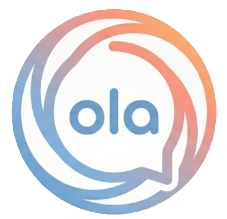

<p align="center">
  <a href="https://github.com/Leevity/Ola">
    
  </a>
  <h1 align="center">Ola</h1>
  <p align="center">
    <strong>A local-first desktop platform for multi-agent AI collaboration</strong><br>
    Turn coding, research, planning, automation, and cross-app workflows into natural language conversations.
  </p>
</p>

<p align="center">
  <a href="README.zh.md">中文文档</a> •
  <a href="#why-ola">Why</a> •
  <a href="#key-features">Features</a> •
  <a href="#architecture">Architecture</a> •
  <a href="#quick-start">Quick Start</a> •
  <a href="https://lbxai.cn/">Homepage</a>
</p>

<p align="center">
  
  
  
  
</p>

---

## 🚀 Why Ola?

Most AI chat interfaces are isolated from your actual work environment. You spend half the time copy-pasting code, file contents, and terminal output between windows.

**Ola puts the agent on your machine:**

- **Direct filesystem access** — Agents read, write, and edit files in your project with your approval.
- **Shell execution** — Run commands, check logs, and manage dev servers without leaving the conversation.
- **Full context awareness** — Agents explore your codebase on their own. No manual context feeding.
- **Human-in-the-loop** — Transparent tool-call approval keeps you in control at every step.

## ✨ Key Features

### ⚙️ Runtime

- **4-layer Electron architecture** — Main process, Preload bridge, Renderer UI (React 19), and provider-agnostic agent runtime backed by a .NET native sidecar.
- **Typed cross-runtime contracts** — TypeScript DTOs and audited C# protocol mirrors from SQLite
  routes through IPC to the UI.
- **SSH remote support** — Agents operate on remote hosts transparently via SSH with xterm.js terminal integration.

### 🔄 4 Agent Modes

Every conversation picks the right mode:

| Mode      | Purpose                                                                                           |
| --------- | ------------------------------------------------------------------------------------------------- |
| `clarify` | Ask grounded questions, resolve ambiguity, produce a reviewable plan before any code is written.  |
| `cowork`  | Full agent: code search, file I/O, shell, browser, sub-agent delegation, and more.                |
| `code`    | Pair programming — focused code generation and surgical editing with Monaco Editor integration.   |
| `acp`     | Architecture-control lead: clarify, design, decompose, and delegate implementation to sub-agents. |

### 🧰 Tool System

- **File & Shell** — Read, Write, Edit, Glob, Grep, Bash (local and SSH).
- **Browser** — Built-in webview with navigate, snapshot, click, type, and content extraction.
- **Task & Team** — Decompose work with TaskCreate/TaskUpdate, spawn parallel sub-agents via Task, and orchestrate Agent Teams with TeamCreate/SendMessage/TeamStatus.
- **Plan Mode** — EnterPlanMode → write plan → ExitPlanMode for structured, reviewable implementation plans.
- **Goal Tracking** — Create, track, and complete session-level goals with token budgets.
- **Memory System** — Layered memory: global SOUL.md / USER.md / MEMORY.md and per-project .agents/ overrides.
- **Cron Agent** — Schedule recurring or one-shot background agent tasks with multi-channel delivery.
- **MCP Client** — Connect to Model Context Protocol servers (stdio, SSE, streamable-HTTP) and expose active MCP tools directly to the agent.
- **Skill System** — Install domain-specific skills from the Skills Market; loaded dynamically and surfaced to the agent at runtime.
- **Custom Extensions** — Build plugins with declarative HTTP tools, sandboxed JS handlers, and custom HTML renderers.

### 💬 Messaging Plugins

Ola ships with integrations for several messaging platforms so the agent can reach you where you already are.

| Platform            | Support |
| ------------------- | ------- |
| Feishu / Lark       | ✅      |
| DingTalk            | ✅      |
| Discord             | ✅      |
| QQ                  | ✅      |
| Telegram            | ✅      |
| WeCom (WeChat Work) | ✅      |
| WeChat Official     | ✅      |
| WhatsApp            | ✅      |

### ⏰ Persistence

- **SQLite** — Messages, sessions, projects, tasks, and plans survive restarts.
- **Additive schema** — Columns are added when absent; no migration files, no data loss.

### 🌐 Internationalization

13+ languages including English, Chinese, Vietnamese, Turkish, and more — all via i18next.

## 🏗️ Architecture

```
Renderer (React 19)  ←→  Preload (contextBridge)  ←→  Main Process
     │                                                      │
  Agent Loop ─ Tool Registry ─ IPC ──────────→  IPC Handlers
     │                                              │
     ├─ File I/O, Grep/Glob, Bash              SQLite (via .NET sidecar)
     ├─ Browser (webview)                       Shell / SSH (node-pty, ssh2)
     ├─ Sub-Agents & Teams                      Messaging Plugins
     ├─ Plan, Goal, Memory                      MCP Client
     ├─ Skills & Extensions                     Cron Scheduler
     └─ MCP Resources                           File System
```

- **Renderer** — React 19 + Tailwind CSS + Zustand stores. Owns the message surface, approvals, and session UX.
- **Preload** — Narrow `contextBridge` API for secure main↔renderer communication.
- **Main Process** — Window and process orchestration, IPC, messaging plugins, cron, and MCP client.
- **Agent Runtime** — Provider-agnostic and hosted by the .NET 10 `Ola.Native.Worker`. Electron main
  supervises it and bridges MessagePack streams, approvals, and renderer-owned tools. The same
  worker owns SQLite, file I/O, and other native capabilities.

## 🛠️ Quick Start

**Prerequisites:** Node.js ≥ 22, .NET 10 SDK, native build toolchain (Xcode CLT on macOS, build-essential on Linux, MSVC on Windows).

```bash
git clone https://github.com/Leevity/Ola.git
cd Ola
npm install
npm run native:publish   # build the .NET sidecar
npm run dev
```

### Key Commands

| Command                  | Description                                     |
| ------------------------ | ----------------------------------------------- |
| `npm run dev`            | Start Electron + Vite with hot reload           |
| `npm run build`          | Typecheck then build for production             |
| `npm run build:win`      | Build Windows installer                         |
| `npm run build:mac`      | Build macOS .dmg/zip                            |
| `npm run build:linux`    | Build Linux .AppImage/.deb                      |
| `npm run lint`           | ESLint with cache                               |
| `npm run typecheck`      | TypeScript check (main + renderer)              |
| `npm run format`         | Prettier auto-format                            |
| `npm run native:publish` | Build the .NET sidecar for the current platform |

> **Data directory:** `~/.ola/` — SQLite database, config, agents, skills, commands, and prompts.

## 🌟 Use Cases

- **Autonomous coding** — Agents refactor, debug, and write code directly in your workspace.
- **Scheduled ops** — Cron agents monitor logs or system health and report to Feishu / DingTalk / Discord.
- **Data research** — Scrape web pages, process CSVs, generate reports with charts.
- **Remote management** — Operate on remote servers via SSH without leaving the app.

## 📖 Documentation

The full documentation site lives at **[lbxai.cn](https://lbxai.cn/)**.

## 🤝 Contributing

We welcome contributions! See [AGENTS.md](AGENTS.md) for the development guide, coding conventions, and commit message format.

## 📜 License

[Apache License 2.0](LICENSE)

---

<div align="center">

⭐ If this project helps you, please give it a star.

Made with ❤️ by the **Ola** Team

</div>
