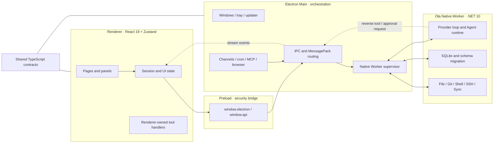

# 整体架构概览 / Architecture Overview

Ola 是 Electron、React 和 .NET Native Worker 组成的本地优先桌面应用。Renderer 管理交互，
Electron Main 管理系统边界和进程生命周期，`Ola.Native.Worker` 承担 Agent Runtime、SQLite
以及主要原生能力。Preload 只暴露受控桥接，`src/shared` 保存跨进程协议。

## 架构图 / Architecture diagram

## 四层职责 / Layer responsibilities

### Renderer

- React 页面、会话展示、权限弹窗和用户交互。
- Zustand 保存 UI 状态和面向用户的配置。
- 仅执行必须访问 Renderer 状态的 reverse-request 工具。
- 不直接打开 SQLite，不托管模型 provider loop。

### Preload

- 在 `contextIsolation` 边界上提供受控 Electron API。
- 不承载领域逻辑，不通过 `nodeIntegration` 绕过 Main。

### Electron Main

- 创建窗口、托盘、更新器并注册 IPC。
- 启动、心跳检查、重启和关闭 Native Worker。
- 在 Renderer IPC 与 Worker MessagePack 协议之间路由请求和流事件。
- 管理 channels、cron、MCP、浏览器、SSH 窗口等需要 Electron 生命周期的服务。

### Native Worker

- 运行 provider-agnostic Agent loop、上下文压缩、工具调度和流事件生成。
- 通过 reverse requests 请求 Renderer 工具或人工审批。
- 打开 `~/.ola/data.db`，执行查询和增量 schema migration。
- 提供 File、Git、Shell、SSH、Sync、Settings 等原生路由。

## 核心调用链 / Core request flow

1. Renderer 构造带 session、provider、tool 和权限快照的 Agent 请求。
2. Main 的 sidecar bridge 把请求发送到 Native Worker。
3. Worker 从 SQLite 或请求负载装配上下文并运行 provider loop。
4. 原生工具在 Worker 内执行；Renderer 工具和审批通过 reverse request 返回 Main/Renderer。
5. Worker 发送带 `runId`、`sessionId` 和序号的 MessagePack 流事件。
6. Renderer 只把匹配当前 session/run 的事件写入状态，并把最终消息持久化。

## 数据边界 / Data boundaries

| 数据                    | 权威所有者                      | 说明                                |
| ----------------------- | ------------------------------- | ----------------------------------- |
| SQLite schema and rows  | Native Worker                   | Main 中的 DB 文件是 typed bridge    |
| Agent run lifecycle     | Native Worker + Main supervisor | Renderer 只展示派生状态             |
| UI/session presentation | Renderer                        | Zustand 与会话路由负责前台/后台切换 |
| Secrets                 | Electron Main                   | Renderer 只接收脱敏 metadata        |
| Cross-process DTOs      | `src/shared`                    | TS/C# 镜像需要契约校验              |

## 关键实现 / Key implementation

| Component                | Responsibility                                   | Source                                             |
| ------------------------ | ------------------------------------------------ | -------------------------------------------------- |
| Native worker supervisor | spawn、heartbeat、restart、MessagePack framing   | `src/main/lib/native-worker.ts`                    |
| Agent bridge             | handshake、active runs、reverse requests         | `src/main/ipc/native-agent-runtime.ts`             |
| Sidecar IPC              | Renderer routing、permissions、stream forwarding | `src/main/ipc/sidecar-manager.ts`                  |
| Agent Runtime            | providers、tools、compression、stream            | `sidecars/Ola.Native.Worker/Modules/AgentRuntime/` |
| SQLite module            | schema migration and data routes                 | `sidecars/Ola.Native.Worker/Modules/Db/`           |
| Tool registry            | Renderer-owned tool definitions                  | `src/renderer/src/lib/agent/tool-registry.ts`      |

## 设计约束 / Invariants

- 数据库迁移只做增量修改；不得要求用户删除 `~/.ola`。
- `Ola.Native.Worker`、`OLA_*` 和 `~/.ola` 是产品身份，不能从参考项目复制改名。
- Renderer、Main、Worker 的 route 和 payload 必须通过 shared type 或自动契约审计保持一致。
- Worker 断连必须终止其拥有的 run，不能让 Renderer 永久显示生成中。
- 引入 OpenCowork 能力前运行 `npm run audit:sync`，区分品牌差异和行为差异。
