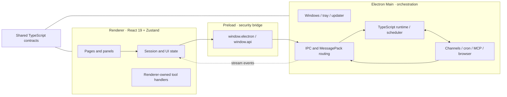

# 整体架构概览 / Architecture Overview

Ola 是 Electron、React 和 TypeScript 运行时组成的本地优先桌面应用。Renderer 管理交互，
Electron Main 管理系统边界和进程生命周期，Main/Runtime 承担 Agent、SQLite 以及主要本地能力。
Preload 只暴露受控桥接，`src/shared` 保存跨进程协议。

## 架构图 / Architecture diagram

```mermaid
flowchart LR
  subgraph Renderer["Renderer · React 19 + Zustand"]
    UI["Pages and panels"]
    Stores["Session and UI state"]
    Tools["Renderer-owned tool handlers"]
  end

  subgraph Preload["Preload · security bridge"]
    Bridge["window.electron / window.api"]
  end

  subgraph Main["Electron Main · orchestration"]
    Windows["Windows / tray / updater"]
    IPC["IPC and MessagePack routing"]
    Runtime["TypeScript runtime / scheduler"]
    Services["Channels / cron / MCP / browser"]
  end

  Shared["Shared TypeScript contracts"]
  UI --> Stores --> Bridge --> IPC --> Runtime
  Runtime <--> Services
  IPC -. "stream events" .-> Stores
  Services --> IPC
  Shared --- Renderer
  Shared --- Main
```

## 四层职责 / Layer responsibilities

### Renderer

- React 页面、会话展示、权限弹窗和用户交互。
- Zustand 保存 UI 状态和面向用户的配置。
- 仅执行必须访问 Renderer 状态的 UI 工具。
- 不直接打开 SQLite，不托管模型 provider loop。

### Preload

- 在 `contextIsolation` 边界上提供受控 Electron API。
- 不承载领域逻辑，不通过 `nodeIntegration` 绕过 Main。

### Electron Main

- 创建窗口、托盘、更新器并注册 IPC。
- 管理 TypeScript Runtime、窗口、任务调度和 MessagePack/IPC 路由。
- 为 Renderer、渠道、Cron 和团队运行提供统一取消、审批和空间授权。
- 管理 channels、cron、MCP、浏览器、SSH 窗口等需要 Electron 生命周期的服务。

### TypeScript Runtime

- 运行 Agent loop、上下文压缩、工具调度和流事件生成。
- 通过受控 IPC 请求 Renderer UI 工具或人工审批。
- 打开 `~/.ola/data.db`，执行查询和版本化 schema migration。
- 提供 File、Git、Shell、SSH、Sync、Settings 等本地路由。

## 核心调用链 / Core request flow

1. Renderer 构造带 session、provider、tool 和权限快照的 Agent 请求。
2. Main 将请求交给 TypeScript Runtime。
3. Runtime 从 SQLite 或请求负载装配上下文并运行 provider loop。
4. 本地工具在 Main/Runtime 内执行；Renderer 工具和审批通过受控 IPC 返回。
5. Runtime 发送带 `runId`、`sessionId` 和序号的 MessagePack 流事件。
6. Renderer 只把匹配当前 session/run 的事件写入状态，并把最终消息持久化。

## 数据边界 / Data boundaries

| 数据                    | 权威所有者                | 说明                                |
| ----------------------- | ------------------------- | ----------------------------------- |
| SQLite schema and rows  | TypeScript Main/Runtime   | 单一 writer，按 workspace 授权      |
| Agent run lifecycle     | TypeScript Runtime + Main | Renderer 只展示派生状态             |
| UI/session presentation | Renderer                  | Zustand 与会话路由负责前台/后台切换 |
| Secrets                 | Electron Main             | Renderer 只接收脱敏 metadata        |
| Cross-process DTOs      | `src/shared`              | 所有边界通过 TypeScript 契约校验    |

## 关键实现 / Key implementation

| Component          | Responsibility                          | Source                                        |
| ------------------ | --------------------------------------- | --------------------------------------------- |
| TypeScript runtime | providers、tools、compression、stream   | `src/runtime/`、`src/main/runtime/`           |
| Main IPC           | routing、permissions、stream forwarding | `src/main/ipc/`                               |
| SQLite module      | schema migration and data routes        | `src/main/db/`、`src/runtime/storage/`        |
| Tool registry      | Renderer-owned tool definitions         | `src/renderer/src/lib/agent/tool-registry.ts` |

## 设计约束 / Invariants

- 数据库迁移只做增量修改；不得要求用户删除 `~/.ola`。
- `~/.ola` 是本地数据目录；生产构建不得包含旧 Worker 或 .NET 可执行资产。
- Renderer、Main、Runtime 的 route 和 payload 必须通过 shared type 或自动契约审计保持一致。
- Runtime 失败或重启必须终止/恢复其拥有的 run，不能让 Renderer 永久显示生成中。
- 引入 Ola 能力前运行 `npm run audit:sync`，区分品牌差异和行为差异。
