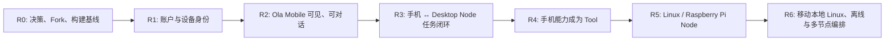

# 移动端优先的 Mesh 开发计划

> 关联目标架构：[多设备 Agent Mesh 架构规划](/docs/reference/multi-device-agent-mesh)。

## 1. 目标与开发策略

本计划同时交付两个结果，且两者必须在每一个阶段相互验证：

1. **完整 Mesh 基础**：中心化身份、设备注册、能力授权、P2P/Relay 通道、跨 Node 任务与审计。
2. **可发布的 Ola Mobile**：基于 OpenMinis 原生 iOS/Android 壳，能够作为 Ola 的移动客户端和 Mobile Node，最终产出 Android APK/AAB 与 iOS IPA/TestFlight 包。

开发顺序调整为 **Mobile-first vertical slices**：优先做能让手机真实连接和控制现有 Ola Desktop 的最小 Mesh，而非先完成通用 Linux/Pi Node 后才开始手机端。



### 1.1 第一版产品定义

首个可交付版本命名为 **Ola Mobile Preview**。它不是 OpenMinis 的换皮版，而是接入同一 Ola Account、同一设备网络、同一任务协议的移动端。

用户可完成以下闭环：

```text
手机登录 Ola
  → 查看自己的 Ola Desktop
  → 打开或创建会话
  → 向 Desktop Agent 下发任务
  → 实时看见 Agent 消息、工具状态、终端输出和审批
  → 在手机上批准/拒绝 Desktop 的高风险操作
  → 从分享菜单把文本、链接、图片发送给 Ola
```

第二个闭环是反向调用：

```text
Desktop Agent
  → 请求 mobile.camera.capture / mobile.clipboard.read
  → 手机显示审批和系统权限
  → 手机执行能力并回传结果
```

## 2. 仓库与代码所有权决策

### 2.1 推荐仓库布局

OpenMinis 必须保持为独立移动端工程，不把其 Swift、Kotlin、JNI、iSH 或 PRoot 文件复制到 Electron 主仓库。

```text
Ola/                              # 当前仓库：Desktop、Control Plane、共享规范
  docs/
  server/
  src/
  packages/ola-protocol/          # 新增：跨 Node 协议规范与生成代码
  packages/ola-node-ts/           # 新增：Desktop adapter / protocol test harness

ola-mobile/                       # 新仓库：从 OpenMinis fork，建议同组织管理
  src/ios/                        # Swift / SwiftUI
  src/android/                    # Kotlin / Compose
  ola-protocol/                   # Git submodule、发布包或生成文件镜像
  docs/ola-adapter.md
```

选择独立仓库的原因：

- OpenMinis 的原生构建链、子模块和 GPLv3 义务与 Electron 发布链不同。
- Android/iOS CI、签名证书、App Store/Play Console 配置不应耦合 Desktop CI。
- 未来需要停止使用 OpenMinis 或替换实现时，Ola Mesh 协议不受移动壳束缚。

`ola-protocol` 是两个仓库之间唯一共享的“强契约”。第一阶段使用 JSON Schema + TypeScript 生成类型；移动端手写/自动生成 Kotlin 与 Swift DTO。协议稳定后再评估 Protobuf。

### 2.2 OpenMinis 的保留、替换与暂缓

| 类别                                   | 处理                              | 原因                                                                         |
| -------------------------------------- | --------------------------------- | ---------------------------------------------------------------------------- |
| Android Compose / iOS SwiftUI UI 基础  | 保留并品牌替换                    | 快速获得原生聊天、输入、权限和系统交互能力                                   |
| Share Extension、Widget、File Provider | 保留并接 Ola task intake          | 这是 Ola Mobile 的高价值移动入口                                             |
| iSH / PRoot / Alpine sandbox           | 保留构建能力，但 R0–R4 默认不依赖 | 不让复杂原生依赖阻塞手机与 Desktop 的首条闭环                                |
| Provider、API Key、OAuth、Agent loop   | 适配/隔离                         | 以 Ola Account、Ola session 与 Ola Desktop executor 为主；避免双运行时事实源 |
| OpenMinis Memory / Workspace           | 暂不与 Ola 全量同步               | 先用会话附件和文件引用；后期再设计明确同步规则                               |
| 设备工具                               | 映射到 `mobile.*` capability      | 让 Desktop/Pi/CLI 都能按同一协议调用                                         |

> OpenMinis 为 GPLv3，且其本地 Linux 依赖涉及 iSH/PRoot。实际 fork、重新分发和闭源/商业策略须先完成法务评估；本计划不是法律意见。

## 3. 工作流、团队并行与依赖

### 3.1 三条并行工作流

| 工作流                  | 主要目录                                                 | 负责结果                                  | 不应等待的事项           |
| ----------------------- | -------------------------------------------------------- | ----------------------------------------- | ------------------------ |
| A. Mesh / Control Plane | `server/`, `packages/ola-protocol/`                      | 身份、Node、Ticket、信令、事件协议        | 不等待移动 UI 完成       |
| B. Desktop Node         | `src/main/remote/`, `src/shared/`, Native Worker adapter | 将现有 Agent run 转为跨 Node task/event   | 不等待 Linux Node        |
| C. Ola Mobile           | `ola-mobile`                                             | 原生 UI、登录、配对、会话、审批、移动能力 | 不等待移动 Linux sandbox |

所有跨工作流接口先写入 `ola-protocol` 的 Schema 和契约测试；禁止 B/C 直接依赖对方私有类型。

### 3.2 开发环境与分支

| 组件       | 分支/发布策略                                                                  |
| ---------- | ------------------------------------------------------------------------------ |
| Ola 主仓库 | `codex/mesh-*` 或团队约定 feature branch；协议变更需 ADR + 版本号              |
| ola-mobile | fork 的 `ola/main` 跟踪上游；`ola/mesh-adapter` 承载 Ola 修改；记录上游 commit |
| 协议       | `v0alpha1`、`v0beta1` 等显式版本；新增字段向后兼容，不无版本删除字段           |
| API        | `/api/mesh/v1/...`，与现有 `/api/devices`、`/api/pairing` 保持迁移兼容         |

## 4. 发布节奏与详细里程碑

### R0 — 基线、许可与协议冻结（1–2 周）

**目的**：确保移动端工程能构建，且两仓库的边界没有法律与架构盲点。

工作项：

- 创建 `ola-mobile` 私有/组织 fork，保留 OpenMinis 上游 remote 和 commit 记录。
- 在 macOS 真机环境构建 OpenMinis iOS baseline；在 Android 环境构建 debug APK baseline。
- 记录 Xcode、Swift、JDK、NDK、Android SDK、CMake、子模块与 rootfs 构建版本。
- 写 ADR：GPLv3 分发策略、独立仓库、Mobile v0 不依赖本地 Linux、协议所有权。
- 在 Ola 主仓库创建 `packages/ola-protocol`，仅含版本、Node/Task/Event/Approval DTO 和 JSON Schema。
- 明确品牌资产、Bundle ID、Android `applicationId`、iOS Team ID、隐私说明与签名主体；不在代码或仓库提交证书和密钥。

验收：

- Android 能稳定产生未签名 debug APK。
- iOS 能在真机完成 unsigned build；模拟器问题单独记录，不阻塞真机。
- Ola Desktop 和 ola-mobile 均能编译基线。
- 协议 fixture 可由 TypeScript 解析并校验。

### R1 — 统一账户与设备身份（2 周）

**目的**：手机不再使用独立 OpenMinis 身份，而是成为 Ola Account 下的一台 Device/Node。

Control Plane：

- 扩展现有 `accounts`、`devices`、pairing、JWT/撤销逻辑；保留旧 Remote Control API 兼容。
- 增加 `nodes`（设备上的运行时实例）、Node public key、app version、平台、能力 manifest 版本。
- 增加 `/api/mesh/v1/auth/*`、`/nodes/register`、`/nodes/heartbeat`、`/nodes/capabilities`。
- 注册响应返回设备凭据/密钥登记结果，不将长期私钥上传给服务器。

Mobile：

- 替换/新增 Ola Login 页面与安全凭据存储（iOS Keychain、Android Keystore）。
- 首次登录注册为 `platform: ios|android` 的 Device 和 `runtime: ola-mobile` 的 Node。
- 心跳、退出登录、设备撤销和重新注册。

Desktop：

- 将已有 Remote Account 记录扩展到 Mesh Node identity；现有 `device-register`、heartbeat 迁移到兼容路径。

验收：同一账号下，Ola Desktop 与 Android/iOS 各自显示为不同在线设备；任一设备撤销后不能再取得新会话 ticket。

### R2 — Ola Mobile 可见、可对话（2–3 周）

**目的**：用户看见的是 Ola，而不是一个独立的 OpenMinis App。

Mobile：

- 完成名称、图标、主题、文案、隐私页和 Bundle ID 品牌替换。
- 映射 Ola 会话模型：会话列表、消息流、run 状态、工具卡片、错误与重试。
- 提供设备页：在线状态、能力、版本、撤销、配对二维码/短码。
- 通过 HTTPS/WebSocket 从 Control Plane 获取会话目录和已授权 Desktop Node。
- 暂时不要求本地 Agent；“发送消息”优先转发到已选的 Desktop Node。

Desktop / Control Plane：

- 定义最小 `session.list`、`session.get`、`message.send`、`run.subscribe` API，或将它们透传为 `task.*`。
- 将 Native Worker 的 stream event 映射为协议事件，保证 `runId`、`sessionId`、`sequence` 可重放。

验收：手机可选择 Desktop、创建/打开会话、发送一句任务，并看到 Desktop Agent 的流式文本结果。

### R3 — 移动端控制 Desktop Agent 的 Mesh 闭环（2–3 周）

**目的**：完成首个真正跨设备执行链路。

工作项：

- Control Plane 签发绑定 `sourceNode`、`targetNode`、`session`、`capability` 和过期时间的短期 ticket。
- Desktop Node 对 ticket、nonce、过期、目标、策略和本地审批进行校验。
- 使用既有 WebRTC 信令/TURN 建立优先 P2P 的 data channel；v0 可先用经认证 WebSocket relay，保证先可用后直连优化。
- 实现 `task.start`、`task.event`、`task.cancel`、`task.resume` 和 `approval.resolve`。
- 移动端显示工具执行、终端 stdout/stderr、审批和完成/失败状态；断网后可从 sequence 恢复。

首条验收链路：

```text
Android/iPhone 发送“检查电脑项目的测试状态”
  → Control Plane 鉴权、签发 ticket
  → Mobile 连接 Desktop Node
  → Desktop Agent 执行已批准工具
  → 手机实时展示输出
  → 手机批准一次高风险操作或拒绝它
  → 最终状态与审计摘要保存
```

验收：Android 真机和 iOS 真机均完成此闭环；P2P 失败时 Relay 仍可完成；无 ticket、过期 ticket、错误目标 ticket 均被 Desktop 拒绝。

### R4 — 手机成为可调用的 Mobile Node（2–3 周）

**目的**：不仅“手机控制电脑”，也让 Ola 使用手机独有能力。

首批能力：

| Capability                 | iOS / Android 实现                   | 默认策略 |
| -------------------------- | ------------------------------------ | -------- |
| `mobile.share.ingest`      | Share Extension / Android Sharesheet | safe     |
| `mobile.files.read`        | Document picker / scoped storage     | 每次确认 |
| `mobile.camera.capture`    | 系统相机与媒体库                     | 每次确认 |
| `mobile.clipboard.read`    | 平台剪贴板 API                       | 每次确认 |
| `mobile.notification.send` | 本地/远程通知                        | safe     |

工作项：

- 将 OpenMinis 的系统工具封装成 Ola capability provider，不暴露其内部工具协议。
- Desktop Agent 将远程能力作为正式 Tool registry 中的 `mobile.*` 工具。
- 设置系统权限、拒绝、超时、后台被系统终止和大文件传输的可观测错误。
- Share Sheet 把文本/URL/图片生成有来源信息的任务附件，发送给选定 Coordinator。

验收：PC 上的 Agent 请求一次拍照，手机明确审批并上传结果；手机分享一个网页后，Desktop Agent 在正确会话中收到附件并处理。

### R5 — Android/iOS 可发布预览版（2 周）

**目的**：从“开发工程”变为可供测试用户安装的 Ola Mobile Preview。

工作项：

- Android：debug APK、release APK、AAB、签名、版本号、proguard/R8、崩溃收集和更新说明。
- iOS：Archive、TestFlight、App Privacy、权限用途说明、崩溃收集、内部测试组。
- GitHub Actions 或现有 CI：Android build/unit test；macOS runner 做 iOS build/test/archive 验证。
- E2E matrix：Android ↔ Desktop、iOS ↔ Desktop、LAN、蜂窝网络/Relay、设备撤销、票据过期、审批拒绝。
- 生成 SBOM/第三方许可页，包含 OpenMinis、iSH、PRoot、FFmpeg 等。

验收：

- 可安装的 Android APK 与 AAB；受保护 CI 生成签名产物。
- TestFlight 可邀请内部用户，或至少可导出 ad hoc IPA。
- 一套明确的 Beta 限制说明：手机后台限制、数据使用、支持设备/架构、网络要求。

### R6 — Linux/Raspberry Pi Node 与 CLI（并行于 R4–R5，3–4 周）

**目的**：Mesh 不被“手机—PC 两端”锁死，证明协议可支持第三类执行节点。

工作项：

- Go `ola-node`：注册、密钥、心跳、ticket 校验、任务执行、事件缓存、systemd 服务。
- Go `ola` CLI：设备、能力、授权、任务、日志、取消、文件命令。
- Raspberry Pi arm64 包、Docker/systemd 安装说明。
- 首批 Linux capabilities：`system.info`、`shell.exec`、`files.read/write`、`process.cancel`、`docker.inspect`。

验收：手机可查看 Pi、发起只读诊断并在手机流式查看；PC 可在授权后调用 Pi；Pi 可离线缓存任务结果并在恢复网络后上报。

### R7 — OpenMinis 本地 Linux、离线与多节点 Agent（后续）

**目的**：把 OpenMinis 的本地 Linux 真正变成 Ola 的可选移动执行面。

工作项：

- `mobile.shell.exec`、受限文件 Workspace、本地 task queue 与离线策略。
- 路由策略：根据网络、设备能力、隐私、能耗、任务时长选择 Mobile/Desktop/Pi executor。
- 多 Node 子任务 DAG、文件引用、失败恢复和审批链。
- 评估 NATS Leaf Nodes、Tailscale adapter、P2P 文件直传和对象存储预签名。

验收：一个 Coordinator 能让手机拍摄、Pi 预处理、Desktop 分析并将摘要回送手机；每个子任务均保留来源、权限和审计。

## 5. 协议优先级与 v0 范围

为保障移动端不会被 Desktop IPC 锁死，R1 前必须定义以下契约并有 fixture：

```text
NodeIdentity
CapabilityManifest
CapabilityTicket
TaskStart / TaskCancel
TaskEvent (sequence + eventId)
ApprovalRequest / ApprovalResolve
AttachmentReference
ErrorEnvelope
```

v0 只要求：单控制者 → 单目标 Node、单会话、流式事件、审批、取消、重连恢复。多 Coordinator、DAG、离线任务转移与端到端文件直传属于 R6/R7。

## 6. 质量门与验收矩阵

| 类别    | 必须验证                                                                   |
| ------- | -------------------------------------------------------------------------- |
| 协议    | Schema fixture、向后兼容、非法字段拒绝、event sequence 重放                |
| 身份    | 登录、设备注册、密钥轮换、逐设备撤销、票据过期/篡改/错目标拒绝             |
| Desktop | 现有 Electron 本地会话不回归；Remote IPC 边界不扩大                        |
| Android | 单元测试、真机 login/desktop task/approval/share、debug APK 与 release AAB |
| iOS     | unit/UI test、真机 login/desktop task/approval/share、Archive/TestFlight   |
| 网络    | LAN 直连、NAT 后 Relay、断线恢复、移动前后台切换                           |
| 安全    | 高危能力默认审批；服务器/Relay 不记录任务与附件明文；审计只存必要元数据    |
| 许可    | LICENSE、NOTICE、第三方清单、源码获取义务和应用商店分发策略评审            |

## 7. 必须避免的实现路径

- 不把 OpenMinis 的会话数据库、Memory 和 Agent loop直接当作 Ola 的权威状态。
- 不通过公开 Electron IPC 或现有 `remote:*` UI 通道直接让移动端执行本机操作。
- 不将一个长期 JWT 作为任意 Node 的万能执行凭证。
- 不在第一版要求 iOS 后台常驻 Linux shell；iOS 是短任务、通知唤起和用户前台批准模型。
- 不为了移动端首发而删除或重构现有 Desktop Native Worker；使用 Adapter 包装。
- 不在未做 GPL 评估前把 OpenMinis 代码合并进 Ola 主仓库或宣传为闭源 proprietary app。

## 8. 首个开发 Sprint（立即开始）

第一个 Sprint 的唯一目标是让后续工作可并行，不追求功能完整：

1. 建立 `ola-mobile` fork，记录上游 commit，成功构建 Android Debug APK。
2. 在 Ola 创建 `packages/ola-protocol/v0alpha1`，提供 Node、Task、Event、Approval 的 JSON Schema 与示例 fixture。
3. 为现有 `server/` 写 Node 注册数据模型与最小 API contract，但不破坏既有 `devices/register`。
4. 制作 Desktop Node 能力 manifest（先只读：`agent.run.readonly`、`system.info`）。
5. 在 Mobile 加一个 Ola 登录后“我的设备”页，先展示 mock/HTTP 设备列表。
6. 完成 R0/R1 风险清单：GPL、签名主体、Bundle ID、服务域名、推送证书和隐私用途。

Sprint 完成的 Demo：**Android 手机上登录 Ola，看到同账户下的 Desktop Node 与其能力。** 这就是移动端呈现与 Mesh 身份层同时成立的第一块证据。

## 9. 当前执行进度（2026-08-19）

- 已完成桌面 Node adapter：桌面设备注册后自动注册 Mesh Node，使用 Electron
  `safeStorage` 保存 Ed25519 私钥，心跳同步到 Mesh。
- 已完成服务端注册 proof-of-possession：注册请求必须对完整 manifest 摘要签名，
  主端与 `Ola-admin` 服务端都覆盖了篡改 proof 测试。
- 已完成 OpenMinis 独立工程基线：`ola-mobile` 保留原生 iOS/Android 壳、iSH、
  PRoot 和原有扩展边界，没有把 OpenMinis 源码混入 Electron 主仓库。
- 已加入 Android Keystore 与 iOS CryptoKit/Keychain 的 Mesh Node adapter，
  两端使用与桌面端一致的 manifest、能力和 proof 规则。
- Android 已加入 Ola Mesh 账号会话与“我的 Mesh 设备”页面：登录后自动注册当前
  手机 Node，并读取同账户 Desktop/Phone/Pi 节点及能力清单；页面令牌只保存在
  加密偏好中。
- OpenMinis iOS adapter 已加入 `Minis.xcodeproj` 主 target，并提供与 Android
  对齐的登录、节点列表和 Mesh 设备页面入口。
- 控制面已增加 ticket 绑定的 task event relay：事件有目标节点、会话、递增序号、
  256 条进程内队列和 32KB payload 上限；Desktop、Android、iOS 客户端均已具备调用接口。
  队列不写入控制面快照，控制面重启后未完成任务必须由 Coordinator 重新下发。
- 已完成 Linux/Pi Node 与 `ola mesh` CLI：默认只注册低风险能力；`terminal.execute`
  只有在显式 `--enable-shell` 时启用，并要求本地验证短期 delivery ticket。
- 已同步 `Ola-admin`：管理端可查看 Mesh Node、能力清单、在线时间和事件审计元数据，
  不在页面展示事件 payload。
- 当前可用环境的验收已通过：主端/管理端 Go 全量 test 与 vet、主端 TypeScript
  typecheck/lint、管理端 production build、Linux ARM64 交叉编译及移动端静态工程检查。
- 仍需在 macOS/Android 构建机完成原生验收：Android Gradle debug/release 构建、
  iOS Xcode build/archive、真机登录、双节点命令/事件联调和前后台恢复测试。
- 尚未宣称移动安装包完成：当前 Windows 工作机没有 Android SDK/Gradle 可用环境，
  也没有 Xcode。Android compileDebugKotlin、iOS device build、真机登录和
  双节点联调必须在对应构建机执行后，才能进入发布验收。
