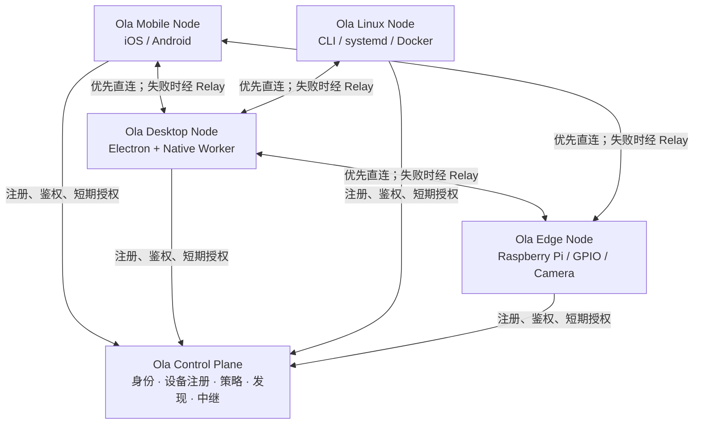
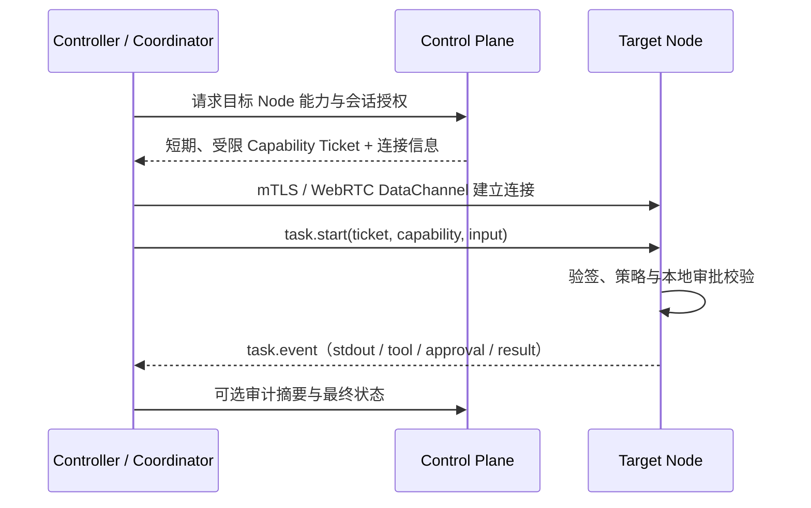

# 多设备 Agent Mesh 架构规划

## 1. 决策摘要

Ola 应演进为一个 **中心化信任、去中心化执行** 的多设备 Agent 网络，而不是把当前
Electron 应用简单迁移到手机。



核心原则：

- **Control Plane（中心控制面）是信任根**：认证、设备身份、能力授权、设备发现、撤销、审计索引与必要中继。
- **Data Plane（设备数据面）尽量直连**：任务流、终端输出、文件、屏幕和媒体不默认经过中心服务。
- **每个设备是 Node，不是假装成远程桌面**：Node 声明能力；控制者按授权调用能力。
- **协调者是角色而非固定机器**：手机、PC 或树莓派都可发起和编排任务；常驻树莓派可作为家庭局部协调者。
- **离线优先**：Node 保有本地任务队列、审批、缓存与审计；控制面短暂不可用不应立即中断已获授权的会话。

## 2. 产品边界与非目标

第一阶段的目标是让用户安全地在任意已授权设备上发起、观察和审批另一个设备的任务；并非在每个设备复制完整的 Ola Desktop。

| 范围           | 第一阶段                                      | 后续阶段                                     |
| -------------- | --------------------------------------------- | -------------------------------------------- |
| PC             | 完整 Ola Agent、文件、Shell、浏览器、MCP、SSH | 可作为常驻协调者                             |
| Linux / 树莓派 | Node daemon、CLI、Shell、文件、Docker         | GPIO、相机、局部 Agent、传感器自动化         |
| Android / iOS  | 会话、审批、通知、相机/分享/文件等移动能力    | 本地 Linux sandbox、离线 Agent 和移动 Skills |
| Control Plane  | 账户、设备、能力、配对、策略、信令和中继      | 组织、多用户、审计检索、HA                   |
| 跨设备任务     | 一跳远程工具调用和流式结果                    | DAG 编排、多 Node 子任务与恢复               |

不在第一阶段实现：共识选主、全量数据库双向同步、任意 Node 自动获得高危权限、云端代执行全部 Agent 任务。

## 3. 当前 Ola 基座与演进边界

当前仓库已经具备可复用基础，而不是从零开始：

| 当前组件                               | 已有职责                                 | Mesh 中的目标位置                           |
| -------------------------------------- | ---------------------------------------- | ------------------------------------------- |
| `server/` Go 服务                      | 注册、登录、设备、配对、会话、信令、TURN | Ola Control Plane 的基础                    |
| `src/main/remote/`                     | Electron 端账户、配对、WebRTC 与远程控制 | Desktop Node transport / UI adapter         |
| `src/main/ipc/native-agent-runtime.ts` | Worker Agent 的流事件与反向请求          | Desktop Node executor adapter               |
| `sidecars/Ola.Native.Worker`           | Agent、SQLite、文件、Shell、SSH、Sync    | Desktop Node 的本地执行运行时               |
| `src/shared/`                          | Main/Renderer/Worker 的跨进程 DTO        | 新增跨 Node 协议的唯一 TS 权威来源          |
| `cli/`                                 | 当前 CLI 入口                            | 演进为通用 Mesh client 与 Linux Node 安装器 |

关键边界：Electron IPC **不得**成为跨设备协议；它仍是 Desktop Node 内部实现。跨设备协议必须独立版本化，任何平台均可实现。

## 4. 目标逻辑架构

### 4.1 四类角色

| 角色          | 是否固定设备            | 职责                                                               |
| ------------- | ----------------------- | ------------------------------------------------------------------ |
| Control Plane | 是，部署为服务          | 身份、设备注册、授权签发、发现、撤销、审计索引、信令与 Relay       |
| Node          | 否，每台设备都可为 Node | 本地工具、任务执行、能力上报、策略校验、事件与文件服务             |
| Coordinator   | 否，按任务指定          | 选择 Node、编排子任务、汇总结果；可由手机、PC、树莓派或 CLI 担任   |
| Client        | 否                      | 展示会话、发送任务、订阅事件、提交审批；可与 Node/Coordinator 同机 |

### 4.2 Node 能力模型

Node 用显式 manifest 声明能力，声明不等同于可调用；Control Plane 的策略才决定调用权。

```json
{
  "nodeId": "pi-kitchen",
  "platform": "linux",
  "runtime": "ola-node/0.1",
  "capabilities": [
    { "id": "shell.exec", "risk": "high" },
    { "id": "files.read", "risk": "medium" },
    { "id": "docker.inspect", "risk": "low" },
    { "id": "pi.camera.capture", "risk": "medium" }
  ]
}
```

命名规则：`domain.action`，例如 `shell.exec`、`files.write`、`browser.open`、`mobile.camera.capture`、`pi.gpio.write`。能力版本与输入 JSON Schema 一起登记，禁止根据 UI 文本或运行时猜测权限。

### 4.3 调用链



直连失败时由 Control Plane 只转发端到端加密数据；Relay 不拥有任务或文件明文。

## 5. 安全与身份设计

### 5.1 身份层级

```text
Account → Organization / Personal Space → Device → Node key pair → Session / Capability ticket
```

- 登录令牌证明 **用户**。
- 设备证书或设备密钥证明 **设备属于谁**。
- 短期 Capability Ticket 证明 **哪个源 Node 可在多久内调用哪个目标 Node 的哪项能力**。
- 目标 Node 仍进行本地策略与用户审批；中心授权绝不绕过本机的拒绝策略。

### 5.2 授权模型选型：Capability-based + Policy-based

选择“中心策略评估 + 短期能力票据 + 目标侧强制校验”，而不是仅使用长期 Bearer Token。

Ticket 最小字段：

```json
{
  "issuer": "ola-control-plane",
  "subjectNodeId": "phone-01",
  "targetNodeId": "pi-kitchen",
  "capabilities": ["pi.camera.capture"],
  "sessionId": "ses_...",
  "nonce": "...",
  "iat": 0,
  "exp": 0,
  "aud": "ola-node"
}
```

策略维度：账户/组织、源 Node、目标 Node、能力、资源范围（路径、容器、GPIO pin）、风险等级、时间、是否需要现场确认。

### 5.3 票据与撤销

- Access token：15–60 分钟，可刷新。
- Device credential：长期但可逐设备撤销和轮换。
- Capability ticket：建议 1–5 分钟，绑定 session、目标和 nonce，不可泛用。
- 高危操作：额外一次性 approval token，默认 60 秒内有效。
- Node 连续接收 ticket 时离线检查 `exp`、`aud`、签名和本地 deny-list；联网时额外查询撤销状态。

## 6. 技术选型

### 6.1 选型结论

| 层               | 第一选择                                                      | 备选                        | 结论理由                                                                   |
| ---------------- | ------------------------------------------------------------- | --------------------------- | -------------------------------------------------------------------------- |
| Control Plane    | Go（延续 `server/`）+ PostgreSQL + Redis                      | Node/NestJS                 | 现有服务、迁移、信令和安全测试均为 Go，避免重写                            |
| Node 协议        | HTTPS API + WebSocket 事件；WebRTC DataChannel 用于直连       | NATS 直连                   | 更贴合现有 WebRTC 信令/TURN，移动端 SDK 成熟；先降低运维复杂度             |
| P2P/Relay        | WebRTC + STUN/TURN（现有 coturn）                             | Tailscale/WireGuard overlay | 对移动端与 NAT 友好，现有代码已有信令；Tailscale 可作为自托管/高级部署选项 |
| Node daemon      | Go                                                            | Rust                        | 交叉编译 Linux/arm64、常驻服务和单二进制交付简单；与控制面复用 DTO 思路    |
| CLI              | Go，随 Node SDK 分发                                          | 保留 TS CLI                 | 适合 Linux/树莓派安装和单文件发布；旧 TS CLI 可逐步迁移                    |
| Desktop executor | 复用 .NET Native Worker + Electron adapter                    | 重写 Runtime                | 保留已验证的 Agent、SQLite、工具与权限边界                                 |
| Android          | Kotlin + Jetpack Compose，基于 OpenMinis fork/adaptor         | Flutter / RN                | OpenMinis 已是 Kotlin/Compose，最低整合摩擦                                |
| iOS              | Swift + SwiftUI，基于 OpenMinis fork/adaptor                  | KMP / RN                    | OpenMinis 已有原生项目、Share/Widget/File Provider                         |
| 本地移动 Linux   | OpenMinis iSH/PRoot（可选、后置）                             | 不提供 Linux sandbox        | 价值高但原生依赖和 GPL 代价大，不能阻塞 Mobile Node v0                     |
| 文件数据面       | HTTPS 分块上传起步，后续 WebRTC data channel / 对象存储预签名 | 同步数据库                  | 先稳定可靠，再优化大文件直传；不做全量状态同步                             |

### 6.2 为什么不在 v0 选择 NATS

NATS Leaf Nodes 是很好的长期参考：本地集群可向上游连接并保留局部通信。但在 v0 直接引入 NATS 会新增 broker 部署、权限模型和移动端连接维护成本；Ola 已具备 WebSocket/WebRTC/TURN 基础。计划是在 v1 的多地点/多组织场景评估 NATS JetStream 与 Leaf Node，而不是把它作为第一条闭环的阻塞依赖。

### 6.3 为什么不把 Tailscale 作为唯一网络依赖

Tailscale 的设备身份、直连、Subnet Router 和 Exit Node 模型很适合作为部署参考；但产品核心协议不能只建立在第三方 overlay 上。Ola 应在 WebRTC/TURN 上完成官方跨平台连接，再提供 Tailscale/WireGuard 作为高级用户“私有网络直连”适配器。

## 7. OpenMinis 融合策略

### 7.1 事实与判断

OpenMinis 是原生移动 Agent：iOS 为 Swift/SwiftUI，Android 为 Kotlin/Compose，并提供本地 Alpine Linux、浏览器自动化、设备工具、技能和记忆。它使用 iSH（GPLv3）和 PRoot（GPLv2），仓库整体按 GPLv3 分发。其初始构建需要 iSH/PRoot、FFmpeg、LAME 与 Alpine rootfs；Android 需 NDK r28+，仅构建 `arm64-v8a`。详见 [OpenMinis](https://github.com/OpenMinis/OpenMinis) 与 [BUILDING.md](https://raw.githubusercontent.com/OpenMinis/OpenMinis/main/BUILDING.md)。

**决策：建立独立的 `ola-mobile` fork/仓库或 git subtree，作为 Ola Mobile Node 的原生宿主；不要把 OpenMinis 的 Swift/Kotlin/JNI 文件混入 Electron/TypeScript 源树。**

这能实现代码和版本边界清晰，但不消除 GPL 义务。若未来 Ola 需要闭源或不愿以 GPLv3 发布移动应用，必须改为“协议兼容的自研 Mobile Node”，不能复制或链接 OpenMinis/iSH/PRoot 代码。该事项必须在启动实际 fork 前取得法律意见。

### 7.2 融合方式：Adapter，而非双 Agent Runtime 硬同步

```text
OpenMinis Native App
├── 保留：原生 UI、Share Extension、Widget、文件与设备能力、可选 Linux sandbox
├── 新增：Ola Node SDK、Ola 登录/设备身份、能力 manifest、任务/event transport、审批 UI
└── 替换/隔离：Ola session 映射、远程任务入口、Ola policy enforcement adapter
```

移动端分两个阶段：

1. **Mobile Node v0（优先）**：作为 Ola 的客户端和设备能力执行者。支持登录、设备注册、推送、会话、审批、Share Sheet、文件/相机/剪贴板；不要求本地完整 Agent 或 Linux shell。
2. **Mobile Node v1（后置）**：启用 OpenMinis 本地 Linux sandbox、移动端本地工具和离线 Agent。Ola Task Router 决定任务落在手机还是 PC/Pi。

### 7.3 Android/iOS 打包路线

| 平台    | 开发与验证                                    | 发布产物                                 | CI 目标                                                    |
| ------- | --------------------------------------------- | ---------------------------------------- | ---------------------------------------------------------- |
| Android | Android Studio, JDK 17, SDK/NDK r28+          | Debug APK → signed APK → AAB             | `assembleDebug`, unit test, connected test, release bundle |
| iOS     | macOS Apple Silicon, Xcode, Swift 6, 真机优先 | Debug IPA/TestFlight → App Store archive | `xcodebuild`, unit/UI test, archive/export                 |

OpenMinis 目前要求先构建本地依赖；它的 iOS 依赖默认只构建 device arm64，因此模拟器需要单独产物。第一版 CI 只做 Android debug APK 和 iOS unsigned build；签名、TestFlight 与 Play Console 发布放到受保护的 release pipeline，密钥只进入 CI secrets。

## 8. 协议与数据模型 v0

新增独立契约目录，避免平台 SDK 从 UI 类型反推协议：

```text
packages/
  ola-protocol/                 # JSON Schema + protobuf/TS generated types（权威）
  ola-node-go/                  # Node 与 CLI 共用 SDK
  ola-node-ts/                  # Desktop adapter / test harness
apps/
  ola-node-linux/               # Go daemon
  ola-cli/                      # Go CLI（可逐步替换现有 cli/）
  ola-mobile/                   # OpenMinis fork / adapter（独立仓库或 subtree）
```

协议首先定义：

- `node.register`, `node.heartbeat`, `node.capabilities.report`
- `node.connect.offer/answer/ice`（信令）
- `session.create`, `session.close`
- `task.start`, `task.cancel`, `task.event`, `task.resume`
- `approval.request`, `approval.resolve`
- `file.offer`, `file.chunk`, `file.complete`
- `audit.append`（仅元数据摘要）

任务事件必须有 `eventId`、递增 `sequence`、`taskId`、`sessionId`、时间戳和幂等语义，支持断线后的 `task.resume(afterSequence)`。

## 9. 分阶段里程碑与验收标准

### M0：架构冻结与 ADR

交付：本文件、协议边界、数据分类、OpenMinis GPL 决策记录。

验收：团队能回答“谁是信任根、谁执行、谁看到明文、控制面离线时如何处理”。

### M1：Control Plane 升级

在现有 `server/` 增加 Node 身份、公钥、能力 manifest、授权策略和可撤销 capability ticket。

验收：PC Node 注册后，服务端可列出其能力；无授权请求被拒绝；撤销设备后其新建会话被拒绝。

### M2：协议与 Desktop Node adapter

在 `src/shared/`/`packages/ola-protocol` 定义 v0 契约；将现有 Native Worker 的 run/stream 适配为 `task.*` 事件。

验收：另一个客户端可在授权后启动 Desktop 的只读诊断任务，并持续收到可恢复事件流。

### M3：Linux Node 与 CLI 闭环

实现 Go `ola-node` daemon（systemd）和 CLI，首批能力为 `system.info`、`shell.exec`、`files.read/write`、`process.cancel`，默认对 Shell/写操作要求审批。

验收：

```bash
ola devices list
ola capabilities pi-kitchen
ola exec pi-kitchen -- uname -a
ola task logs <task-id>
ola task cancel <task-id>
```

在普通 Linux 与 Raspberry Pi arm64 上均通过。

### M4：文件与跨设备任务

实现分块文件传输、摘要校验、断点续传和任务委托。大文件默认不经业务数据库；后续优化直连。

验收：手机/PC/树莓派任意两台之间能在权限范围内传输文件；PC Coordinator 可以“收集 Pi 诊断日志并分析”。

### M5：Mobile Node v0 / OpenMinis adapter

fork OpenMinis，加入 Ola 账号、设备注册、能力 manifest、任务事件、审批与 push；先接 Share Sheet、相机、文件、剪贴板和通知。

验收：Android APK 与 iOS 真机 build 均可登录同一个 Ola Account；手机可批准 PC 发来的 `mobile.camera.capture`，结果回到任务事件流。

### M6：移动 Linux 与离线执行

将 OpenMinis 的 sandbox 作为可选 capability，提供 `mobile.shell.exec` 与本地 task queue；定义离线任务和恢复语义。

验收：无公网时，移动设备可完成安全等级允许的本地任务；恢复连接后上报结果和审计摘要。

### M7：多节点编排与生产化

引入子任务 DAG、失败恢复、策略管理 UI、组织支持、Relay 容量、审计、监控和自动升级；评估 NATS Leaf Node 与 Tailscale adapter。

验收：一个任务可协调 PC、Pi、Mobile 三个 Node，并按每个 Node 的策略审批、恢复和审计。

## 10. 参考项目与可借鉴点

| 项目                                                                        | 借鉴点                                                                               | 不直接照搬的部分                                                  |
| --------------------------------------------------------------------------- | ------------------------------------------------------------------------------------ | ----------------------------------------------------------------- |
| [OpenMinis](https://github.com/OpenMinis/OpenMinis)                         | 原生移动 Agent、iOS/Android 工程、移动 Linux、Share/Widget/File Provider、Skill 体验 | Agent loop、provider/session 内部模型；GPL 代码不能无评估混入 Ola |
| [Tailscale](https://tailscale.com/docs/how-to/connect-to-devices)           | 设备身份、直连优先、Relay、Subnet Router/Exit Node 角色、ACL 思路                    | 不把 Ola 的业务协议绑定到单一商业 overlay                         |
| [Home Assistant](https://www.home-assistant.io/integrations/homeassistant/) | 本地优先、设备/能力抽象、自动化与移动端作为能力提供者                                | 固定单 Hub 模型不适用于每个 Node 都可协调的 Ola                   |
| [NATS Leaf Nodes](https://docs.nats.io/learn/topologies/leaf-nodes)         | 本地消息域与上游连接、边缘自治                                                       | v0 不引入 broker；在大规模/多地点时再评估                         |
| [Syncthing](https://docs.syncthing.net/users/faq.html)                      | 设备直传、离线后同步、数据不必集中上云                                               | 不拿它直接承载任务状态或权限语义                                  |
| [EdgeX Foundry](https://docs.edgexfoundry.org/)                             | Edge runtime、设备服务、局部处理                                                     | 工业 IoT 的微服务规模不适合早期个人产品                           |

## 11. 风险、约束与规避

| 风险             | 影响                                  | 处理                                                                         |
| ---------------- | ------------------------------------- | ---------------------------------------------------------------------------- |
| OpenMinis GPLv3  | 可能影响移动端分发和 Ola 整体许可策略 | fork 前法律评估；保持独立仓库；必要时转为协议兼容自研                        |
| iOS 后台限制     | 手机不能长期可靠运行 shell/daemon     | Mobile v0 以用户触发、push、短任务为主；常驻能力放 PC/Pi                     |
| P2P NAT 失败     | 远程连接不稳定                        | TURN fallback、带宽与费用监控、Relay 可用性指标                              |
| 高危远程命令     | 数据破坏或越权                        | capability ticket、本地 deny、路径/参数范围、逐次审批与审计                  |
| 双 Agent Runtime | 会话/记忆重复、行为不一致             | Mobile v0 只做 Node；本地 Agent 作为显式可选 executor，不复制 Desktop 数据库 |
| 协议过早复杂化   | 延误首个闭环                          | v0 只做单任务、单目标 Node、流事件、审批和取消                               |

## 12. 下一步执行顺序

1. 审核并接受本规划中的许可与“Mobile v0 先于移动 Linux”的决策。
2. 创建 `packages/ola-protocol`，写 JSON Schema 与契约测试。
3. 扩展现有 Go `server/`：Node 表、节点公钥、capability manifest、policy、ticket 与撤销。
4. 在现有 Desktop Remote 模块上实现 `DesktopNodeAdapter`，先暴露只读诊断能力。
5. 实现 `ola-node-linux` + `ola-cli`，用树莓派跑通第一条端到端链路。
6. 单独 fork OpenMinis，先构建干净的 Android APK 与 iOS 真机包，再接 Ola Mobile Node SDK。

第一条必须跑通的“垂直切片”是：**CLI/PC 获得中心授权 → 直连 Raspberry Pi → 执行受审批的 `uname -a` → 流式返回 stdout → 写入审计摘要**。完成它后，再做移动端接入，协议不会被 UI 或某个平台绑死。
