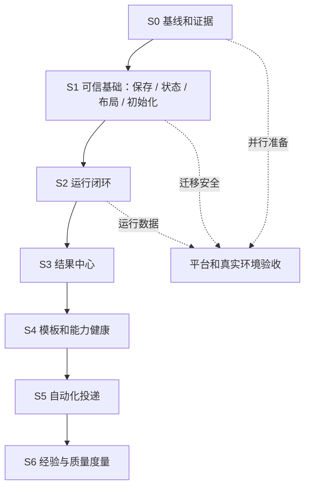

# Ola 功能改造与优化实施方案

日期：2026-10-02  
基线：当前工作区 `1.0.5`；功能现状与问题编号以仓库根目录 [AI_ANALYSIS.md](../AI_ANALYSIS.md) 为准。  
范围：基于既有功能路线图，补足可落地的产品功能设计、改造顺序、交付拆分和验收定义。本方案是规划文档，不表示下列功能已经实现或通过验收。

## 1. 目标与实施原则

### 1.1 目标

把当前分布在对话、任务、自动化、项目、能力和结果页面中的能力组织成一致的工作闭环：

> 选择工作场景 → 检查执行条件 → 发起运行 → 处理审批或异常 → 查看并交付结果 → 重试或复用

改造先处理会造成保存丢失、状态错误、操作不可达和恢复失败的问题，再连接已有运行与产物能力，最后改善首次使用、能力诊断和自动化交付。现有功能优先做完整和可验收，不以新增页面数量作为进展。

### 1.2 原则

1. **先修正确性，再加能力**：任务状态、日期、保存和恢复不可靠时，不叠加复杂工作流。
2. **复用现有领域对象**：继续使用 Workspace、Project、Session、Goal、Plan、Task、Run、Cron 和 Artifact；不建第二个任务库或调度器。
3. **状态有来源**：分别表达配置、授权、连接、运行、结果投递状态；不能用“已启用”代表“可用”，也不能用 Task 完成代表 Run 成功。
4. **高影响动作有确认**：外部发送、覆盖文件、删除、凭据使用等动作先展示目标和影响；重试不默认重放不具幂等保证的动作。
5. **空间边界贯穿全链路**：工作区、项目、会话、运行、产物及记忆的读取和写入都保留归属校验。
6. **渐进替换**：每个迭代先明确旧入口、数据兼容与回滚办法，再切换用户路径。

## 2. 目标功能结构与导航

这是产品功能层级，不要求一比一新建一级菜单。优先让现有入口承担职责，减少重复入口。

| 层级         | 用户要完成的事                                    | 现有功能基础                                  | 改造方向                                                                   |
| ------------ | ------------------------------------------------- | --------------------------------------------- | -------------------------------------------------------------------------- |
| 工作台       | 继续最近工作、启动常用任务、处理等待事项          | Workspace、Session、First Success、通知       | 显示当前空间/项目、最近会话、待处理运行、最近结果；空状态提供明确起步任务  |
| 项目         | 围绕一个工作目录/主题持续完成工作                 | 项目/工作区、会话、文件、Git、CodeGraph、Wiki | 将会话、运行、变更、结果放在项目上下文中；项目切换明确提示数据归属         |
| 任务与自动化 | 看见计划中的任务、正在运行和需要处理的事项        | Task、Goal、Plan、Cron、Run Journal           | 统一发现与筛选，保留不同对象的真实状态；重试/取消/审批进入原运行上下文     |
| 能力         | 配置并确认模型、Skills、MCP、扩展、渠道及远程连接 | Capability Center、Skills、MCP、Settings      | 搜索和分类入口统一，能力详细配置仍按类型展示；健康状态带最近检查时间       |
| 结果         | 找回、检查、预览和复用交付物                      | Artifacts Panel、预览器、FinalOutcomeArtifact | 结果关联 Run/Project/Workspace；提供文件状态和来源，不擅自删除本地内容     |
| 设置与维护   | 管理账户、安全、偏好、同步、诊断和更新            | 22 个设置注册页面、同步、用量、更新           | 维持单一设置注册表；先改字体层级、中文覆盖、键盘可达和错误反馈，再整理分组 |

建议导航映射：

| 现有入口/页面                              | 目标职责                           | 处理方式                                             |
| ------------------------------------------ | ---------------------------------- | ---------------------------------------------------- |
| 工作区首页                                 | 最近工作与首次成功                 | 强化恢复入口与条件检查，不另建首页系统               |
| Tasks、Task Board、Execution Center        | 任务、运行、待处理事项、定时任务   | 逐步形成任务与自动化中心，原有路由兼容一段时间       |
| Projects、Workspace、会话与代码页面        | 项目材料、对话、开发工作           | 通过项目上下文串起会话/运行/变更/结果                |
| Skills、Capability Center、Extensions、MCP | 能力发现、配置、诊断               | 统一索引和健康状态；保留专业设置面板                 |
| Artifacts Panel、各类预览页                | 运行产物和内容创作                 | 先补统一登记与检索，再决定是否独立一级入口           |
| Settings                                   | 账户、模型、权限、安全、外观、数据 | 保留 settings-registry 为唯一路由清单                |
| SSH、Remote                                | 远程连接与操作                     | 明确 SSH 终端/SFTP 与远程桌面/代理各自状态和能力边界 |

## 3. 核心用户流程设计

### 3.1 新用户第一次完成工作

1. 工作台读取当前空间和可用项目；加载失败显示错误与重试，不呈现误导性空白。
2. 用户选择一个可执行示例（首批：项目只读体检、资料整理成报告、SSH 只读巡检）。
3. 表单只收集该场景必须的输入；显示将访问的项目/目录、模型、技能/连接、权限和结果位置。
4. 执行前检查返回逐项结果：已满足、需设置、需授权、无法验证。检查不暗中触发高成本模型请求或外部副作用。
5. 用户确认后创建一个 Run，并将其关联至 Workspace、Project、Session、Task（适用时）。
6. 执行期间显示步骤、等待原因、停止操作和可继续处理入口；窗口关闭或进程重启后可恢复查看状态。
7. 完成时展示输出摘要与产物；明确“运行完成”和“外部投递完成”是两个结果。
8. 用户可以打开结果、定位文件、复制链接或将其作为下一次任务的输入。

### 3.2 长任务运行与恢复

| 状态              | 主界面表达   | 用户操作           | 处理要求                                      |
| ----------------- | ------------ | ------------------ | --------------------------------------------- |
| queued            | 等待开始     | 查看队列/取消      | 保留运行 ID 和创建来源                        |
| running           | 正在执行     | 查看步骤/停止      | 进度必须来自 runtime 事件，不虚构百分比       |
| awaiting-approval | 等待审批     | 查看目标/批准/拒绝 | 说明动作目标、范围及影响，记录决定者和时间    |
| awaiting-user     | 等待补充信息 | 回复/取消          | 回复回到原运行上下文                          |
| succeeded         | 已完成       | 查看结果/打开产物  | 成功依据为 Run 最终状态；产物分别呈现可用状态 |
| failed            | 执行失败     | 查看原因/重试      | 重试创建新的 attempt 并保留前次失败信息       |
| cancelled         | 已取消       | 查看此前记录       | 不能显示成失败或待执行                        |
| interrupted       | 中断，待确认 | 恢复/重新执行/终止 | 说明中断原因；有副作用风险时先检查状态再重试  |

聊天、任务中心、通知和运行详情共享同一个状态投影。运行事件可以追加，不能通过覆盖旧记录抹掉审批、错误和尝试历史。

### 3.3 任务与运行的关系

- Task 表示可跟踪的工作项，可以关联一个或多个 Run。
- Run 表示一次实际尝试，拥有唯一 `runId` 和 attempt 序号。
- Goal/Plan 用于描述更高层目标和步骤，不应被看板任务或运行状态吞并。
- Cron 表示调度定义；Cron 每次触发产生独立 Run。
- Task 标记完成只表示工作项被关闭；Run 的 success/failure 仍来自运行终态。
- 任务删除默认执行软删除或按现行数据契约处理；运行日志、审计和产物引用依保留策略单独管理。

### 3.4 统一结果登记

第一阶段登记文件路径、链接、图片/文档/媒体类型和来源工具；每条结果至少包含 `artifactId`、`workspaceId`、可选 `projectId`、`runId`、类型、标题、定位符、创建时间和存在状态。结果页面要支持：

- 按项目、运行、类型、时间和关键词筛选。
- 预览、打开原文件、复制路径/链接、重新检查文件是否存在。
- 显示生成来源和关联运行，定位到对应会话或运行详情。
- 区分索引移除与文件删除；文件删除是显式危险操作。
- 限定链接协议和本地路径访问边界；跨空间查询不得返回其他工作区结果。

历史结果只能从可证明的运行记录补齐；无法确认来源的旧文件不自动归入项目结果。

## 4. 改造工作包

| 工作包                | 功能设计与实现范围                                                                                        | 对应基线问题       | 交付物                                     |
| --------------------- | --------------------------------------------------------------------------------------------------------- | ------------------ | ------------------------------------------ |
| W0 基线和证据         | 固定提交/环境，核对 I01–I16；将确认、未复现、外部环境阻塞分开；记录测试数据和截图                         | 全部               | 基线报告、需求卡、证据索引                 |
| W1 任务数据正确性     | 保存 Promise 和错误回显；并发保存版本控制；7 种状态一致；本地日期与 UTC 日期语义分开；失败不静默          | I01–I04、I09       | Task 编辑状态规范、存储契约、状态/日期用例 |
| W2 任务体验可靠性     | 看板加载 requestId、错误/重试、跨空间切换不闪旧数据；实时失效刷新；小窗滚动布局；终端停靠恢复根因和回归   | I05、I07、I09、I16 | 看板体验更新、窗口/重启验收记录            |
| W3 工具可恢复初始化   | 将工具注册初始化改为可等待 Promise；仅成功后标记完成；失败后幂等重试；动态目录与固定工具恢复一致          | I13                | 工具目录初始化契约、失败注入覆盖           |
| W4 运行中心           | 聚合 Run/审批/等待/失败/中断；筛选和详情；运行与会话/任务/计划/定时定义互相定位；取消、重试、恢复         | I11                | 运行中心列表/详情、状态映射、attempt 历史  |
| W5 结果中心           | 扩展已有产物类型；工具输出登记；统一索引和预览入口；文件存在性、来源与空间授权                            | I10                | Artifact 登记协议、结果列表、索引迁移      |
| W6 场景模板和首次成功 | 三个只读/低风险模板；输入字段、能力清单、执行前检查、结果位置、模板版本管理                               | I12                | 模板清单、模板执行器复用约定、首次成功引导 |
| W7 能力健康           | 汇总模型、Skill、MCP、扩展、渠道和连接的安装/配置/授权/连接/最近调用状态；单项检测和脱敏诊断              | I14                | 能力状态模型、检查器适配器、诊断导出       |
| W8 自动化投递         | 试运行、调度状态、实际执行、结果投递分开呈现；时区和错过调度策略可理解；投递重试独立于任务重跑            | R6                 | Cron 详情、投递状态、有限重试策略          |
| W9 视觉与可访问性     | 设置页字体层级和中文适配；看板/运行中心状态词；窄窗口、缩放、键盘焦点、ARIA 和错误文案检查                | I04–I06            | 字体令牌与组件应用表、多语言验收清单       |
| W10 迁移与发布证明    | SQLite 版本迁移、旧库保留、回滚；Windows fsync 与原子切换；真实站点授权、撤销、流式；按平台安装/升级/启动 | I08、I15           | 迁移证据、平台矩阵、主站验收记录           |
| W11 复用与度量        | 用户确认后保存项目经验；按 Run 统计耗时、错误类别和 token；可靠数据不足时不显示推算成本                   | R7、R8             | 记忆来源/撤销机制、基础质量概览            |

## 5. 分阶段计划与完成门槛

人日仅为初始区间。假设一名熟悉 Electron/React/TypeScript 的开发人员和按需 QA；外部主站账号、其他平台设备和审批等待另行计算。

| 阶段            | 顺序和范围                                              | 初始估算（开发/QA） | 阶段出口                                                             |
| --------------- | ------------------------------------------------------- | ------------------- | -------------------------------------------------------------------- |
| S0 基线         | W0；复现现存问题，清理测试数据边界，确定每个验收责任人  | 2–3 / 1–2 人日      | 问题状态、证据、依赖和回滚点均可追踪                                 |
| S1 可信基础     | W1、W2、W3，并并行处理 W10 中 handover 可在本机复现部分 | 8–12 / 3–5 人日     | 任务保存/日期/状态正确；失败可恢复；窄窗输入可操作；工具初始化可重试 |
| S2 运行闭环     | W4；将 Run 状态与 Task/Goal/Cron 关系打通               | 7–10 / 3–5 人日     | 聊天和任务中心状态一致；重启仍可追踪；重试生成新 attempt             |
| S3 交付结果     | W5；文件、媒体及可识别扩展产物逐类接入                  | 6–9 / 3–5 人日      | 可按项目/运行检索、预览和定位；空间隔离与文件删除语义正确            |
| S4 首次成功     | W6、W7；完成三个场景的可运行模板和能力检查              | 8–12 / 3–5 人日     | 每个模板至少完成一次真实路径；缺依赖有准确指引                       |
| S5 自动化稳定   | W8；挑选报表/巡检做连续实际投递                         | 6–10 / 3–5 人日     | 执行、投递分别报告；投递重试不重复执行原任务                         |
| S6 有证据再扩展 | W11；基于使用数据决定项目记忆、共享模板、预算/质量能力  | 单独估算            | 用户收益明确、权限和数据策略通过评审后排期                           |
| 发布验收线      | W10 与 S1–S5 同步推进                                   | 依平台和真实环境    | 台账逐项通过；缺少外部环境时标阻塞，不标为完成                       |

开发加 QA 估算仅涵盖 S0–S5，约 **37–56 开发人日、14–25 QA 人日**。与路线图估算出现差异时，以拆分后的实际工作卡和复现结果重估，不承诺固定日期。

## 6. 第一阶段工作卡（建议直接实施）

| 编号  | 工作卡                                                                                       | 依赖/涉及区域                              | 验收步骤与证据                                                               |
| ----- | -------------------------------------------------------------------------------------------- | ------------------------------------------ | ---------------------------------------------------------------------------- |
| S1-01 | 将任务创建/编辑/删除改为可确认的异步持久化；保存中禁重复提交；失败保留可重试输入             | task-store、任务 IPC/DAO                   | 注入 IPC/SQLite 写失败；UI 不报成功；恢复写入后重试；重启确认成功数据        |
| S1-02 | 统一 pending/in-progress/completed/failed/cancelled 等任务状态的存储映射、标签、计数和终态列 | TaskBoard、TaskList、任务领域类型          | 创建 7 种状态；列表、详情、看板总数逐一对照；中文/英文各验证                 |
| S1-03 | 日期字段统一为日期语义或显式时区时间；修正 UTC+8/UTC-7 的日期偏移                            | TaskBoard 日期控件、序列化与 DAO           | 两个时区选择同一日、保存、刷新及重启后仍为同一日；精确时间另测时区转换       |
| S1-04 | 看板错误态、重试、请求序号与空间切换保护；任务变更后刷新或订阅                               | task-board-store、TaskBoardPage            | 人为慢响应后快速切换 A/B 空间；旧数据不闪现；注入加载错误显示重试            |
| S1-05 | 纠正小窗布局，使队列/运行信息不遮挡输入区；按内容限制面板高度并配置正确滚动容器              | Chat/Input/Queue/Execution panel           | 760×560 和更大窗口；元素上下左右均在视窗；输入、停止、确认按钮可见且点击命中 |
| S1-06 | 逐个复现终端停靠重启失败；分离布局偏好、项目 ID、初始化时序；不预设历史归因                  | Workspace/terminal dock/persistence        | 两项目分别设置；重启恢复；关闭项目后的回退；保存恢复证据和根因               |
| S1-07 | 修复工具目录初始化竞争，提供可等待和可重试的单一初始化 Promise                               | tool index/dynamic catalog/team tools      | 动态目录成功、失败、重试、并发进入各测；固定工具无重复注册，动态工具最终可见 |
| S1-08 | 复现 Windows 旧库 handover fsync EPERM；在临时库修复原子替换、句柄释放和回滚                 | legacy-database-handover、SQLite migration | 原库备份可校验；故障中止后旧库可读；成功迁移后新库可读；无损坏时才关闭       |
| S1-09 | 调整设置页与看板的正文、说明、元信息字号和中文状态文案；保持一致的字体令牌                   | Settings、Task Board、本地化资源           | 常规/125%/150% 缩放检查；中文长文案不裁切；键盘焦点和错误提示可见            |
| S1-10 | 将历史审查中不足的“可见”结论改为待验，保存新的布局/恢复证据                                  | audit 文档、对应 E2E                       | 报告中的结论、截图和测试范围一致；失败仍明确登记，不用计划文案替代结果       |

## 7. 视觉、字体与语言标准

以下为本次改造的起始规则，需用真实界面检查，而不是全局替换字号：

| 文本层级  |                建议字号 | 使用场景                   | 验收规则                                 |
| --------- | ----------------------: | -------------------------- | ---------------------------------------- |
| 页面标题  |                 20–24px | 主页面标题、设置分组标题   | 层级稳定；同类页面一致                   |
| 区块标题  |                 15–18px | 卡片、表单分区、列表标题   | 不与正文竞争；中文标题不截断             |
| 正文/控件 |                 14–15px | 设置项、表格、菜单主要内容 | 作为桌面常规可读基线                     |
| 说明文字  |                 13–14px | 次级说明、帮助文案         | 对比度足够；重要限制不可只用浅色小字     |
| 元信息    |                 12px 起 | 时间、版本、来源等         | 不承载主要操作或关键错误；缩放下仍可辨认 |
| 图标按钮  | 目标触控区域不少于 32px | 工具栏、行内动作           | 有可读 tooltip/ARIA 名称；焦点态可见     |

中文验收范围包括长标签、占位符、空态、错误、按钮、tooltip、日期、复数/插值、键盘导航、屏幕阅读器标签和小窗口换行。应用既有 i18n 模式，禁止新增 UI 硬编码中文或只把英文默认文案隐藏在 locale 缺失回退中。

## 8. 非功能要求与架构边界

- **数据契约**：新增字段和索引采用版本化迁移；迁移必须有旧库备份/失败恢复证据，不直接编辑用户数据目录。
- **授权与安全**：Renderer 不扩大通用 IPC 能力；新结果和诊断 IPC 验证发送方、Workspace、资源归属和敏感字段脱敏。
- **运行一致性**：保持 TypeScript Runtime 和 Run Journal 作为运行事实来源；UI 聚合是只读投影，不另造调度状态。
- **兼容性**：旧数据可读取；不确定归属的数据保持未分类；兼容读取何时移除需写进迁移验收台账。
- **可访问性**：状态不只靠颜色表达；所有可操作元素键盘可达；图标动作有辅助名称；对话框恢复焦点。
- **可观测性**：错误记录携带稳定错误码、runId/attempt 和脱敏上下文，不采集密钥、Cookie 或默认上传消息内容。
- **性能**：建立固定数据量、设备、空间数的首屏/任务/结果查询基线后再设门槛；分页/虚拟列表仅在实际规模需要时加入。
- **回滚**：每个阶段有功能开关或兼容入口；涉及数据格式时，先确保新旧版本交叉读取策略，否则拆分发布。

## 9. 统一验收矩阵

| 验收面     | 最低验收内容                                                       | 不能替代它的证据                   |
| ---------- | ------------------------------------------------------------------ | ---------------------------------- |
| 行为正确性 | 保存、状态转换、日期、空间切换、取消、重试、恢复                   | TypeScript 编译通过                |
| UI 体验    | 常见窗口尺寸、最小窗口、缩放、键盘、中文长文案、加载/错误/空态     | 静态代码截图或组件存在             |
| 安全与数据 | Workspace 授权、发送方校验、路径/链接校验、敏感值脱敏、SQLite 兼容 | 只验证 Renderer 隐藏按钮           |
| 持久化     | 进程重启、应用升级、旧库迁移、迁移失败回滚                         | 单次运行内状态更新                 |
| 集成       | 模型、MCP/Skills、渠道、远程连接、主站真实授权和撤销（按范围）     | mock、配置表单保存或健康状态假值   |
| 发布       | 每目标平台原生安装、升级、启动和数据延续；实际发布环境记录         | 仅构建成功或其他操作系统的模拟构建 |

每个工作卡记录：问题编号、用户任务、相关功能/路由、数据与权限边界、正常流程、空/错/等待/取消状态、测试步骤、证据路径、回滚方式和负责人。测试命令按受影响层选择，不要求对纯文档规划运行项目构建。

建议阶段指标：

- 主任务保存成功率与失败反馈覆盖率；
- 执行从发起到明确成功/失败/等待状态的比例；
- 失败后可恢复率及重复副作用次数；
- 结果登记率、结果可重新打开率与来源可追溯率；
- 首次成功所需时间、模板完成率与复用率；
- 中文关键路径覆盖率及窄窗操作成功率。

先收集本地基线；未经单独设计和用户告知，不加入远程遥测。

## 10. 主要风险、依赖和延后范围

| 风险/依赖                              | 影响                            | 处理办法                                                                   |
| -------------------------------------- | ------------------------------- | -------------------------------------------------------------------------- |
| Run、Task、Goal、Cron 来源状态定义混杂 | 汇总页显示错误或用户重复操作    | 先建立只读映射表；领域状态不互相覆盖；数据来源字段必须可追溯               |
| 旧会话和历史产物没有稳定 runId         | 结果中心无法可靠回填            | 只索引有证据的数据；新运行先保证完整关联，再做历史迁移                     |
| 外部副作用不支持幂等                   | 自动重试导致重复发送/写入       | 投递重试与业务运行重试分开；必要时先查询外部状态并要求确认                 |
| 主站和各渠道缺少测试账号               | 真实授权/撤销、流式验证无法完成 | 将准备账号作为发布验收依赖，状态登记为阻塞而非通过                         |
| 平台和架构设备不足                     | 安装/升级证据不完整             | 建立平台矩阵，使用真实目标机器或可审计的 CI runner；不把交叉构建当原生验收 |
| 结果数量增长与大文件                   | 查询、缩略图、磁盘空间压力      | 先做索引和按需检查；预览复用现有 viewer；大文件不复制进数据库              |
| 扩大远程执行和扩展权限                 | 安全边界增大                    | 延后任意脚本工作台和自由 webhook；先完成能力授权与审计                     |

本轮延后：复杂 DAG 工作流、开放式任意脚本市场、自动模型静默切换、未经授权的自动经验写入、团队共享模板权限体系、宠物社交/内容社区。具备明确用户频率、权限设计和负责人后再估算。

## 11. 方案采纳后的执行顺序

1. 从 S0 开始，把 I01–I16 转为可追踪开发卡，确认状态和复现材料。
2. 执行 S1-01 至 S1-10；数据正确性与历史迁移故障优先，字体/布局同步设计验收。
3. S1 出口通过后，先打通 Run 聚合（S2），再索引真实产物（S3）。
4. 用实际 Run/产物契约构建三个场景模板和能力检查（S4），避免模板先于真实执行能力。
5. 最后增强 Cron 投递闭环（S5）；连续真实执行后再决定经验与质量概览（S6）。
6. 发布证据线与产品迭代并行；真实环境缺失时列出明确责任人和阻塞项，不能用“功能代码已存在”签收。

**建议本次立项范围：S0 + S1。** 其余阶段作为已拆分的后续批次，由每阶段验收结果和实际用户反馈决定继续顺序。这既覆盖完整功能路线，又将首批控制在能逐项验证的问题修复范围内。

## 12. 实施进度与验证记录

更新日期：2026-10-02。此处只记录本地代码和测试证据；fixture/E2E 通过不等同于真实模型、消息渠道或线上服务验收。

| 阶段/工作项                                   | 当前状态                         | 已有证据                                                                                                                                                                                                                                                                                                                                                                                                                                                                                                                                                                                                                                                                                                                                                                                                         | 仍未证明的范围                                                                                                                                                                                       |
| --------------------------------------------- | -------------------------------- | ---------------------------------------------------------------------------------------------------------------------------------------------------------------------------------------------------------------------------------------------------------------------------------------------------------------------------------------------------------------------------------------------------------------------------------------------------------------------------------------------------------------------------------------------------------------------------------------------------------------------------------------------------------------------------------------------------------------------------------------------------------------------------------------------------------------- | ---------------------------------------------------------------------------------------------------------------------------------------------------------------------------------------------------- |
| S0 问题基线                                   | 已建立，持续维护                 | [AI_ANALYSIS.md](../AI_ANALYSIS.md) 的 I01–I16 和本方案工作卡；原安全/UI 复测更正见 [整改验收](../analysis/audits/2026-10-01-security-ui/整改验收.md)                                                                                                                                                                                                                                                                                                                                                                                                                                                                                                                                                                                                                                                            | 负责人、计划日期和外部测试账号需在立项后补充                                                                                                                                                         |
| S1-01 至 S1-04 任务保存、状态、日期、看板投影 | 代码已实现，定向回归通过         | `renderer-task-persistence`、`renderer-task-board-projection`、`task-board-date`、`task-board-status` 等 18 项通过；任务档案/锁定状态加入 TS SQLite schema v10 并通过创建、更新、读取 round-trip；看板读取前等待当前窗口工作区注册；完整 Electron 流程新增断言且通过                                                                                                                                                                                                                                                                                                                                                                                                                                                                                                                                             | UI 上故障注入后的每种字段编辑体验仍需人工走查                                                                                                                                                        |
| S1-05 窄窗输入与队列                          | 已复测通过                       | [760×560 布局截图](../analysis/audits/2026-10-01-security-ui/recheck-2026-10-02/queue-minimum-window-after-layout.png) 与 JSON；760×560 下发送按钮底部 y=548.8，125%/150% 等效缩放 E2E 通过                                                                                                                                                                                                                                                                                                                                                                                                                                                                                                                                                                                                                      | 具体用户显示缩放、字体设置和不同显示器的手工抽查                                                                                                                                                     |
| S1-06 终端停靠恢复                            | 集成流程通过                     | `node scripts/verify-pending-session-queue-electron.mjs` 完整通过，含两个项目偏好与重启恢复                                                                                                                                                                                                                                                                                                                                                                                                                                                                                                                                                                                                                                                                                                                      | 其他平台窗口管理和真实项目目录未覆盖                                                                                                                                                                 |
| S1-07 工具初始化恢复                          | 定向测试通过                     | `renderer-tool-registration-recovery` 覆盖动态目录失败、重试和幂等注册                                                                                                                                                                                                                                                                                                                                                                                                                                                                                                                                                                                                                                                                                                                                           | 第三方扩展的真实目录/运行场景按发布验收补充                                                                                                                                                          |
| S1-08 Windows 旧库交接                        | 本地专项回归通过                 | `tests/runtime/legacy-database-handover.test.ts`：64 项通过；TS 业务库 schema v10 为 `sessions` 增加 `task_profile` / `task_profile_locked` 并保留现有旧库数据；会话创建、更新、读取 round-trip 测试通过                                                                                                                                                                                                                                                                                                                                                                                                                                                                                                                                                                                                         | 真实已安装旧版覆盖升级和安装器级数据延续仍未通过                                                                                                                                                     |
| S1-09 设置视觉/中文                           | 静态规则通过，实际界面复核待做   | `verify:settings-visual` 通过；Capabilities 页面展示文案改为只走 locale 资源，不再以内联英文/raw ID 兜底；`settings-registry.test.ts` 通过，确保 22 个设置页面的导航图标互不重复；`verify:i18n` 扫描 16 个 locale，en/zh 新增术语齐全                                                                                                                                                                                                                                                                                                                                                                                                                                                                                                                                                                            | 14 种其他语言仍各有 60 个英文回退键；设置全页面 100%/125%/150%截图回归和设置侧栏键盘/读屏走查待完成；本轮尚未获得实际 Electron 页面截图方式确认                                                      |
| S1-10 历史结论校正                            | 已记录                           | 旧队列 JSON 的 y=603.5 超出视口；新 E2E 增加输入框/发送按钮边界断言并完整通过                                                                                                                                                                                                                                                                                                                                                                                                                                                                                                                                                                                                                                                                                                                                    | 旧截图作为历史记录保留，不能再单独作为通过证据                                                                                                                                                       |
| S2 运行中心、S3 结果中心                      | 现有集成路径通过，功能验收继续   | `verify:product-experience`、`verify:chat-experience` 和 Electron 全流程通过；运行/结果、任务、会话入口可互相定位；[2026-10-02 Electron 场景记录](migrations/ts-runtime/evidence/electron-workspace-regression-2026-10-02.md)；修复 TS 会话事件缺失工作区边界并通过 [19 项 IPC 回归](migrations/ts-runtime/evidence/workspace-session-event-regression-2026-10-02.md)；结果页按项目、文件类别（文档/图片/音视频/数据/链接/其他）与时间筛选；扩展名分类与预览器支持格式对齐（含 HEIC、Office 表格和常见音视频）；HTTP 扩展可用显式 JSON Pointer 声明登记链接；SSH Write/Edit 在远端 stat 确认后登记文件，查询时核对来源会话连接并复查存在状态；结果页可预览/复制远程文件路径；SSH 工具/产物 IPC 定向回归 39 项通过，结果分类 IPC 回归 28 项通过；类型检查、Electron 主进程/预加载/渲染构建和 `runtime:build` 通过 | SSH 真实主机端到端预览、连接掉线恢复与大规模历史数据仍需验收；JS 扩展任意非链接产物不纳入索引；主站及真实扩展授权/副作用验收仍未完成                                                                 |
| S4 模板与能力诊断                             | 本地模板集成路径通过，部分验收中 | 报告模板本地 Provider SSE 请求、回复展示和记忆工作区归属通过；修复任务档案字段未持久化的问题后，`node scripts/verify-pending-session-queue-electron.mjs` 通过（1 项完整 Electron 集成测试）；schema v10 与 session profile round-trip 专项测试通过；能力诊断相关 25 项定向测试、项目预检查 5 项回归通过；首次成功面板新增当前 Provider 最近一次已观察到的响应状态和时间，不触发网络探测、不把无记录误报为健康；`scenario-preflight.test.ts` 7 项通过，`verify:i18n` 与 `typecheck` 通过                                                                                                                                                                                                                                                                                                                          | [本地 Provider 执行验收](migrations/ts-runtime/evidence/first-success-local-provider-attempt-2026-10-02.md)；项目只读体检与 SSH 巡检还没有各自的完整实环境验收；真实 Provider/MCP/渠道状态检查未覆盖 |
| S5 Cron 投递                                  | 策略与单元回归通过               | Cron 投递重试、运行工具和错过调度相关定向测试通过；`verify:cron-skipped-runs` 通过                                                                                                                                                                                                                                                                                                                                                                                                                                                                                                                                                                                                                                                                                                                               | 真实目标投递、执行/投递失败分离与重复发送验证尚未完成                                                                                                                                                |
| 发布与运行时迁移退出                          | 未完成，保持开放                 | `verify:ts-migration-ledger`：376/376 接受；严格退出检查仍有 10 项开放                                                                                                                                                                                                                                                                                                                                                                                                                                                                                                                                                                                                                                                                                                                                           | 旧版原始安装包/升级证据、主站真实授权/撤销/流式、缺失操作系统与架构的原生发布验收均未证明                                                                                                            |

本次本地验证还发现并修正了 `verify:run-lifecycle` 的执行方式：原 esbuild 脚本会把 Vite 专属 `import.meta.glob` 带进 Node bundle；现改为 Vitest 执行实际生命周期/最终结果测试，5 项通过。Electron 应用构建、`npm run typecheck`、设置视觉契约、任务回归和旧库交接定向套件均已通过。全量测试未在本次重跑，因此不将全仓测试标为通过。

## 13. 后续实施记录（2026-10-02）

- W9 设置页窄窗补验：当前 Windows x64 安装版在 150% 等效视口实测固定导航占 236px、内容仅约 271px；改为窄视口 56px 图标导航，保留按钮可访问名称并收紧内容边距。源码版和新安装版设置页全流程各 1/1 通过，760×560、125%/150% 等效视口均无文档横向溢出、主内容至少 280px、字号输入与导航可操作；新安装版任务看板全流程 1/1 通过。真实系统缩放和完整视觉签收仍开放，见 [设置页布局证据](migrations/ts-runtime/evidence/settings-persistence-status-2026-10-03.md)。
- W9 设置子页字号补查：设置树内剩余 1 处 9px、75 处 10px、135 处 11px 文字统一提高至可随根字号缩放的 12px；13/15px 字号改为等效 rem。整页扫描再发现主题预览和凭据子组件的小字，已一起提高；静态补查覆盖凭据登录弹窗两处 9px。源码版和新 Windows x64 安装版 Electron 均逐一打开 22 个设置子页，在 150% 等效窄视口下无横向溢出、首屏可见控件越界或整页已渲染文字低于 12px；完整构建、设置视觉契约和定向 ESLint 通过。未打开的弹窗、人工截图视觉评估及真实系统显示缩放仍开放，见 [巡检证据](migrations/ts-runtime/evidence/settings-persistence-status-2026-10-03.md)。
- P10 安装版看板补验发现终端停靠偏好间歇未写盘：同一 Windows x64 安装包全流程 5 次中 2 次通过、3 次在项目停靠偏好持久化断言处失败；源码版 1 次通过。已在故障断言加入 Main 缓存和进程日志诊断，根因待定位，见 [发布记录](migrations/ts-runtime/evidence/windows-x64-2026-09-20.md)。
- P10 终端停靠偏好写盘故障已定位到 Windows 原子替换 `settings.json` 的 `EPERM`。对短暂文件占用加入最多 8 次有限退避重试，连续失败仍保留旧文件和错误回报；专项成功/持续失败用例通过。修复后源码版看板与设置页 Electron 流程通过，最新 Windows x64 安装版看板完整流程连续 5/5、设置页 1/1 通过。其他平台、真实用户长期运行及完整视觉验收仍开放，见 [修复证据](migrations/ts-runtime/evidence/windows-settings-rename-retry-2026-10-03.md)。
- P10 设置页截图审查发现安装版“项目智能”因缺失 CodeGraph 语法 WASM 弹出未处理错误，遮挡后续页面；新增 22 页逐页未处理错误门禁，旧包确定性失败。发布 staging 现在复制解析器声明支持的 20 个包内语法文件，与 3 个原有语法文件一起验收；恢复原 8GB 构建上限后正式打包成功。新安装版 22 页无未处理错误、CodeGraph 18/18 语法可用、TypeScript 文件实际索引成功，设置页与看板 Electron 流程各 1/1 通过。项目内 [截图审查](../analysis/audits/2026-10-03-settings-visual/审查记录.md)同时列出插件/桌面自动化窄窗编排、频道/迁移中心中文适配等仍待修复的问题；详见 [打包证据](migrations/ts-runtime/evidence/codegraph-wasm-packaging-2026-10-03.md)。
- W9 设置字号一致性：设置页 72 处固定 13px 说明文字和 2 处固定 15px 标题改为等效 rem，保持默认 16px 外观并随字号设置缩放。Electron 在真实写盘失败/重试/重启流程中核对 16→17px 时说明文字计算值 13→约 13.8125px；源码版和新 Windows x64 安装版各 1/1 通过。实际屏幕缩放及截图视觉质量仍开放，见 [设置保存与字号证据](migrations/ts-runtime/evidence/settings-persistence-status-2026-10-03.md)。
- S1-04 慢响应跨空间可见验收：隔离 Electron 测试进程在 Main 已完成 A 空间真实数据库读取后暂存一次任务列表响应；切换 B 空间并确认团队任务先显示，再释放 A 的旧响应。DOM 观察器确认个人任务未闪现、团队任务持续可见；源码版和当前 Windows x64 安装版完整流程各 1/1 通过。测试结束恢复原 IPC handler，生产包没有延迟开关。见 [看板慢响应验收](migrations/ts-runtime/evidence/task-board-save-failure-electron-2026-10-03.md)。S1-04 该可见切换子项已补齐，P10 总体验收仍开放。
- W9 看板键盘与中文适配补验：任务卡片、列表行、排期行及状态下拉框增加可见焦点环；详情标题/状态控件补可访问名称，优先级选项接入现有中英文翻译。源码版与新 Windows x64 安装版 Electron 完整流程各 1/1 通过，包含真实 Tab 焦点环计算样式检查；生产构建与类型/格式检查通过。中英文分别切换的人工视觉签收仍开放，见 [看板键盘与语言证据](migrations/ts-runtime/evidence/task-board-keyboard-localization-2026-10-03.md)。
- Windows 文件身份精度补查：旧库交接使用 Number 型 inode 比较，Windows 本机 inode 已超出安全整数范围，导致全量测试随机误报回滚基线不安全；改用 BigInt 后全量 Runtime 连续两次均为 1082 项通过、16 项跳过，核心 CI 与生产构建通过。随后把本地 Shell 声明产物的文件替换识别也改为精确 inode、设备号和纳秒时间，专项 4/4 通过。见 [文件身份精度证据](migrations/ts-runtime/evidence/windows-file-id-precision-2026-10-03.md)。这不改变 P1/P10/跨平台发布项的开放状态。

- S4 首次成功预检现在按 Provider ID 选取响应观测记录；区分未观测、最近响应状态和记录读取失败。记录基于应用进程内的真实请求，不额外探测服务。`scenario-preflight.test.ts` 7 项通过，`verify:i18n`、定向 ESLint 与 `typecheck` 通过。
- S4 SSH 模板的连通性检查现在绑定请求编号、工作区、连接 ID 和仍打开的场景；切换工作区/连接或关闭后重开会废弃旧结果，避免过期成功响应将当前场景标为就绪。远程项目不再被误判为“本地项目”而引导到本地目录体检。`scenario-preflight.test.ts` 12 项、`typecheck:web` 和定向 ESLint 通过；实际 SSH 主机巡检仍未验收。
- S4 [本地项目体检模板预检](migrations/ts-runtime/evidence/project-review-local-preflight-2026-10-03.md)已在完整 Electron 用例中走通：真实本地目录经工作台项目选择和目录检查后，生成含正确路径的只读体检提示词。`npx electron-vite build`、`node scripts/verify-pending-session-queue-electron.mjs` 通过；同时补齐会话更新的 `taskProfile` 类型契约，`typecheck:runtime` 通过。这尚不证明模型实际读取项目文件或无写入行为，S4 真实 Provider 执行仍开放。
- S5 Cron 日历改为复用任务日历的实际执行时间计算：按 Cron 表达式时分、IANA 时区、间隔任务的真实 cadence 预测日期；本地日边界按 DST 长短日计算，避免夏令时日历偏移。`task-schedule.test.ts` 覆盖 DST 春季跳时、时区 Cron、两日间隔；排期与 Cron 投递/工具定向套件共 16 项通过；定向 ESLint、`typecheck` 与完整 `npm run build` 通过。
- S5 日历排期计算复核：同一台 Windows 开发机上，一个每日 09:00 Cron 任务的 42 天日期投影由约 2363 ms 降至约 105 ms；无匹配日期字段时由约 2274 ms 降至低于本次毫秒计时分辨率。实现复用时区格式化器、只取每日首个命中并先排除不可能的日期；这是局部基准，不代表大量不同任务的 UI 实机性能。预览现覆盖当前 `node-cron` 支持的英文月份/星期、星期日 `7`、跨界范围与步长、`L`/`W`/`#` 和内置别名；28 项排期测试包含与生产调度器的正反匹配对照，`typecheck` 通过。
- S5 渠道手动重投在数据库事务中限制为最多 3 次尝试（首次投递加 2 次手动重试），并发时只有一个重试能创建；失败后再重试可继续到上限，未知结果仍必须先人工核实。结果详情不再为已有子尝试或达到上限的失败记录展示可重试。`legacy-database-handover.test.ts` 全部 64 项通过，含并发重复和三次上限；类型检查通过。
- S5 定时任务面板将顶部“running”改为真实的“已启用”任务数；任务卡和历史记录分别显示执行状态与投递状态，避免执行成功掩盖投递失败或未知。任务、日历、历史、操作提示和日期时间接入中英文资源与应用语言区域设置，关键元数据字号由 9 px 提至 11 px。`npm run build`、定向 ESLint、`verify:i18n`、`verify:product-experience` 通过；尚未做可见 UI 截图走查。
- S5 补充“已启用但未排入调度”显式提示，日历只投影当前调度器实际挂载的任务；历史页只读取一次完整记录，任务筛选只作用于本页，避免筛选结果覆盖任务卡共享的最近执行记录。`cron-store-workspace-switch.test.ts` 1 项、`typecheck:web`、`verify:i18n` 与定向 ESLint 通过；界面筛选交互仍待实机走查。
- Cron 实际渠道目标投递与失败恢复仍需真实目标验收；代码级投递测试不作为真实外部投递证明。设置页面缩放截图、键盘与读屏验收仍需可见 UI 检查条件。
- S5 会话投递由主进程在 TS BusinessRepository 事务中写入消息与投递结果，按运行 ID 去重，渲染窗口只刷新已持久化消息。测试覆盖并发重复、跨工作区目标拒绝、试运行禁止投递、迁移重建后保留会话投递记录，以及真实临时库上两次启动恢复仅写一次；定向 16 项测试、主/渲染与 runtime 类型检查、完整构建通过。见 [会话投递证据](migrations/ts-runtime/evidence/cron-session-delivery-2026-10-03.md)。真实应用重启、窗口多开和外部渠道连续投递仍待实机验收。
- S5 会话投递增加启动补投扫描，限定为 schema v11 之后的终态未投递运行，防止结果入库与投递间崩溃造成永久遗漏；“无投递”配置即使残留旧渠道绑定也不暴露发送工具。候选查询及模式回归通过，实机强制退出后恢复仍待验证。严格迁移退出检查当前仍有 10 项开放。
- 设置共用组件的页面标题采用 20px、区块标题 15px；说明、提示和常规/系统设置的表单文案按设置页 CSS 的最终覆盖规则为 14–15px，版本与数值元信息约 13px，并给长路径增加断行。`verify:settings-visual`、`typecheck:web`、定向 ESLint 和完整 `npm run build` 通过。其余历史设置页仍需逐页检查，且缺少 100%/125%/150% 实机截图，因此设置视觉验收继续开放。
- 记忆设置独立面板同步调整：路径和标签最终至少 13px，说明/状态与模板预览 14px，编辑器和操作按钮 15px；关键的未保存状态不再用 11px 表示，长模板内容可断行。`typecheck:web`、`verify:settings-visual` 与定向 ESLint 通过，实机截图仍待验。
- 用量分析面板将表格正文与筛选控件按设置页 CSS 调整到 15px、表头/说明 14px，原始 Token 数值元信息 13px；标题和操作区在窄宽度下允许换行。`typecheck:web`、`verify:settings-visual`、定向 ESLint 和完整 `npm run build` 通过，真实数据密度和缩放仍待可见界面验收。
- 模型配置面板将说明和空态按设置页 CSS 调整到 14px、选择项与选择框 15px，模型 ID 与供应商分组 13px；固定 320px 选择框改为可随容器收缩。温度及最大 Token 预设按钮增加至少 32px 点击范围、`type="button"` 与 `aria-pressed`。`typecheck:web`、`verify:settings-visual`、定向 ESLint 和完整 `npm run build` 通过，实际窄窗与键盘/读屏操作仍待实机验收。
- 设置页顶部保存状态原先用 500ms 定时器假定成功；现改为真实 `settings:set` IPC 写入状态，失败时展示重试，快速连续写入只由最新值决定最终状态。AI 模型标签栏和侧栏补齐最小操作高度、焦点环及窄窗换行。见 [设置保存状态证据](migrations/ts-runtime/evidence/settings-persistence-status-2026-10-03.md)；3 项写入状态测试、`typecheck`、`verify:i18n`、`verify:settings-visual`、定向 ESLint 与完整 `npm run build` 通过，实机故障注入及截图仍待验。
- 设置写盘链路继续补强：只有文件确实不存在才初始化空设置；损坏 JSON 或读取错误不会在下一次修改时被空对象覆盖；Main 缓存只在写盘成功后更新，写入与关机 flush 按顺序处理。设置存储、IPC 与同步文件等 4 个定向测试文件共 9 项通过；实机故障注入与恢复仍待验。
- 退出流程原来对 `flushSettingsSync()` 使用 `void`，导致写入队列虽可等待、关机流程却没有实际等待。现改为在 runtime 停止后 `await` 设置写入完成，再关闭后台服务和退出。定向 ESLint、`typecheck` 通过；应用强制退出及真实磁盘故障仍需单独验收。严格 TS 迁移退出检查仍有 10 项开放。
- Windows x64 发布复核用本轮最新代码重新执行完整构建与隔离 staging 打包，NSIS、ZIP、解包目录生成成功；对解包目录扫描 718 个文件，未发现旧 Worker/.NET 运行资产。新安装包在独立当前用户目录安装成功；隔离数据目录启动检查确认安装目录 Renderer 加载、TS Runtime 就绪和窗口可见。该检查未捕捉页面画面或验证交互，安装包仍未签名，旧版原位升级未验收，因此发布目标继续开放；见 [Windows x64 证据](migrations/ts-runtime/evidence/windows-x64-2026-09-20.md)。
- 旧版升级基线尝试发现 `v1.0.4` 本地重建包缺少 Native Worker，且该版 .NET Worker 不遵守当前 E2E 数据根环境变量，不能在同一 Windows 用户中安全做原位升级演练。测试过程中真实 `~/.ola` 的部分文件修改时间改变，现状已单独保全，未猜测回滚；当前版 `1.0.5` 已重新安装并通过隔离启动检查。详见 [升级尝试与数据隔离记录](migrations/ts-runtime/evidence/windows-x64-upgrade-attempt-2026-10-03.md)。
- 设置字体复核发现 Provider 模型配置弹窗及 Radix 下拉菜单通过 Portal 挂在 `.settings-page` 外，原有字号兜底未生效。现将十个实际设置弹窗（Provider、MCP、账户、快捷键、宠物）纳入共用 Portal 字号规则：小字约 12–14px、紧凑控件至少 32px；设置页打开时的下拉选项至少 14px。静态视觉契约逐类断言弹窗覆盖；`verify:settings-visual`、`typecheck:web`、定向 ESLint 与完整 `npm run build` 通过。100%/125%/150% 可见截图及交互验收仍待做。
- 渠道模型选择 Popover 和 Provider 右键菜单也使用 Portal，原设置页字号规则同样无法覆盖；现增加菜单局部 12–14px 规则及静态断言。Provider Tooltip 实现实际上转为原生 `title`，没有独立可样式化浮层，因此未对 Tooltip 添加无效 CSS。`verify:settings-visual`、`typecheck:web`、定向 ESLint 与完整 `npm run build` 通过；菜单实机操作与缩放仍待验。
- 全量 Runtime 回归发现旧库交接用例的迁移状态预期停在 schema v10，与已实施的 Cron 会话投递 schema v11 不符；已将 v11 纳入精确预期。旧库交接专项 64 项通过；复跑全量得到 257 个测试文件通过、2 个跳过，1042 项通过、13 项跳过。`npm run lint` 退出码为 0、无 ESLint 错误，但 Windows 检出下仍产生 124834 条以 CRLF/Prettier 为主的警告；另有 `node-pty` 的 `AttachConsole failed` 标准错误输出，均未计为验收通过的替代证据。严格 TS 迁移退出检查仍有 10 项开放。
- 核心 CI 复跑首次暴露两处过时的静态安全断言：浏览器注册校验仍读取已改为转发层的 Renderer `channels.ts`，WebView 校验仍要求已迁走的单文件分区和弹窗处理代码。现分别对照共享 IPC 契约、Main 的工作区分区判断及 `renderer-security.ts` 的弹窗拒绝逻辑校验。两项定向门禁和完整 `npm run verify:ci-core` 通过；该静态门禁不替代 P1/P10 的界面流程或 P12 的发布验收。
- S4 场景模板权限核查发现项目审查和 SSH 巡检目前只生成“只读”提示词，`FirstSuccessPanel` 通过 `onUsePrompt` 填入普通聊天输入框，没有把只读执行策略传到 Agent/Runtime；当聊天进入完整工具循环时，当前会话仍可暴露其他工具。已将中英文界面的“只读访问/只读命令”承诺改成准确的“提示词要求只读，实际工具权限按当前会话审批”。S4 仍未完成：需为模板运行建立可持久化的工具策略，在 Main/Runtime 执行边界限制本地只读文件查询及经审定的 SSH 只读操作，覆盖续跑、队列、重启恢复、MCP/插件工具和越权调用测试，再做真实 Provider 路径验收；不能用提示词或批准弹窗替代执行限制。
- S4 模板入口的处理函数原只检查模型和资源基本条件，SSH 连通性检查仅体现在按钮 `disabled` 属性。现让处理函数也检查完整 `canStartScenario`，确保 SSH 连接尚未通过当前项目/工作区预检时无法生成巡检提示词。`scenario-preflight.test.ts` 12 项、`typecheck:web` 与定向 ESLint 通过；这仍不构成执行层只读保障。
- S4 场景模板已接入持久化的 `scenario_policy`（schema v12）与 Main Runtime 工具边界：项目审查和 SSH 巡检只可请求各自的读取类工具；项目目录、SSH 连接或远程目录与会话记录不符时拒绝运行，策略不可通过会话更新移除，未知策略值也拒绝。临时库迁移及策略相关 72 项测试、全量 Runtime 1045 项测试、完整构建、类型检查与核心 CI 通过；见 [只读策略证据](migrations/ts-runtime/evidence/scenario-read-only-policy-2026-10-03.md)。真实 Provider/Electron、续跑/队列/重启与 SSH 实机路径验收继续开放，S4 不能标为完成。
- S4 只读策略进一步前移到 Main 的运行提交授权，队列重新启动时仍沿用同一授权钩子，工具执行入口再复核一次。隔离临时数据目录中的真实 Runtime 提交测试证实带 `Write` 的项目审查运行在模型调用前被拒绝；Renderer 也移除了该场景的 MCP、渠道、Team、桌面控制与图像插件提示上下文，避免模型看到不可执行的能力。策略专项 5 项通过。该验证未覆盖真实 Provider 返回、Electron 界面和 SSH 服务器，S4 仍开放。
- SSH 只读工具源码复核确认 `Read`/`LS`/`Glob`/`Grep` 可读取该连接有权访问的其他远端路径，运行上下文的目录匹配不等于逐次工具输入的目录隔离。界面中英文权限说明已改为“仅开放远程文件读取工具”，未承诺所选目录内读取；如需目录级约束，须在 SFTP 实际读取时做远端真实路径/软链接边界检查并以真实服务器验收。
- S4 隔离 Runtime 重启回归已补齐：同一会话策略写入临时库、停止 Runtime 与数据库连接、重新启动后再次提交 `Write`，仍在 Main 提交阶段拒绝。策略专项 5 项、`verify:i18n`、`verify:product-experience`、定向 ESLint 与格式检查通过；完整应用重启和真实 Provider 仍待验收。
- Windows x64 用当前 schema v12 代码重新打包、扫描并安装到新的临时目录；安装版隔离启动检查通过，临时 SQLite 库确认为 schema v12 且含 `sessions.scenario_policy`。当前 NSIS SHA-256、安装命令、机器可读启动结果与限制见 [Windows x64 证据](migrations/ts-runtime/evidence/windows-x64-2026-09-20.md)。旧版原位升级、真实页面交互和签名状态仍未完成发布验收。
- S4 会话策略补查：隔离业务库重开后，单条查询及当前工作区会话列表均保留 `scenario_policy`，其他工作区列表为空；Main 运行提交对不同项目目录的只读请求在模型调用前拒绝。`scenario-tool-policy.test.ts` 5 项、`typecheck:runtime` 与专项格式检查通过。严格迁移退出门禁本轮重跑仍有 10 项开放，故不将 S4 或发布阶段标为完成。
- S4 资料报告模板补齐 `materials-no-tools` 持久化策略；Main 拒绝该会话的所有工具请求，隔离 Runtime 重启后仍生效。受限场景跳过自定义 Hooks、MCP 刷新与自动记忆写入，Main 不实例化 Skill/MCP/扩展工具；无项目资料报告不创建默认工作目录，也不加载既有记忆。定向 18 项、最终代码完整构建、核心 CI、类型检查、i18n、产品体验静态门禁和 ESLint 通过。可见 Electron/真实 Provider 路径及 SSH 实机边界仍未验收。
- S4 Hook 旁路补查：Main 的 `hooks:emit` IPC 按窗口工作区从持久化会话读取场景策略，Renderer 缺少会话缓存时仍阻止受限场景执行 Hook；普通会话保持原行为。专项 2 项、类型检查及最终代码完整构建通过；全量 Runtime 1050 项通过、13 项跳过。全量测试期间出现一次 Windows `node-pty` 子进程 `AttachConsole failed` 日志，最终测试退出码为 0，终端实机行为仍需复核。
- S4 Hook 会话归属补查：发送流程在触发 `sessionStart` 前等待会话创建，Main 对不存在或不属于当前窗口工作区的会话拒绝 `hooks:emit`。新增跨空间用例后 Hook/策略/创建顺序专项 10 项、最终代码完整构建和定向 ESLint 通过；全量 Runtime 1051 项通过、13 项跳过。
- Hook 项目路径补查：设置页改传会话 ID；Main 为 `hooks:list`、`hooks:trust`、`hooks:emit` 从当前窗口工作区的持久化会话解析本地路径，并避免把 SSH 远端目录用作本地 Hook 目录。专项 5 项、最终代码完整构建、核心 CI 与全量 Runtime 1053 项通过。自动 Hook 执行当前被功能开关关闭，本改动是权限边界，不能记为 Hook 功能可用。
- S4 SSH 巡检路径边界：受限运行的四个 SFTP 读取工具将请求路径与远程根目录作 `realpath` 后限制在根内，Glob/Grep 跳过软链接项；同时修正 `**/*` 搜索误匹配，避免 Grep 空结果。专项 13 项、完整构建、核心 CI 与全量 Runtime 1057 项通过。真实 SSH 服务器及并发软链接替换尚未验证，不能将其记为 S4 实机验收完成。
- S1/S4 会话创建失败补查：创建 IPC 很快失败时，原等待表清理后后续发送可能看不到失败。新增 `SessionCreationGate` 保留已完成的错误，发送前等待会话落库会继续抛出该错误，输入框异步失败路径保留草稿；重试同 ID 成功后清除错误，旧请求的迟到失败不会覆盖较新成功。失败创建的本地会话允许在数据库确实不存在时删除，项目删除也不被已失败的创建 Promise 卡住。定向 7 项、最终代码完整构建、核心 CI 与全量 Runtime 1060 项通过、13 项跳过；实际写库故障的 Electron 可见流程仍待验收。
- S1/S4 子记录写入顺序补查：消息新增/更新/删除原先吞掉会话创建失败后仍继续写库，清空消息也有同样问题；会话元信息更新没有等待创建完成。现让这些写入等待创建成功，失败时不发出子记录写入；清空消息的严格写入路径保留错误。新增失败后零次子写入及重试恢复用例，相关 9 项、`npm run typecheck`、定向 ESLint 与格式检查通过。真实 Electron 注入 SQLite 写失败、用户可见恢复及重启后的数据库核对仍待验收。
- S1 首页发送失败可见性补查：`ChatHomePage` 原先创建本地会话后立即导航，若创建 IPC 失败，首页输入框先卸载，异步草稿恢复可能落在不可见的旧组件。现等待创建确认后才导航；失败时首页仍显示，`InputArea` 的既有失败处理可恢复草稿。`typecheck:web`、定向 ESLint/Prettier 通过。失败创建的本地会话仍可能暂留列表，实际 Electron 故障注入与后续清理体验尚待验证。
- S1 失败会话清理补查：首页新会话创建确认失败后，先调用正常的持久化删除流程，再把原创建错误交回输入框恢复草稿；即使创建已写入数据库但 IPC 应答失败，也以数据库删除结果为准。删除失败时保留本地会话并记录错误，避免在无法确认持久化状态时仅从界面隐藏记录。相关 9 项、`typecheck:web`、定向 ESLint/Prettier 通过；注入真实数据库故障及验证删除失败后的恢复体验仍待实机验收。
- S1 失败创建的状态核对：发送前若创建 IPC 报错，按当前工作区查询数据库中的会话行；已提交则清除失败状态，明确不存在则有限重试创建，重试应答再次丢失时复查数据库。同一会话的并发恢复共用一次操作；查询不可用时维持失败状态，不猜测成功。专项 13 项、`typecheck:web`、`typecheck:runtime`、定向 ESLint 和差异检查通过。此前“创建失败即删除”的描述仅适用于状态核对及重试均未确认成功后的首页清理路径；真实 Electron 故障注入仍待验收。
- P12 Windows x64 当前源码复验：完整构建及隔离 staging 打包退出 0；发布配置排除含源码的 CLI source map 后重新打包，最终安装包 SHA-256 为 `6C45D8A6DE730D107603981BC902913EB1DDE79198A6CD06AA0F251FE2E2C64B`。718 个解包文件无旧 Worker/.NET runtime，`app.asar` 无 `.map` 文件。独立目录当前用户安装退出 0，安装版进程在隔离数据根中加载自身 Renderer、TS Runtime 就绪、窗口可见，SQLite schema v12 初始化正确。见 [Windows x64 最新证据](migrations/ts-runtime/evidence/windows-x64-2026-09-20.md)。旧版原位升级、页面交互及其他平台原生验收仍开放，严格迁移退出门禁不能因此改为通过。
- P12 发布源映射门禁：`verify-runtime-staging.mjs` 现要求 `app.asar` 存在并拒绝打包后的任何 `.map` 文件；含/不含 source map 的临时 ASAR 专项 2/2 通过，当前 Windows x64 解包产物复核通过，`typecheck:runtime` 与定向 ESLint 通过。该规则随 release/runtime staging 在各目标平台执行，不把单平台成功推断为跨平台通过。
- P12 遗留资产扫描补强：原 `verify:legacy-artifacts` 仅遍历解包目录，现用同一组旧 Runtime/.NET 文件名规则检查解包树和 `app.asar`，staging 门禁也拒绝归档中的旧资产。临时 ASAR 正反用例及既有扫描共 10 项通过，当前 Windows x64 包复扫 718 个解包文件和 5177 个归档条目均无遗留资产；`typecheck:runtime`、定向 ESLint 通过。其他平台仍需各自原生产物验收。
- S4 SSH 场景路径预检：明显指向所选目录之外的相对/绝对路径现在会在远端 `realpath` 调用前被拒绝；所选根目录本身是软链接时，仍接受该已配置别名下的绝对路径，并以最终规范路径再校验一次。SSH 专项 14 项、`typecheck:node` 和定向 ESLint 通过。真实 SSH 主机与并发目录替换仍未验收；此次源码变化发生在上述 Windows 安装包生成之后，发布候选包需要重新构建才代表最新代码。
- S5 安装版会话补投复验：使用标记过的临时数据根运行已安装 Windows x64 包，首次启动退出后写入“已结束但尚未投递”的 Cron 运行，再真实启动两次；最终只有一条目标会话消息且待投递列表为空。专项 1/1、`typecheck:runtime` 与定向 ESLint 通过，见 [Cron 投递证据](migrations/ts-runtime/evidence/cron-session-delivery-2026-10-03.md)。此测试未在模型运行中强制终止，也未证明多窗口 UI 刷新或外部渠道实际送达，S5 保持开放。
- S5 桌面通知状态补查：通知 API 之前吞掉显示失败而 Runtime `Notify` 固定报告成功。现只在 Electron `show` 事件后确认成功；`failed`/不支持报告失败，超时/重复抑制报告未知；矛盾的工具结果与 `isError` 不再被成功字段覆盖，通知日志不输出消息内容。相关专项 19 项、Node/Runtime 类型检查、定向 ESLint 和完整生产构建通过。操作系统实际送达与外部渠道仍待验收，Windows 安装包需在此源码变化后重打包。
- S1 新会话失败可见验收：在隔离 Electron + SQLite 中给 `sessions` 插入安装真实故障触发器，首页发送失败时确认本地化提示、草稿仍在且无会话行；去掉故障后同页重试进入持久化会话，数据库中 ID 恰有一条。可见流程 1/1、Runtime 类型检查与定向 ESLint 通过；见 [证据](migrations/ts-runtime/evidence/session-create-failure-electron-2026-10-03.md)。IPC 应答丢失、多窗口及完整视觉基线仍开放。
- S1 队列恢复顺序补查：编辑器原先在新会话落库前读取待发送队列，写库故障时另报 `session-workspace-mismatch`。现在等待会话创建确认后才查询队列；创建失败只保留发送错误与草稿，真实队列读取失败仍提示。最新完整构建、可见 Electron 故障流程 1/1、队列模块专项 4 项、类型检查和定向 ESLint 通过。Windows 发布包需要包含这次 Renderer 修复后重打。
- S1 安装版故障复验：最终 Renderer 错误分类已进入 Windows x64 安装包 `DC867250B503FE78C8C4AEFE88E86A85244A5CDAA3AE81B7EC8E8AC7B2789647`。隔离安装与进程启动通过，真实 SQLite 写库失败后的首页提示、草稿、无误报、恢复重试和单条会话在安装版 Electron 中 1/1 通过；同包 Cron 补投 1/1 通过。P1/P10 的其余界面、视觉和外部路径仍开放。
- S1 设置页落盘故障补验：隔离 Electron 将 `settings.json` 暂存并用同名目录造成真实文件操作失败；设置页字号 16→17 后显示“保存失败”和重试入口，恢复文件后重试显示“已保存”、文件值为 17，重启仍读取 17。源码构建版与当前 Windows x64 安装版各 1/1 通过；Runtime 类型检查、定向 ESLint 与 Prettier 通过。见 [证据](migrations/ts-runtime/evidence/settings-persistence-status-2026-10-03.md)。设置页全量子项与视觉字号质量仍开放。
- S1 看板详情编辑故障补验：既有七状态可见看板流程中注入 SQLite `BEFORE UPDATE` 故障，确认失败提示、草稿保留和旧数据库值；移除故障后重试落库，Electron 重启后值仍在。源码版与当前 Windows x64 安装版完整用例各 1/1 通过，Runtime 类型检查与定向 ESLint 通过；见 [证据](migrations/ts-runtime/evidence/task-board-save-failure-electron-2026-10-03.md)。创建/删除故障和跨空间慢响应仍开放；日期见下方补验。
- S1 双时区看板日期补验：当前 Windows x64 安装版分别以 Asia/Shanghai（UTC+8）和 America/Los_Angeles（所选日 UTC−7）运行，同一 `2026-10-04` 从原生日期输入框写入、刷新和重启后均保持不变；Renderer 内确认实际时区偏移，两轮各 1/1 通过。日期与持久化专项 14/14 通过，含夏令时切换日用例；见 [证据](migrations/ts-runtime/evidence/task-board-save-failure-electron-2026-10-03.md)。S1-03 的日历日主路径已验证，精确时间与其他系统控件仍需单独验收。
- S1 看板跨空间迟到结果补查：投影层以受控 Promise 让 A 工作区的读取晚于 B 返回，最终仍只显示 B 任务，不把 A 的结果或错误写入新页面；专项 2/2 与 Runtime 类型检查通过。实际安装版在看板保持打开期间的慢响应切换还未完成，见 [证据](migrations/ts-runtime/evidence/task-board-save-failure-electron-2026-10-03.md)。
- S1 安装版看板工作区隔离：用侧栏原生选择器从个人空间切到团队空间、重新打开看板，个人任务消失；切回个人空间后任务再次出现，完整安装版用例 1/1 通过。切换会按产品行为返回首页，故这证明正常跨空间隔离；人为慢响应的可见过渡仍未验收，见 [证据](migrations/ts-runtime/evidence/task-board-save-failure-electron-2026-10-03.md)。
- S1 看板隔离证据补强：隔离库同时加入团队任务，安装版切换时先等待目标空间任务出现，再确认原空间任务不出现，往返流程 1/1 通过，排除空白加载状态的假阳性。投影层迟到错误的 `catch/finally` 现同时检查请求序号与当前工作区；加载失败重试和旧工作区迟到失败专项连同既有用例 4/4 通过，完整构建通过。修正后的安装包及人为慢响应可见验收仍待完成，见 [证据](migrations/ts-runtime/evidence/task-board-save-failure-electron-2026-10-03.md)。
- S1 看板投影修正版打包：Windows x64 staging 重新打包退出 0，NSIS SHA-256 为 `E23F86687EF3A222F01391072C63301DD8921C7A10C1FFDD1497701A4DE274EA`；同批解包版 Electron 完整用例 1/1 通过。正式安装和人为慢响应可见切换仍待验收；见 [证据](migrations/ts-runtime/evidence/task-board-save-failure-electron-2026-10-03.md)。
- P12 当前 Windows x64 安装包进一步以 `/S /CURRENTUSER` 安装到独立目录，退出码 0；隔离进程启动通过，临时业务库迁移版本 12，安装版完整任务看板与工作区业务流程 1/1 通过。旧版原位升级、其他平台原生验收、刻意延迟的可见切换仍开放；见 [发布证据](migrations/ts-runtime/evidence/windows-x64-2026-09-20.md)。
- S1-04 加载错误与重试补验：正式安装版指向带标记的临时业务库，短暂重命名 `tasks` 表使看板刷新真实失败；页面出现本地化错误与重试按钮，恢复表名后点击重试，任务重新显示。完整 Electron 用例 1/1 通过；人为慢响应下的可见 A/B 切换仍开放，见 [看板证据](migrations/ts-runtime/evidence/task-board-save-failure-electron-2026-10-03.md)。
- S1-01 创建/删除入口补齐：看板增加关联当前工作区会话的新建表单及详情删除确认，创建说明留空时使用标题满足数据库契约。真实 SQLite INSERT/DELETE 故障下分别核对草稿/确认保留、无误报、解除故障后重试与数据库结果；源码版、最新 Windows x64 正式安装版完整 Electron 流程各 1/1 通过。该包 SHA-256 为 `14CC1C2887D3C084A1F3C21C20F75786872DAFE75CA2266B1CFF29820843C794`，安装版隔离启动与旧 Runtime 资产扫描通过。跨重启结果见下方补验；视觉验收仍开放，见 [看板证据](migrations/ts-runtime/evidence/task-board-save-failure-electron-2026-10-03.md)。
- S1-01 重启补验：同一正式安装版流程再通过 UI 创建一条保留任务，Electron 重启后数据库恰好一条且看板列表仍可见；此前删除的任务在重启后数据库为零且列表不可见。完整用例 1/1 通过，Runtime 类型检查通过。S1-01 创建/编辑/删除的失败恢复及重启持久化主路径已签收；窄窗视觉与 S1-04 人为慢响应可见切换仍开放，见 [看板证据](migrations/ts-runtime/evidence/task-board-save-failure-electron-2026-10-03.md)。
- S1-09 看板窄窗布局补查：150% 等效 CSS 视口首轮测到主体仅约 217px，根因是任务页未触发 Layout 侧栏自动收起，固定右侧详情继续挤压主体。现任务页窄宽度自动收侧栏，看板详情改为下方滚动区，标题栏侧栏按钮补可访问名称；760×560、125%、150% 等效尺寸的源码版 Electron 几何检查及完整流程 1/1 通过。该检查不是系统显示缩放的字体视觉签收，且当前安装包尚未含此改动；见 [看板证据](migrations/ts-runtime/evidence/task-board-save-failure-electron-2026-10-03.md)。
- S1-09 窄窗修正版安装验收：Windows x64 最新包 SHA-256 `06A78B400143071DC7159B7DBFA7B241C0FA3B0CA61CB7E78AE36F4AF3837934`，独立目录安装、隔离启动和安装版完整 Electron 流程均通过；三档看板几何断言含无横向溢出、主体宽度、详情下置与视口边界。真实系统缩放、字体观感与截图对照仍待视觉签收，见 [看板证据](migrations/ts-runtime/evidence/task-board-save-failure-electron-2026-10-03.md)。
- W9/P10 任务日历中文与可访问名称补验：修复简体中文首屏残留的 `Board`，为翻月、日期格及筛选控件补全名称和选中状态。源码与 Windows x64 独立安装版工作台一级页面流程各 1/1 通过，包含真实翻月、日期点击、模型切换和其他一级页面巡检；安装包 SHA-256 `33DFFFEEA032A461BFF650BD21A4165905358E539052CC9981C1D06F9ED9CD37`。真实键盘/读屏、任务外部投递和其他 14 个语言质量仍开放，见 [任务日历证据](migrations/ts-runtime/evidence/task-calendar-localization-accessibility-2026-10-04.md)。
- W9/P10 任务日历窄窗可读性补验：上一安装版在 150% 等效 507×373 CSS 视口把详情挤至约 76px，已保存失败截图；改为窄窗纵向滚动布局后，源码及新 Windows x64 独立安装版 Electron 流程各 1/1 通过，两面板各约 463–464px，日历不溢出且详情可滚动查看。新包 SHA-256 `171A93C26D0901B6341129B72F0027D9CE570DC51185EBAFE13E0C4C758223A5`；真实显示缩放、长任务列表、键盘/读屏及跨平台仍开放，见 [窄窗修复证据](migrations/ts-runtime/evidence/task-calendar-narrow-layout-2026-10-04.md)。
- W9/P10 桌面自动化首屏与失败反馈：录制卡片缩短重复说明，保留前置安全提示，流程名称标签与输入框关联；读取失败有重试入口，录制及流程操作失败有中英文反馈。源码及新 Windows x64 独立安装版设置页流程各 1/1 通过；760×560 视口“开始录制”按钮底部约 379px、安全提示同屏可见。新包 SHA-256 `39B6C02DA2DCC096981A0F75E58BF051038B3E885688A48600C2D9E24430321A`；真实失败注入、系统缩放和读屏仍开放，见 [桌面自动化证据](migrations/ts-runtime/evidence/desktop-automation-first-screen-2026-10-04.md)。
- P10/W9 桌面流程读写恢复：Main 先持久化再结束录制，失败时保留录制并可重试；保存前清理键入文本。页面区分工作区不可用与空列表，原生重放确认框随界面语言显示中/英文。源码和 Windows x64 独立安装版 Electron 均用隔离 SQLite 表不可读与 INSERT 拒绝验证可见错误、重试和恰好一条最终记录，各 1/1 通过；新包 SHA-256 `F782185015A05831620634F68ED1BA6C1B41B6F04396749702871290507167F5`。原生弹窗实拍、真实桌面重放及其他失败路径仍开放，见[保存恢复证据](migrations/ts-runtime/evidence/desktop-automation-save-recovery-2026-10-04.md)。
- P10 对话上下文压缩入口：定位实际挂载的 `InputArea` 圆环，单击代替双击，放大 26→32px 圆环及 7→10px 百分比字体，补齐中英文状态与受阻原因，并阻止快速连点重复请求。源码与 Windows x64 新安装版 Electron 实际会话的聚焦、尺寸、单击后中文受阻提示各 1/1 通过；构建、类型、语言资源、定向 ESLint、安装版隔离启动及旧运行时资产扫描通过。新包 SHA-256 为 `EAAB5AEDC37E6D8F054AA7B76A51A23A96161CA0A1C7FCEC0EFDFA5F334CE2CC`。旧 `ContextPanel` 尚未挂载，其改动不计入实际界面验收；真实模型压缩和其他平台仍开放，见[入口证据](migrations/ts-runtime/evidence/context-compression-entry-2026-10-04.md)。
- P10 上下文压缩功能补验：手动压缩原先调用无 Main 处理器的 IPC，改用 TS Runtime 并绑定真实会话；摘要改为数据库确认后才显示。源码和新 Windows x64 安装版用本地模型 SSE 与 SQLite 触发器完成“真实模型请求→写入拒绝保留原文→恢复重试落库→重启读回”各 1/1，定向单元用例 7/7。新包 SHA-256 为 `1008D9E2A1A0DB5A90B14C5F7F5DE877BED600BDE60E62FAD2FBF058EA74C87`，安装版隔离启动与旧资产扫描通过；真实服务商、其他平台和长对话质量仍开放，见[持久化证据](migrations/ts-runtime/evidence/context-compression-durability-2026-10-04.md)。
- P10 压缩提交后通知边界：数据库已完成替换但会话更新广播失败时，不再把已提交结果报成可重试写入失败；写入本身失败仍返回错误。Main IPC 与持久化定向用例 24/24，通过新 Windows x64 安装版同一压缩故障恢复流程 1/1。新包 SHA-256 为 `5CB6B7B226036C902E94090C0975A0D462997310BBB8237239F4EECDF365B7D8`，隔离启动和旧资产扫描通过；真实多窗口通知故障及跨平台仍开放，见[补验证据](migrations/ts-runtime/evidence/context-compression-durability-2026-10-04.md)。
- P10 “压缩到此处”预览补验：预览绑定会话和原消息快照，切换会话或内容变化时拒绝应用旧摘要；失败提示接入中英文资源。源码与新 Windows x64 安装版使用本地模型服务各 1/1 通过“预览不落库→取消不改消息→切换会话清除预览→重新生成并确认→原文保留且摘要落库”。新包 SHA-256 `FDE3EA31EC7FCF5311D54CD3D1F7F1AAFE0F4CC31345066F8A6AF5F938EE5631`，隔离启动和旧资产扫描通过；跨窗口消息编辑、真实服务商摘要质量及其他平台仍开放，见[预览证据](migrations/ts-runtime/evidence/context-compression-durability-2026-10-04.md)。
- P10 插件模型配置窄窗补验：图片插件模型来源、服务商、模型选择框改为容器内自适应宽度，并补齐选择框与启用开关的中文可访问名称。源码和 Windows x64 安装版隔离 Electron 在 150% 等效窄视口完成独立模型切换及三个选择框边界断言，各 1/1 通过；构建、定向 ESLint 和设置视觉契约通过。新安装包 SHA-256 `5C3AD5B71093A37EB36922410ADB2ADA0B35269B18C2C07CC1962C9994C8981E`，隔离启动及旧资产扫描通过；真实显示缩放和读屏走查仍开放，见[补验证据](migrations/ts-runtime/evidence/settings-plugin-model-responsive-2026-10-04.md)。
- P10 插件页短窗口层级补验：能力健康与生命周期收进可展开概览，插件标签改为两列，表单改用设置页外层滚动。源码和新 Windows x64 安装版的 22 页窄视口流程及短窗概览、宽窗恢复各 1/1 通过；新包 SHA-256 `C010BA7A8719FC573CDCDAA948EBDF27011859C0E28C3CEE29B7F2294BF9BC28`，隔离启动与旧资产扫描通过。真实显示缩放、读屏和其他语言仍开放，见[补验证据](migrations/ts-runtime/evidence/settings-capability-compact-2026-10-04.md)。
- P10 插件内层标签键盘补验：图片、浏览器、Product Design、项目智能标签实现单一 Tab 焦点、方向键/Home/End 切换，内容区引用当前标签；中文概览说明改用自定义扩展、技能与 MCP 服务器。源码和新 Windows x64 安装版隔离 Electron 各 1/1 通过键盘、22 页布局及保存故障恢复；新包 SHA-256 `A6330A0F5ED3F27F0656AE777BCB16C9145F7DEC40965ECC02ACE3AC654B5603`，隔离启动与旧资产扫描通过。读屏实测和其他语言仍开放，见[补验证据](migrations/ts-runtime/evidence/settings-plugin-tabs-keyboard-2026-10-04.md)。
- P10 设置页语义目标补验：22 子页 Electron 扫描初次发现插件与自定义插件页引用不存在的标题 ID；共用页头补可选 ID 后，源码和新 Windows x64 安装版均为 22 页、0 个缺失的标签或说明目标，流程各 1/1 通过。新包 SHA-256 `4C2BFC076C9427429BAA506548ACCB836D8AD2233C8787001E6A22BCD02FCAC0`，隔离启动与旧资产扫描通过；未打开的弹窗、动态错误及读屏朗读仍开放，见[补验证据](migrations/ts-runtime/evidence/settings-semantic-targets-2026-10-04.md)。
- P10 OAuth 账户导入弹窗补验：AI 服务商中 Codex OAuth 的“粘贴 JSON”输入区补可访问名称，并按视口高度压缩，修复 300px 高视口导入按钮被裁切。源码和 Windows x64 安装版隔离 Electron 各 1/1 通过实际打开、边界断言和取消；新包 SHA-256 `1AB1A21AF594B4032F9DB4F52698E34F53BB77491D3D28D250CA153CE3839440`，隔离启动与旧资产扫描通过。真实令牌导入/存储、实际系统缩放和读屏仍开放，见[补验证据](migrations/ts-runtime/evidence/settings-oauth-import-dialog-2026-10-04.md)。
