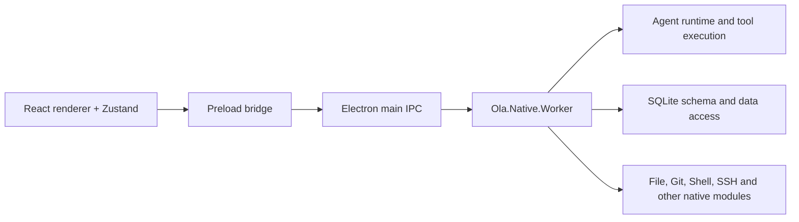

# Ola / OpenCowork 1.2.0 sync audit

This directory is the review gate for the staged OpenCowork capability merge. It records source
evidence, not a mandate to copy reference files.

Run the audit with the sibling checkout at `../OpenCowork`:

```bash
npm run audit:sync
npm run audit:sync:check
```

Refresh `baseline.json` only when the Ola branch or the deliberately pinned reference changes:

```bash
npm run audit:sync:write
```

The audit compares six implementation layers: shared contracts, Electron main, preload, renderer,
Native Worker, and scripts. Native Worker product names are canonicalized before comparison, so a
file is marked `brandOnly` only when its implementation is otherwise equal.

## Classification

| Class | Meaning | Merge treatment |
| --- | --- | --- |
| `identical` | Byte-for-byte equal | No work |
| `brandOnly` | Equal after product-name normalization | Keep Ola naming |
| `changed` | Same canonical path with behavioral differences | Review implementation-level diff |
| `onlyOla` | Exists only in Ola | Preserve unless a later PR explicitly replaces it |
| `onlyReference` | Exists only in OpenCowork | Candidate capability, not an automatic copy |

The catalog section independently compares IPC channels, Native Worker routes, DB routes, settings
tabs, and Native Worker modules. This catches protocol drift that a filename comparison misses.

## Architecture evidence



The renderer owns UI orchestration and provides reverse-request handlers for tools that still need
renderer state. The Worker owns the provider loop, context compression, tool routing, streaming,
and SQLite access. [source:src/main/ipc/native-agent-runtime.ts]
[source:sidecars/Ola.Native.Worker/Modules/AgentRuntime/AgentRuntimeModule.cs]
[source:sidecars/Ola.Native.Worker/Modules/Db/DbModule.cs]

## Ola capabilities that must not regress

- Ola naming, application identity, `~/.ola`, `OLA_*`, and `Ola.Native.Worker`.
- Multi-pet collection, global wallet/resource pool, pet claiming, and per-pet desktop position.
- Local-first credential vault, login agent, challenge handling, and site profiles.
- First-run onboarding and Ola-specific providers/OAuth.
- Windows-aware `launch-dev.mjs`, main-process safety verification, and message-window verification.

## Review sequence

Each later feature PR must begin by refreshing this report in memory, selecting the relevant
`changed` and `onlyReference` entries, and documenting which `onlyOla` behavior is preserved. The
checked-in baseline stays pinned until a reviewer deliberately accepts a new reference snapshot.
